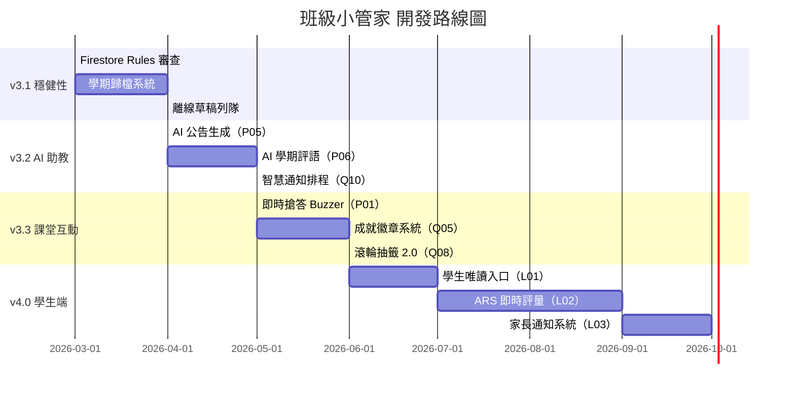

# 班級小管家 - 未來開發建議 📋

> 最後更新：2026-04-24
> 當前版本：v3.1.6
> 本文件提供詳細的未來優化與開發方向建議，供開發參考

---

# 🆕 第十章：2026-04-16 重構後的下一步建議清單

> 本章節基於 v3.0.9 → v3.0.13 累積改動所觀察到的設計機會與技術債，整理出可直接承接的後續工作。

## 🔖 本章導覽

- [A. 深連結 / CTA 機制的延伸應用](#a-深連結--cta-機制的延伸應用)
- [B. 多班級體驗（class-aware-storage 架構延伸）](#b-多班級體驗class-aware-storage-架構延伸)
- [C. 同步與雲端備份進階](#c-同步與雲端備份進階)
- [D. Onboarding 與首次使用體驗延伸](#d-onboarding-與首次使用體驗延伸)
- [E. 本次發現的技術債清單](#e-本次發現的技術債清單)
- [F. 值得評估的新功能想法](#f-值得評估的新功能想法)
- [📊 建議優先級總表](#建議優先級總表)

---

## A. 深連結 / CTA 機制的延伸應用

v3.0.11 建立了 `data-primary-action` 屬性作為通用的「區塊主要行動」標記。目前只有考試監考用到（啟動全螢幕監考按鈕），其他區塊都還沒標記。這是**零風險高 CP 值**的延伸空間。

### A1. 為其他 8 個區塊標記主要行動 🔴 **P0 / 0.5 天**

| 區塊 | 建議的主要行動按鈕 | Deep-link 情境 |
|---|---|---|
| 👥 學生管理 | 「新增學生」或「📁 從 Excel 匯入」 | 分享連結給代課老師，直接看到「匯入」按鈕 |
| ⭐ 加扣分 | 「一鍵多學生加分」區塊 | 下課時快速開啟加分介面 |
| 🧩 隨機分組 | 「立即分組」按鈕 | 活動課直接開始分組 |
| 🎲 抽籤系統 | 「開始抽籤」按鈕 | 課堂隨機抽學生問答 |
| ⏱ 計時器 | 「⏱ 全螢幕時鐘」按鈕 | 考試/活動計時，直接進入全螢幕 |
| 📝 聯絡簿 | 「新增今日聯絡簿」 | 放學前 5 分鐘快速進入 |
| 📋 作業檢查 | 「新增作業」按鈕 | 週一分派作業 |
| 📢 班級公告 | 「新增公告」按鈕 | 臨時公告直接開始輸入 |

**實作**：在每個區塊的主要按鈕加 `data-primary-action="true"`。總計約 9 行 HTML 改動，現有的 `_autoScrollToSection` 會自動生效。

### A2. Deep-link 參數化：預填資料 / 預選狀態 🟡 **P2 / 1 天**

目前 `#exam` 只能跳轉區塊。若擴充為 `#exam?action=start&subject=國語`，老師分享的連結可以預先：
- `#points?student=42` → 直接鎖定 42 號學生的加扣分介面
- `#lottery?groups=4` → 直接設定 4 組
- `#timer?seconds=600&autostart=1` → 直接開啟 10 分鐘計時器並自動啟動

**收益**：老師/代課老師的工作流可以「收藏書籤」或「桌面捷徑」。

### A3. PWA 快捷方式（manifest `shortcuts`）🟡 **P2 / 0.5 天**

在 `manifest.json` 加 `shortcuts` 欄位，讓使用者長按 PWA 圖示看到快速操作選單：

```json
"shortcuts": [
  { "name": "啟動全螢幕監考", "url": "./classnew.html#exam" },
  { "name": "發布班級公告", "url": "./classnew.html#announcement" },
  { "name": "開啟計時器", "url": "./classnew.html#timer" }
]
```

**收益**：直接從桌面圖示跳到特定功能，完全不用進入主選單。

---

## B. 多班級體驗（class-aware-storage 架構延伸）

v3.0.13 建立了透明的 localStorage 攔截器，是**強大的基礎設施**。基於此可以開發許多多班級功能。

### B1. 班級切換鍵盤快捷鍵（`Ctrl+K` 快速切換器）🟡 **P1 / 1 天**

目前切班要點右上角下拉選單。高頻率切換的科任老師需要更快的方式。

**實作方案**：
- 按 `Ctrl+K`（或 `Cmd+K`）彈出搜尋 Modal
- 輸入班號（如「601」）即時過濾- `Enter` 或點選切換
- 類似 VSCode / Slack 的 command palette

**技術要點**：已有 `ClassProfiles.switchTo()` API，只要包一個 UI 即可。

### B2. 班級視覺差異化（顏色 + Emoji 標記）🟡 **P1 / 0.5 天**

**問題**：切到錯班卻沒注意到，導致資料寫錯班（最常見的誤操作）。

**解決**：
- 在 `classProfiles` 增加 `color` 與 `icon` 欄位
- 右上角班級按鈕使用該班專屬顏色（601=藍、602=綠、603=橘...）
- 頂部時鐘條可選顯示當前班級色帶作為邊框
- 新增班級時自動分配下一個未用過的顏色

**收益**：**視覺上就能察覺目前是哪個班**，誤操作率大幅降低。

### B3. 跨班聚合儀表板（老師總覽頁）🟢 **P2 / 2-3 天**

新增 `#dashboard`（或直接放在學生管理之上）顯示：
- 各班學生人數 / 本週加分總量 / 作業繳交率 / 最近公告數
- 橫條圖比較各班狀況
- 「今日待辦」：各班尚未檢查的作業清單、即將到期的公告、本週考試時程

**技術要點**：已有 `class-aware-storage.rawGet(key)` 可以跨班讀取，不需要額外改架構。

### B4. 班級模板 / 複製設定 🟢 **P2 / 1 天**

科任老師新增班級時，常常要重新設定：考試科目、提醒語、抽籤偏好、時鐘設定。

**功能**：新增班級時勾選「從 601 班複製設定」，自動複製這些偏好到新班級。

**實作**：新增 `ClassProfiles.cloneSettingsFrom(sourceId, targetId)`，遍歷 `SHARED_KEYS` 複製設定類型的資料（不複製學生/作業等內容性資料）。

### B5. 班級歸檔（結束學期後封存）🟢 **P2 / 1 天**

學期末，老師希望保留資料但不讓班級出現在選單中。

**功能**：班級管理選單加「📦 歸檔」按鈕，把班級標記為 `archived: true`，從切換選單隱藏，但仍保存在雲端。提供「查看歸檔班級」入口還原。

---

## C. 同步與雲端備份進階

v3.0.13 補齊了同步完整性，但還有幾個進階體驗可以提升。

### C1. 同步衝突偵測與解決 UI 🔴 **P0 / 2-3 天**

**問題場景**：老師在家 A 電腦改了 601 班的聯絡簿，沒同步就去學校 B 電腦改了同一天的聯絡簿。上雲時目前是「最後寫入贏」，會靜默覆蓋。

**解決**：
1. 每個雲端 doc 保留 `updatedAt` 時間戳
2. 同步前先比對：本地 `lastSyncTime` vs 雲端 `updatedAt`
3. 若雲端較新（而本地有未同步改動），彈出衝突 Modal：
   - 顯示差異 diff
   - 選項：「保留本地」/「採用雲端」/「合併」
4. 使用者決定後才同步

**收益**：避免靜默資料遺失。

### C2. 即時多裝置同步（Firestore snapshot listener）🟡 **P1 / 2 天**

目前是「手動一鍵同步」或「10 分鐘自動同步」。若老師在電腦加分，iPad 上的學生排行榜應該**即時**反映。

**實作**：
- 用 Firestore `onSnapshot()` 監聽 `pointsHistory` collection
- 收到變更時更新本地 `pointsHistory-{classId}` 並觸發 `renderPoints()` 等 UI 重繪
- 只監聽目前班級 + 幾個高頻變動的集合（加分、作業繳交）
- 加個開關讓老師可關閉（省流量）

**收益**：課堂上投影學生排行榜時，加分即時反映。

### C3. 同步狀態常駐指示器 🟡 **P1 / 1 天**

目前上次同步時間藏在 Google 帳號下拉選單裡。建議：
- 右上角加「雲端圖示」，狀態分四色：
  - 🟢 綠色 = 已同步（lastSyncTime < 1 分鐘）
  - 🟡 黃色 = 有未同步的本地改動
  - 🔴 紅色 = 同步失敗 / 網路錯誤
  - ⚫ 灰色 = 未登入
- 點擊圖示顯示詳細狀態 + 手動觸發同步

**收益**：老師隨時知道資料是否安全上雲。

### C4. 本地資料匯出（JSON / Excel / PDF 備份）🟢 **P2 / 1-2 天**

雲端同步是「多裝置存取」，但老師有時需要**離線備份**（例如給校長報表、學期末存檔）。

**功能**：
- 單班匯出：全班資料打包成 JSON / Excel 多工作表（學生/加分/作業/考試各一張）
- 全班匯出：所有班級壓成 ZIP
- 學期成績 PDF 報表（整合加扣分統計 + 作業繳交 + 考試缺考）

### C5. 誤刪復原（30 天 soft delete）🔴 **P0 / 2 天**

目前刪學生/班級是「硬刪」，Firebase 資料直接消失。

**改進**：
- 刪除時改用「標記 `deletedAt: timestamp`」，30 天內可復原
- 新增「🗑️ 回收桶」功能顯示近 30 天刪除的項目
- 30 天後由排程（或手動清理）真正刪除

**收益**：老師不小心刪錯東西可以救回來，對關鍵資料特別重要。

### C6. 自動同步策略優化 🟢 **P2 / 1 天**

目前 `auto-sync.js` 固定 10 分鐘一次。可以做得更聰明：
- 有變動後 30 秒再同步（debounce），避免頻繁觸發
- 視窗失焦（切 tab）時立即同步
- `beforeunload` 時同步一次（關頁前保險）
- 網路恢復時（online 事件）立即同步離線期間的變動

---

## D. Onboarding 與首次使用體驗延伸

v3.0.12 做了登入提醒 Banner，但完整的新手引導還有很大空間。

### D1. 互動式首次使用教學（guided tour）🟡 **P1 / 2 天**

**觸發**：完全沒有學生、沒有任何 localStorage 歷史的首次使用者。

**設計**：類似 Notion / Linear 的教學 overlay：
1. 👋 歡迎畫面（可跳過）
2. 「先加 3 位學生試試看」（高亮學生管理按鈕）
3. 「加 5 分給學生」（高亮加分按鈕）
4. 「新增今天的聯絡簿」（高亮聯絡簿按鈕）
5. 「完成！這些資料已存在你的電腦裡。登入 Google 可以跨裝置同步」(連結到 v3.0.12 的登入 Banner)

**技術要點**：用 `driver.js` 或 `shepherd.js`（~10kb），或者純 CSS spotlight + 絕對定位 tooltip。

### D2. 空狀態（empty state）視覺與引導 🟡 **P1 / 1 天**

目前各區塊沒有資料時都是空白。改進為：
- 學生管理：「還沒有學生，點這裡新增 →」或「從 Excel 匯入」大按鈕
- 班級公告：「還沒有公告，創建第一則公告」
- 作業檢查：「還沒有作業，加一個試試看」
- 考試監考：「還沒有考試科目，使用預設三科（國語/自然/英文）」

**收益**：降低認知負擔，明確告訴使用者「下一步該做什麼」。

### D3. 鍵盤快捷鍵提示卡（`?` 打開）🟢 **P2 / 0.5 天**

現在有 `keyboard-shortcuts.js` 但老師可能不知道有快捷鍵。

**改進**：
- 按 `?` 彈出美觀的快捷鍵對照表（分類顯示）
- 在各區塊按鈕加 `title` 或 tooltip 顯示對應快捷鍵

### D4. 「你試試看」沙盒模式 🟢 **P2 / 2 天**

**場景**：老師想試用功能但怕弄亂真實資料。

**功能**：加「🧪 沙盒模式」按鈕，進入後使用專用的 `sandbox-*` localStorage key，有 3 位範例學生、假資料，關閉後資料清除，不影響真實班級。

---

## E. 本次發現的技術債清單

### E1. `classnew.html:1274` 多餘的 `</div>` 🟡 **P1 / 15 分鐘**

v3.0.9 Session 中發現的 HTML 結構不平衡。雖然真實瀏覽器容錯，但會誤導 Launch preview 等工具。**修復風險極低**，該單獨處理。

### E2. Node.js 20 deprecation 警告 🟡 **P1 / 30 分鐘**

GitHub Actions 的 `actions/checkout@v4` 等使用 Node.js 20，將於 **2026-09-16** 被移除。建議：
- 升級到對應的新版 action（如 `actions/checkout@v5`）
- 或在 workflow 加 `FORCE_JAVASCRIPT_ACTIONS_TO_NODE24=true` 先緩衝

### E3. 兩個 `showSection` wrapper 疊加（`announcement.js` + `navigation-enhancement.js`）🟢 **P2 / 1 天**

現況：`showSection` 被 wrap 了兩次，執行路徑複雜，且 `navigation-enhancement.js` 忽略新加的 `opts` 參數。

**改進建議**：
1. 把 `announcement.js` 的特殊邏輯（渲染列表）改為事件訂閱 (`EventBus.on('section-shown', ...)` )
2. 把 `navigation-enhancement.js` 的捲動邏輯合併到 `classnew.html` 基礎 `showSection` 中
3. 全面支援 `opts` 參數：`{ scroll: false, source: 'click'/'init'/'hashchange' }`

**收益**：單一來源真相，行為更可預測，未來延伸更容易。

### E4. `notification.js` 過於簡陋 🟢 **P2 / 1 天**

v3.0.12 本來想用既有 `NotificationSystem`，但發現它只支援自動消失的小 toast，不支援：
- 帶按鈕的通知（像 v3.0.12 Banner 有 CTA）
- 持久不消失的通知
- 通知堆疊管理

**改進**：升級為支援：
- `NotificationSystem.show({ message, type, actions: [{label, onClick}], persistent: true })`
- 多則通知自動堆疊（不互相覆蓋）
- 類型：toast / banner / modal
- 這樣 v3.0.12 的登入 Banner 和其他未來需求可統一實作

### E5. 大量 localStorage 散落呼叫 🟢 **P2 / 2-3 天**

目前 11 個共用 key 有 150+ 個 `localStorage.getItem/setItem` 呼叫散落在各模組。雖然 v3.0.13 攔截器解決了類別隔離，但：
- 沒有統一的資料存取層（Repository pattern）
- 沒有型別驗證（存進去什麼就是什麼，有可能存壞資料）
- 沒有 schema migration 機制

**建議長期方向**：建立 `js/data-access.js`，對每個資料類型定義 `load/save/validate/migrate`，模組只呼叫高階 API。

### E6. 攔截器修改 `Storage.prototype` 的潛在影響 🟡 **P1 / 0.5 天 monitoring**

`class-aware-storage.js` 修改了 `Storage.prototype.getItem/setItem/removeItem`。雖然目前觀察沒有副作用，但：
- 第三方 library（如未來引入的 analytics SDK）可能會用到 localStorage 儲存跟 SHARED_KEYS 同名的 key（極低機率但存在）
- 建議加 **unit test** 驗證攔截行為，未來重構時可以安心

### E7. `firebase-sync.js` 邏輯過長（1300+ 行）🟢 **P2 / 2 天**

已經很複雜且持續膨脹。建議拆成：
- `firebase-sync-core.js`（連線、錯誤處理）
- `firebase-sync-single.js`（單班同步）
- `firebase-sync-multi.js`（全班同步）
- `firebase-sync-ui.js`（Modal、進度顯示）

---

## F. 值得評估的新功能想法

### F1. 家長 / 學生檢視連結 🟡 **P1 / 3 天**

**場景**：家長想看孩子這週的加扣分紀錄、作業繳交狀況、本週聯絡簿。

**設計**：
- 老師為特定學生產生分享連結（含 token）
- 連結是**唯讀**的過濾檢視，只顯示該學生相關資料
- Token 可撤銷 / 設有效期

**技術要點**：Firestore 的 security rules 已可支援精細權限，需要新增 view-only 路由。

### F2. 即時投影模式（學生端顯示）🟢 **P2 / 2 天**

**場景**：教室投影機顯示排行榜 / 計時器 / 座位表，學生可以看到。

**功能**：
- 「📺 投影模式」按鈕 → 開啟新視窗 / 全螢幕
- 投影畫面只顯示學生需要看的部分（大字、無操作介面）
- 老師主視窗繼續操作，投影畫面即時同步（BroadcastChannel API）

### F3. 語音點名 / 語音加分 🟢 **P2 / 2-3 天**

**場景**：老師雙手忙著教學，想用語音快速加分。

**功能**：
- Web Speech API
- 「42 號加 3 分」→ 自動解析並執行
- 「點名 5 號缺席」→ 考試監考缺考
- 可選，需明確觸發才啟用

### F4. Google Classroom 整合 🟢 **P2 / 3-5 天**

**場景**：老師已在 Google Classroom 管理作業，希望同步到班級小管家做繳交追蹤。

**技術要點**：Classroom API → 匯入作業清單、學生名單、繳交狀態。

### F5. AI 聯絡簿建議（Gemini API）🟢 **P2 / 2 天**

**場景**：老師每天寫聯絡簿，內容常常很類似。

**功能**：
- 根據本週作業 / 公告 / 考試自動生成聯絡簿草稿
- 老師編輯後發布
- 可用 Gemini API（免費額度對小學班級足夠）

### F6. 學生個人頁（長期追蹤）🟢 **P2 / 2 天**

**場景**：家長會時老師需要快速調出學生的全學期資料。

**功能**：
- 點學生卡片 → 詳細頁
- 時間軸顯示所有加扣分 / 作業繳交 / 考試成績
- 可列印 / 匯出 PDF
- 統計圖表（加扣分趨勢、作業繳交率）

### F7. 多人協作（兩位老師共教一班）🟢 **P3 / 5 天**

**場景**：主任老師 + 代課老師共教。需要兩人都能操作同一班。

**技術要點**：Firestore 已支援。需要：
- 班級「邀請協作者」功能（產生邀請連結）
- 協作者登入後可存取該班
- 操作 log（誰改了什麼）

### F8. 每日 / 每週學習回顧通知 🟢 **P3 / 2 天**

**場景**：週五放學前，老師想寄本週各班的回顧給家長群組 / 同事。

**功能**：
- 排程（Cloud Function）每週五自動產生：各班加分冠軍、作業繳交率、本週重點公告
- 可複製到 LINE / Email 貼出

### F9. 繳交佐證圖片上傳 🟢 **P2 / 2 天**

**場景**：作業批改時老師想留照片（如：「字跡潦草」作為下次訂正的參考）。

**功能**：
- 作業檢查每格可附上 1-3 張圖片
- 存在 Firebase Storage
- 家長檢視連結（F1）可看到

---

## 📊 建議優先級總表

| ID | 項目 | 優先級 | 工時 | 收益 | 風險 | 建議順序 |
|---|---|---|---|---|---|---|
| **A1** | 為 8 個區塊標記 `data-primary-action` | 🔴 P0 | 0.5 天 | ⭐⭐⭐⭐ | 極低 | **1** |
| **E1** | 修掉 `classnew.html:1274` 多餘 `</div>` | 🟡 P1 | 15 分 | ⭐⭐ | 極低 | **2** |
| **E2** | GitHub Actions Node.js 升級 | 🟡 P1 | 30 分 | ⭐⭐ | 極低 | **3** |
| **B2** | 班級視覺差異化（顏色/emoji）| 🟡 P1 | 0.5 天 | ⭐⭐⭐⭐⭐ | 低 | **4** |
| **C3** | 同步狀態常駐指示器 | 🟡 P1 | 1 天 | ⭐⭐⭐⭐ | 低 | **5** |
| **B1** | `Ctrl+K` 班級快速切換 | 🟡 P1 | 1 天 | ⭐⭐⭐⭐ | 低 | **6** |
| **D2** | 空狀態視覺與引導 | 🟡 P1 | 1 天 | ⭐⭐⭐⭐ | 低 | **7** |
| **C1** | 同步衝突偵測與解決 UI | 🔴 P0 | 2-3 天 | ⭐⭐⭐⭐⭐ | 中 | **8** |
| **C5** | 誤刪復原（soft delete）| 🔴 P0 | 2 天 | ⭐⭐⭐⭐⭐ | 中 | **9** |
| **D1** | 互動式首次使用教學 | 🟡 P1 | 2 天 | ⭐⭐⭐⭐ | 低 | **10** |
| **C2** | 即時多裝置同步（Snapshot）| 🟡 P1 | 2 天 | ⭐⭐⭐⭐ | 中 | 11 |
| **E4** | `notification.js` 升級 | 🟢 P2 | 1 天 | ⭐⭐⭐ | 低 | 12 |
| **B3** | 跨班聚合儀表板 | 🟢 P2 | 2-3 天 | ⭐⭐⭐⭐ | 中 | 13 |
| **B4** | 班級模板 / 複製設定 | 🟢 P2 | 1 天 | ⭐⭐⭐ | 低 | 14 |
| **A2** | Deep-link 參數化 | 🟡 P2 | 1 天 | ⭐⭐⭐ | 低 | 15 |
| **A3** | PWA shortcuts | 🟡 P2 | 0.5 天 | ⭐⭐⭐ | 極低 | 16 |
| **C4** | 本地資料匯出 | 🟢 P2 | 1-2 天 | ⭐⭐⭐ | 低 | 17 |
| **C6** | 自動同步策略優化 | 🟢 P2 | 1 天 | ⭐⭐⭐ | 低 | 18 |
| **E6** | 攔截器單元測試 | 🟡 P1 | 0.5 天 | ⭐⭐⭐ | 低 | 19 |
| **F1** | 家長 / 學生檢視連結 | 🟡 P1 | 3 天 | ⭐⭐⭐⭐⭐ | 中 | 20 |
| **D3** | 鍵盤快捷鍵提示卡 | 🟢 P2 | 0.5 天 | ⭐⭐ | 低 | 21 |
| **B5** | 班級歸檔 | 🟢 P2 | 1 天 | ⭐⭐⭐ | 低 | 22 |
| **E3** | 整併 showSection wrapper | 🟢 P2 | 1 天 | ⭐⭐⭐ | 中 | 23 |
| **E7** | `firebase-sync.js` 拆檔 | 🟢 P2 | 2 天 | ⭐⭐⭐ | 中 | 24 |
| **E5** | 統一資料存取層 | 🟢 P2 | 2-3 天 | ⭐⭐⭐⭐ | 中 | 25 |
| **D4** | 沙盒試用模式 | 🟢 P2 | 2 天 | ⭐⭐⭐ | 低 | 26 |
| **F2** | 即時投影模式 | 🟢 P2 | 2 天 | ⭐⭐⭐⭐ | 低 | 27 |
| **F6** | 學生個人頁 | 🟢 P2 | 2 天 | ⭐⭐⭐⭐ | 低 | 28 |
| **F5** | AI 聯絡簿建議 | 🟢 P2 | 2 天 | ⭐⭐⭐ | 中 | 29 |
| **F3** | 語音加分 | 🟢 P2 | 2-3 天 | ⭐⭐ | 中 | 30 |
| **F4** | Google Classroom 整合 | 🟢 P2 | 3-5 天 | ⭐⭐⭐⭐ | 高 | 31 |
| **F9** | 作業佐證圖片 | 🟢 P2 | 2 天 | ⭐⭐⭐ | 低 | 32 |
| **F8** | 每週學習回顧通知 | 🟢 P3 | 2 天 | ⭐⭐⭐ | 低 | 33 |
| **F7** | 多人協作 | 🟢 P3 | 5 天 | ⭐⭐⭐⭐ | 高 | 34 |

### 📌 快速勝利套餐（1 週內可完成的 P1 以上項目，總計約 4 天）

推薦直接挑以下組合，可在一週內全部完成，累積的 UX 提升非常顯著：

**Day 1 上午**：
- A1（0.5 天）：為 8 個區塊加 `data-primary-action`

**Day 1 下午**：
- E1（15 分）+ E2（30 分）：技術債小修
- B2（0.5 天）：班級視覺差異化

**Day 2**：
- C3（1 天）：同步狀態指示器

**Day 3**：
- B1（1 天）：Ctrl+K 班級切換器

**Day 4**：
- D2（1 天）：空狀態改善

這四天累積的改動可以做出 **v3.1.0** 大版本升級。

### 📌 資料安全強化套餐（P0 項目，總計約 5-6 天）

若重點放在「資料絕對不丟失」：
- C1（2-3 天）：同步衝突偵測
- C5（2 天）：誤刪復原
- E6（0.5 天）：攔截器單元測試

---

*本章建議基於 2026-04-16 Session 累積的設計洞察與技術觀察整理。所有建議均有明確實作方向，可直接承接開發。*

---

## 📊 目錄

1. [優先級說明](#優先級說明)
2. [✅ v2.9.x 已完成功能摘要](#v29x-已完成功能摘要)
3. [短期優化 (1-2 週)](#短期優化-1-2-週)
4. [中期功能 (1-2 個月)](#中期功能-1-2-個月)
5. [長期規劃 (3-6 個月)](#長期規劃-3-6-個月)
6. [技術債務清理](#技術債務清理)
7. [效能優化](#效能優化)
8. [無障礙與國際化](#無障礙與國際化)
9. [部署與維運](#部署與維運)
10. [新增：AI 輔助工具](#新增ai-輔助工具)
11. [新增：護具與安全性](#新增護具與安全性)
12. [新增：進階視覺與動畫](#新增進階視覺與動畫)
13. [🆕 第八章：v2.9.9 後最新開發建議 (P 系列)](#第八章v299-後最新開發建議)
14. [🆕 第九章：v3.x 後最新開發建議（Q 系列）](#第九章v3x-後最新開發建議)


---

## ✅ v2.9.x 已完成功能摘要

> 本區块記錄 v2.9.0~v2.9.8 所有完成的專案改善，供日後開發參考。

### 🔔 大時鐘全螢幕（v2.9.5~v2.9.6）
- ✅ 封裝 `fitClockToScreen()` v2：精確量測法（`scrollWidth`/`scrollHeight`）取代固定 `clamp` 公式
- ✅ 數位/LED/可愛時鐘：先設 200px 基準 → 測量實際寬度 → 按比例縮放，保證不溢出
- ✅ 翻轉時鐘：新增獨立分支，正確設定 `.flipper` 和 `.flipper-colon` 字體
- ✅ 視窗大小變化監聽：自動重新計算字體大小

### ☁️ Google 帳號同步功能屬全優化（v2.9.7~v2.9.8）

#### 已修復
- ✅ **公告下載缺漏** - `syncFromCloud()` 補上 `classAnnouncements` 下載
- ✅ **`renderGroups()` 缺漏** - `loadFromCloud()` 補上分組重繪呼叫
- ✅ **考試監考統計假警報** - 本地/雲端統一改用陣列長度計算
- ✅ **深淺色按鈕覆蓋頭像** - 移入導覽列 slot，加入 `theme-toggle-slot`
- ✅ **Service Worker 快取問題** - 加入版本 console.log，升版 sw.js 強制刷新

#### 新增同步資料類別（共 10 種）

| 資料 | 之前 | 現在 |
|------|------|------|
| 學生名單 | ✅ | ✅ |
| 加扣分記錄 | ✅ | ✅ |
| 分組記錄 | ✅ | ✅ |
| 聯絡簿 | ✅ | ✅ |
| 作業列表 | ✅ | ✅ |
| 作業繳交狀態 | ✅ | ✅ |
| 抽簽歷史 | ✅ | ✅ |
| **班級公告（下載）** | ❌ 缺漏 | ✅ |
| **考試監考設定** | ❌ 未同步 | ✅ |
| **時鐘設定** | ❌ 未同步 | ✅ |

#### 新增同步確認 Modal
- ✅ 廢除原生 `confirm()` 對話框
- ✅ 同步前静默讀取雲端統計，顯示 10 類資料對比表格
- ✅ 差異彩色標示（増加 🟢 / 減少 🔴 / 無變化 灰色）
- ✅ 上傳/下載各有獨立方向確認 Modal，正確說明覆蓋方向

---

---

## 優先級說明

| 優先級 | 圖示 | 說明 |
|--------|------|------|
| 🔴 高 | P0 | 影響核心功能或用戶體驗，需優先處理 |
| 🟡 中 | P1 | 增強功能或改善體驗，可排入近期迭代 |
| 🟢 低 | P2 | 錦上添花的功能，可視資源決定 |

---

## 短期優化 (1-2 週)

### ✅ P0：程式碼品質提升（已完成）

#### ✅ EventBus 事件總線（已完成 v2.6.0）
- ✅ 建立 `js/event-bus.js` 事件總線模組
- ✅ 支援 `on`, `once`, `off`, `emit` 方法
- ✅ 事件歷史記錄和除錯模式

#### ✅ 錯誤處理機制（已完成 v2.6.0）
- ✅ 建立 `js/error-handler.js` 錯誤處理模組
- ✅ 統一中文錯誤訊息顯示
- ✅ 全域捕獲 `unhandledrejection`、`window.error`

#### ✅ PWA 完整支援（已完成 v2.6.x～v2.8.x）
- ✅ Service Worker 離線快取
- ✅ 安裝引導 Banner
- ✅ Firebase App Check（reCAPTCHA v3）
- ✅ 開發環境 SW 自動 unregister（localhost 隔離）
- ✅ App Check 節流 400 錯誤修復

---

### 🟡 P1：考試監考模組優化（部分完成）

#### ✅ 科目時間衝突檢測（已完成）
- ✅ 自動偵測時間重疊科目
- ✅ ⚠️ 警告標示 + 衝突詳情

#### ✅ 缺考學生記錄（已完成）
- ✅ 按科目記錄缺考（病假/事假/公假/其他）
- ✅ 備註欄 + 出席率統計
- ✅ 匯出缺考報告 .txt

#### ✅ 3. 音效提醒系統（已完成 v2.8.4）
**完成內容**：
- ✅ `js/exam-sounds.js` - Web Audio API 合成，**無需任何外部 mp3 檔案**
- ✅ 5 種合成音效：開始鈴 / 5分鐘警告 / 1分鐘緊急 / 結束鈴 / 計時器到期
- ✅ 全螢幕監考模式整合（🔔/🔇 靜音按鈕 + Toast 通知）
- ✅ 計時器歸零連動（MutationObserver 監聽 #timerDisplay）
- ✅ 靜音狀態 localStorage 持久化

**未來可擴充**：
- 可加入更多音效類型（如：設施铃聲、下課鈴、特殊事項提醒）
- 可為不同警告等級設定不同音量（嚴重程度對應音量）
- 可加入自訂音效上傳功能（使用者自選 mp3）

**預估工時**：✅ 已完成


**建議實作**：
```javascript
// 在 exam-proctor.js 中新增
const ExamSounds = {
  sounds: {
    start: new Audio('sounds/exam-start.mp3'),
    end: new Audio('sounds/exam-end.mp3'),
    warning: new Audio('sounds/warning.mp3'),
    break: new Audio('sounds/break.mp3')
  },
  enabled: true,
  
  play(type) {
    if (!this.enabled) return;
    const sound = this.sounds[type];
    if (sound) {
      sound.currentTime = 0;
      sound.play().catch(e => console.log('Audio play failed:', e));
    }
  },
  
  toggle() {
    this.enabled = !this.enabled;
    localStorage.setItem('examSoundEnabled', this.enabled);
    return this.enabled;
  }
};
```

> **💡 無音效檔也可用 Web Audio API 合成簡單鈴聲，完全不需要外部檔案！**

**預估工時**：1 天

---

### 🟡 P1：UI/UX 細節優化

#### ✅ 4. 骨架屏（已完成 v2.8.3）
**完成內容**：
- ✅ `css/skeleton.css` - 波紋揃描動畫 + 深色模式 + RWD
- ✅ `js/skeleton.js` - `SkeletonManager` 通用管理器
- ✅ 學生列表 / 排行榜 / 作業儀表板 / 全螢幕作業檢查 四個模組全部整合

**限制與可援展**：
- 可將骨架屏模板扩充至其他新模組
- 可邏些真實 API loading，経第二階段整否 Firebase 資料來源

**預估工時**：✅ 已完成

---

#### 5. 🔲 通知系統升級（Browser Notification API）
**需求描述**：
- 離開瀏覽器時仍能收到考試提醒
- 學生繳交作業通知（需 Firebase 配合）
- 計時器到期 OS 通知

**建議實作**：
```javascript
// js/notification-manager.js
async function requestNotificationPermission() {
  if ('Notification' in window) {
    const permission = await Notification.requestPermission();
    if (permission === 'granted') {
      new Notification('班級小管家', {
        body: '通知功能已啟用，考試倒數時您將收到提醒',
        icon: './icons/icon-192.png'
      });
    }
  }
}

function sendExamWarning(minutesLeft) {
  if (Notification.permission === 'granted') {
    new Notification('⚠️ 考試提醒', {
      body: `距離考試結束還有 ${minutesLeft} 分鐘！`,
      icon: './icons/icon-192.png',
      tag: 'exam-warning', // 避免重複通知
      silent: false
    });
  }
}
```

**預估工時**：0.5 天

---

## 中期功能 (1-2 個月)

### 🔴 P0：資料持久化增強

#### ✅ 6. IndexedDB 遷移（已完成 v2.9.9）

**完成內容**：
- ✅ 建立 `js/class-db.js`（`ClassDB` 模組），儲存容量從 ~5MB 提升至 **250MB+**
- ✅ 9 個 Array 資料表 + `settings` KV 表，涵蓋全部業務資料
- ✅ 首次開啟自動從 localStorage 一次性遷移，完成後標記避免重複
- ✅ 每次 `ClassDB.save()` 同步備份至 localStorage（雙重保護）
- ✅ IndexedDB 不可用時透明降級至 localStorage，完全不破壞現有功能
- ✅ `firebase-sync.js` 的 `loadFromCloud()` 已整合 ClassDB.save
- ✅ localhost 開發模式下 Console 顯示 IDB 用量報告（MB / 總配額）

**後續可擴充**：
- 搭配學生照片儲存（二進位 Blob 直接存 IDB）
- 學期結束歸檔機制（舊資料移至 `/archive/{semester}/`）
- 真實 IDB 分頁讀取（班級人數 > 50 時效能優化）
- 整合 `enableIndexedDbPersistence` 升級至 Firebase 9 modular API

**預估工時**：✅ 已完成

---


### 🟡 P1：新功能模組

#### 7. 🔲 課表管理模組（**強力推薦**）
**需求描述**：
- 視覺化週課表編輯
- 整合考試監考時間
- 匯出圖片或 PDF

**功能規劃**：
```
📅 課表管理
├── 🗓️ 週課表顯示
│   ├── 拖拽編輯課程
│   ├── 顏色區分科目（國語-藍/數學-紅/英語-綠）
│   └── 顯示節次與時間
├── 📋 課表範本
│   ├── 預設範本（40 分鐘制/45 分鐘制）
│   └── 自訂範本儲存
├── 🔄 課表切換
│   ├── 正課課表
│   └── 段考/特殊課表
└── 📤 匯出功能
    ├── 匯出圖片（html2canvas）
    └── 列印友善版
```

**建議 UI 設計**：
```html
<!-- 課表網格結構 -->
<div class="timetable-grid">
  <div class="timetable-header">
    <div class="time-col">時間</div>
    <div class="day-col">週一</div>
    <div class="day-col">週二</div>
    <!-- 週三~週五 -->
  </div>
  <div class="timetable-body">
    <div class="time-row">
      <div class="time-cell">08:00-08:45</div>
      <div class="class-cell" data-day="1" data-period="1">
        <span class="subject-tag" style="background: var(--subject-chinese)">
          國語
        </span>
      </div>
    </div>
  </div>
</div>
```

**預估工時**：7-10 天
**新增檔案**：`js/timetable.js`, `css/timetable.css`

---

#### 8. 🔲 班級公告系統（**適合每日使用**）
**需求描述**：
- 發布班級公告（支援類型標籤）
- 重要通知置頂顯示
- 公告到期日自動隱藏

**功能規劃**：
```javascript
const Announcement = {
  types: {
    GENERAL: { icon: '📢', color: '#6366f1', label: '一般公告' },
    URGENT:  { icon: '🚨', color: '#ef4444', label: '緊急通知' },
    EVENT:   { icon: '🎉', color: '#22c55e', label: '活動通知' },
    HOMEWORK:{ icon: '📚', color: '#f59e0b', label: '作業提醒' }
  },
  
  create(data) {
    return {
      id: Date.now().toString(),
      type: data.type || 'GENERAL',
      title: data.title,
      content: data.content,
      isPinned: data.isPinned || false,
      createdAt: new Date().toISOString(),
      expiresAt: data.expiresAt || null  // null = 永不過期
    };
  },
  
  getActive() {
    const now = new Date();
    return announcements
      .filter(a => !a.expiresAt || new Date(a.expiresAt) > now)
      .sort((a, b) => {
        if (a.isPinned !== b.isPinned) return b.isPinned - a.isPinned;
        return new Date(b.createdAt) - new Date(a.createdAt);
      });
  }
};
```

**預估工時**：4-5 天
**新增檔案**：`js/announcement.js`

---

#### 9. 🔲 學生成績追蹤（**教學核心功能**）
**需求描述**：
- 記錄各科段考/平時考成績
- 成績趨勢折線圖（Chart.js）
- 個別成績單匯出 PDF

**功能規劃**：
```javascript
// 成績資料結構
const GradeRecord = {
  studentId: '',
  examId: '',          // 識別考試場次
  examType: 'midterm', // midterm / final / quiz
  examDate: '',
  scores: [
    { subject: 'chinese', score: 95, fullScore: 100 },
    { subject: 'math',    score: 88, fullScore: 100 },
    { subject: 'english', score: 92, fullScore: 100 }
  ],
  rank: 5,
  totalStudents: 28,
  comments: ''
};

// 成績統計分析
const GradeAnalytics = {
  calculateAverage(grades, subject = null) {
    const scores = grades
      .flatMap(g => g.scores)
      .filter(s => !subject || s.subject === subject)
      .map(s => s.score);
    return scores.reduce((a, b) => a + b, 0) / scores.length;
  },
  
  calculateProgress(studentId, subject) {
    const sorted = grades
      .filter(g => g.studentId === studentId)
      .sort((a, b) => new Date(a.examDate) - new Date(b.examDate));
    if (sorted.length < 2) return null;
    const getScore = (g) => g.scores.find(s => s.subject === subject)?.score || 0;
    const first = getScore(sorted[0]);
    const last = getScore(sorted[sorted.length - 1]);
    return { change: last - first, percentage: ((last - first) / first * 100).toFixed(1) };
  }
};
```

**圖表整合（Chart.js）**：
```javascript
// 成績趨勢折線圖
const trendChart = new Chart(ctx, {
  type: 'line',
  data: {
    labels: ['第一次段考', '第二次段考', '第三次段考'],
    datasets: [
      { label: '國語', data: [85, 90, 92], borderColor: '#6366f1' },
      { label: '數學', data: [78, 82, 88], borderColor: '#22c55e' }
    ]
  },
  options: {
    responsive: true,
    plugins: { legend: { position: 'top' } }
  }
});
```

**預估工時**：7-10 天
**依賴**：引入 Chart.js CDN
**新增檔案**：`js/grade-tracker.js`, `css/grade-tracker.css`

---

#### 10. 🔲 AI 評語生成（**整合現有 Gemini API**）
**需求描述**：
- 一鍵生成個別學生期末評語
- 根據分數、標籤、表現自動撰寫
- 語氣親切正面，符合台灣小學風格

**建議實作**（整合現有後端架構）：
```javascript
// 複用專案中已有的 Firebase Function 架構
async function generateStudentComment(student) {
  const prompt = `
    你是一位台灣小學老師，請根據以下學生資訊生成一段60-100字的期末評語。
    語氣要溫暖正面，鼓勵學生持續努力。
    
    學生資訊：
    - 姓名：${student.name}
    - 累積分數：${student.score} 分
    - 特殊標籤：${student.tags.map(t => t.label).join('、') || '無'}
    - 近期表現：${student.score > 0 ? '分數為正，表現不錯' : '需要加油'}
    
    請直接輸出評語，不要包含「評語：」等前綴文字。
  `;
  
  // 呼叫現有 Firebase Function
  const response = await fetch(VITE_FUNCTIONS_BASE + '/generateComment', {
    method: 'POST',
    headers: { 'Content-Type': 'application/json' },
    body: JSON.stringify({ studentId: student.id, prompt })
  });
  return response.json();
}
```

**預估工時**：3-4 天（可複用現有 Firebase Function 架構）

---

### 🟢 P2：體驗增強

#### 11. 🔲 手勢操作支援（觸控裝置）
**需求描述**：
- 觸控滑動切換功能區
- 長按編輯項目
- 支援平板觸控操作

**建議實作**：
```javascript
// js/gesture-handler.js
class GestureHandler {
  constructor(element, options = {}) {
    this.element = element;
    this.options = {
      swipeThreshold: 50,
      longPressDelay: 500,
      ...options
    };
    this.touchStartX = 0;
    this.touchStartY = 0;
    this.longPressTimer = null;
    this.bindEvents();
  }
  
  bindEvents() {
    this.element.addEventListener('touchstart', (e) => {
      this.touchStartX = e.touches[0].clientX;
      this.touchStartY = e.touches[0].clientY;
      this.longPressTimer = setTimeout(() => {
        this.options.onLongPress?.(e);
      }, this.options.longPressDelay);
    });
    
    this.element.addEventListener('touchmove', () => {
      clearTimeout(this.longPressTimer);
    });
    
    this.element.addEventListener('touchend', (e) => {
      clearTimeout(this.longPressTimer);
      const dx = e.changedTouches[0].clientX - this.touchStartX;
      const dy = e.changedTouches[0].clientY - this.touchStartY;
      
      if (Math.abs(dx) > this.options.swipeThreshold) {
        dx > 0 ? this.options.onSwipeRight?.(e) : this.options.onSwipeLeft?.(e);
      }
      if (Math.abs(dy) > this.options.swipeThreshold) {
        dy > 0 ? this.options.onSwipeDown?.(e) : this.options.onSwipeUp?.(e);
      }
    });
  }
}

// 使用範例
const contentArea = document.querySelector('.content-area');
new GestureHandler(contentArea, {
  onSwipeLeft:  () => switchToNextTab(),
  onSwipeRight: () => switchToPrevTab(),
  onLongPress:  (e) => showContextMenu(e)
});
```

**預估工時**：2-3 天

---

#### 12. 🔲 語音指令整合（創新功能）
**需求描述**：
- 語音抽籤：「抽一個人」
- 語音計時：「設定五分鐘」
- 語音加分：「王小明加三分」

**建議實作**：
```javascript
// js/voice-commands.js
class VoiceCommands {
  constructor() {
    const SpeechRecognition = window.SpeechRecognition || window.webkitSpeechRecognition;
    if (!SpeechRecognition) return;
    
    this.recognition = new SpeechRecognition();
    this.recognition.lang = 'zh-TW';
    this.recognition.continuous = false;
    
    this.commands = new Map([
      [/抽(一個|一位|\d+個)?人/, () => startLottery(1)],
      [/計時(\d+)分鐘?/, (m) => { setTimer(parseInt(m[1]) * 60); startTimer(); }],
      [/(.+)(加|扣)(\d+)分/, (m) => {
        const student = findStudentByName(m[1].trim());
        if (student) adjustScore(student.id, m[2] === '加' ? parseInt(m[3]) : -parseInt(m[3]));
      }],
      [/全班靜下來|安靜/, () => playAttentionSound()]
    ]);
    
    this.recognition.onresult = (event) => {
      const text = event.results[0][0].transcript;
      this.processCommand(text);
    };
  }
  
  processCommand(text) {
    for (const [pattern, handler] of this.commands) {
      const match = text.match(pattern);
      if (match) {
        handler(match);
        showNotification(`✅ 已執行：${text}`, 'success');
        return;
      }
    }
    showNotification(`❓ 無法辨識：${text}`, 'warning');
  }
  
  start() {
    this.recognition?.start();
    showNotification('🎙️ 請說出指令...', 'info');
  }
}

const voiceCommands = new VoiceCommands();
```

**預估工時**：3-4 天
**注意事項**：需 HTTPS 環境（GitHub Pages 已符合）

---

## 長期規劃 (3-6 個月)

### 🔴 P0：架構升級

#### 13. 🔲 TypeScript 遷移
**現狀問題**：缺乏型別檢查，IDE 自動補全有限，大型專案維護困難

**遷移計劃**：

**Phase 1：基礎設置 (1 週)**
```typescript
// types/student.d.ts
interface Student {
  id: string;
  name: string;
  seatNumber: number;
  avatar: string;
  score: number;
  tags: StudentTag[];
  records: ScoreRecord[];
  createdAt: string;
  updatedAt: string;
}

type StudentTag = 'leader' | 'monitor' | 'tutor' | 'special' | 'president' | 'vicePresident';

interface ScoreRecord {
  id: string;
  studentId: string;
  change: number;
  reason: string;
  timestamp: string;
}

interface ExamSubject {
  id: string;
  name: string;
  startTime: string;
  endTime: string;
  hasConflict?: boolean;
}
```

**Phase 2：核心模組遷移 (2-3 週)**
```
優先順序：
1. app-state.ts
2. storage-manager.ts
3. event-bus.ts
4. 各功能模組...
```

**Phase 3：建置流程 (1 週)**
- 設定 Vite + TypeScript
- 配置 source maps
- ESLint + 型別嚴格模式

**預估工時**：4-6 週

---

#### 14. 🔲 Web Components 重構
**需求描述**：建立可重用 UI 元件，元件封裝與隔離，跨專案共用

**建議元件清單**：
```
📦 Web Components
├── <class-student-card>     學生卡片
├── <class-timer>            計時器
├── <class-lottery-wheel>    抽籤輪盤
├── <class-leaderboard>      排行榜
├── <class-notification>     通知訊息
├── <class-modal>            彈窗
├── <class-timetable>        課表
└── <class-score-badge>      分數徽章
```

**預估工時**：6-8 週

---

### 🟡 P1：多租戶支援

#### 15. 🔲 多班級/多帳號系統
**需求描述**：教師可管理多個班級，班級資料完全隔離，快速切換

**建議架構**：
```javascript
// 多班級資料結構
const UserData = {
  userId: 'teacher_001',
  name: '王老師',
  classes: [
    { classId: 'class_501', className: '501班', studentCount: 28 },
    { classId: 'class_502', className: '502班', studentCount: 30 }
  ],
  currentClassId: 'class_501'
};

// 班級快速切換
async function switchClass(classId) {
  await saveCurrentClassData();
  const classData = await loadClassData(classId);
  AppState.set('currentClass', classData);
  AppState.set('students', classData.students);
  renderAllViews();
}
```

**預估工時**：8-10 週

---

### 🟢 P2：進階 AI 整合

#### 16. 🔲 智慧分組建議（Gemini API）
**需求描述**：
- 依成績異質分組（高中低分混搭）
- 依個性標籤分組（避免全幹部同組）
- AI 建議最佳分組方案

```javascript
async function getAIGroupingSuggestion(students, groupCount) {
  const studentSummary = students.map(s => ({
    name: s.name,
    score: s.score,
    tags: s.tags
  }));
  
  const prompt = `
    請為以下 ${students.length} 位學生分成 ${groupCount} 組。
    要求：
    1. 每組成績高低均衡（異質分組）
    2. 幹部學生分散到各組
    3. 特殊需求學生需要擔任組長的同學陪同
    
    學生資料：${JSON.stringify(studentSummary)}
    
    請以 JSON 格式回傳分組結果。
  `;
  
  // 呼叫 Firebase Function
}
```

**預估工時**：4-5 天

---

#### 17. 🔲 學習狀況分析儀表板
**需求描述**：
- 全班分數分佈視覺化（直方圖）
- 進步/退步學生自動標記
- 每週班級狀況摘要報告

**功能規劃**：
```
📊 分析儀表板
├── 📈 分數趨勢（折線圖）
├── 📊 分佈統計（直方圖）
├── 🏆 進步最多 Top 5
├── 💪 需要關注學生清單
└── 📄 週/月報表自動生成
```

**預估工時**：5-7 天（整合 Chart.js）

---

## 技術債務清理

### 18. Console Log 清理
**現狀**：開發用的 `console.log` 散落各處，正式版不應顯示

```javascript
// js/logger.js
const Logger = {
  isDev: window.location.hostname === 'localhost',
  
  log(...args)  { if (this.isDev) console.log('[LOG]', ...args); },
  warn(...args) { if (this.isDev) console.warn('[WARN]', ...args); },
  error(...args){ console.error('[ERROR]', ...args); this.report('error', args); },
  info(...args) { if (this.isDev) console.info('[INFO]', ...args); },
  
  report(level, args) { /* 未來接 Sentry 等錯誤收集服務 */ }
};
```

**預估工時**：1 天

---

### 19. CSS 架構優化
**現狀**：樣式分散在多個檔案，部分樣式內嵌在 JS 中

**建議最終結構**：
```
css/
├── base/
│   ├── reset.css        # 重置樣式
│   ├── typography.css   # 字體樣式
│   └── variables.css    # CSS 變數（色彩/間距/陰影/動畫）
├── components/
│   ├── buttons.css
│   ├── cards.css
│   ├── modals.css
│   └── forms.css
├── layouts/
│   ├── grid.css
│   ├── nav.css
│   └── sidebar.css
├── utilities/
│   ├── spacing.css
│   ├── colors.css
│   └── animations.css
└── main.css             # 入口檔案（@import 各模組）
```

**CSS 變數標準化**：
```css
/* css/base/variables.css */
:root {
  /* 色彩系統 */
  --primary-500: #6366f1;
  --primary-600: #4f46e5;
  --success-500: #22c55e;
  --warning-500: #f59e0b;
  --danger-500: #ef4444;
  
  /* 間距 */
  --space-1: 0.25rem;
  --space-2: 0.5rem;
  --space-4: 1rem;
  --space-8: 2rem;
  
  /* 圓角 */
  --radius-sm: 4px;
  --radius-md: 8px;
  --radius-lg: 12px;
  --radius-full: 9999px;
  
  /* 動畫 */
  --transition-fast:   150ms ease;
  --transition-normal: 250ms ease;
  --transition-slow:   350ms ease;
}

[data-theme="dark"] {
  --bg-primary:   #0f172a;
  --bg-secondary: #1e293b;
  --text-primary: #f8fafc;
  --text-secondary: #94a3b8;
}
```

**預估工時**：3-5 天

---

### 20. HTML 拆分（主要技術債）
**現狀**：`classnew.html` 達 5000+ 行，難以維護

**建議方案**：
```javascript
// 動態載入 HTML 片段
async function loadComponent(name, targetId) {
  const response = await fetch(`components/${name}.html`);
  const html = await response.text();
  document.getElementById(targetId).innerHTML = html;
}

// 應用啟動時載入
await Promise.all([
  loadComponent('student-section', 'studentArea'),
  loadComponent('homework-section', 'homeworkArea'),
  loadComponent('exam-section', 'examArea')
]);
```

**預估工時**：5-7 天（風險中等，需完整測試）

---

## 效能優化

### 21. 🔲 懶加載（Lazy Loading）
```javascript
// 僅在切換到對應功能時初始化模組
const moduleLoaders = {
  exam:     () => import('./js/exam-proctor.js'),
  homework: () => import('./js/homework-enhancement.js'),
  lottery:  () => import('./js/lottery-enhancement.js')
};

async function switchTab(tabName) {
  if (moduleLoaders[tabName] && !loadedModules.has(tabName)) {
    await moduleLoaders[tabName]();
    loadedModules.add(tabName);
  }
  showSection(tabName);
}
```

**優點**：初始載入時間減少 40-60%
**預估工時**：3-4 天

---

### 22. 🔲 防抖/節流統一化
**現狀**：防抖邏輯散落各處，不一致

```javascript
// js/utils.js
function debounce(fn, delay = 300) {
  let timer;
  return (...args) => {
    clearTimeout(timer);
    timer = setTimeout(() => fn.apply(this, args), delay);
  };
}

function throttle(fn, interval = 200) {
  let lastTime = 0;
  return (...args) => {
    const now = Date.now();
    if (now - lastTime >= interval) {
      lastTime = now;
      fn.apply(this, args);
    }
  };
}
```

**預估工時**：0.5 天

---

## 無障礙與國際化

### 23. 🔲 無障礙功能（A11y）
**需求描述**：
- 螢幕閱讀器支援（ARIA labels）
- 鍵盤完整操作
- 色盲友善配色模式

```html
<!-- 範例：學生卡片 ARIA -->
<div class="student-card"
     role="button"
     aria-label="學生 王小明，座號 6，目前分數 15 分"
     tabindex="0"
     onkeydown="if(event.key==='Enter') openStudentDetail(this)">
  <!-- 內容 -->
</div>
```

**預估工時**：3-5 天

---

### 24. 🔲 深色模式完整審核
**現狀**：深色模式覆蓋率約 80%，部分細節元件未完全支援

**建議審核清單**：
- [ ] 所有 Modal 彈窗
- [ ] 考試監考全螢幕
- [ ] 課表模組（未來）
- [ ] Toast 通知
- [ ] 工具提示（Tooltip）

**預估工時**：2 天

---

## 部署與維運

### 25. 🔲 錯誤監控整合（Sentry）
```javascript
// 整合 Sentry SDK
import * as Sentry from '@sentry/browser';

Sentry.init({
  dsn: 'YOUR_SENTRY_DSN',
  environment: import.meta.env.MODE,
  tracesSampleRate: 0.1,  // 10% 效能追蹤取樣
});

// 捕獲自訂錯誤
try {
  await riskyOperation();
} catch (error) {
  Sentry.captureException(error, {
    extra: { studentId, operation: 'saveScore' }
  });
}
```

**預估工時**：1 天

---

### 26. ✅ CI/CD 自動部署（已完成）
- ✅ GitHub Actions 自動部署到 GitHub Pages
- ✅ Service Worker 版本自動更新
- ✅ Environment Variables 透過 GitHub Secrets 注入

**未來增強**：
- [ ] PR 預覽環境（Preview Deployments）
- [ ] 自動化 E2E 測試（Playwright）
- [ ] Lighthouse CI 效能檢查

---

## 📋 開發路線建議摘要

| 階段 | 時程 | 重點功能 | 預估工時 |
|------|------|----------|----------|
| **Sprint 1** | 1-2 週 | 音效提醒 + 通知 API + 骨架屏 | 3-4 天 |
| **Sprint 2** | 3-4 週 | 課表管理模組 | 7-10 天 |
| **Sprint 3** | 5-6 週 | 班級公告 + 成績追蹤基礎 | 4-5 天 |
| **Sprint 4** | 7-8 週 | AI 評語生成 + 分析儀表板 | 5-7 天 |
| **Sprint 5** | 9-12 週 | 語音指令 + 手勢操作 | 5-7 天 |
| **長期** | 3-6 個月 | TypeScript + 多班級 + Web Components | - |

> [!TIP]
> **建議最先開始的 3 個項目**（投入小、效益高）：
> 1. 🔔 **音效提醒系統**（1天，考試必備）
> 2. 📅 **課表管理模組**（7天，每天都用）
> 3. 🤖 **AI 評語生成**（3天，複用現有架構）

---

## 📌 快速開發環境

```powershell
# 啟動本地伺服器（最快）
cd H:\Class
python -m http.server 8080
# 開啟 http://localhost:8080/classnew.html

# GitHub 推送
git add -A
git commit -m "✅功能說明"
git push
```

- **GitHub 倉庫**：https://github.com/cagoooo/class.git
- **GitHub Pages**：https://cagoooo.github.io/class/classnew.html

---

## 新增：AI 輔助工具

> 利用 Google Gemini API 為班級小管家加入 AI 能力，提升教師工作效率。

### 🤖 A01：學生個人化評語生成（強力推薦，預估 2 天）

**需求描述**：教師期末需針對每位學生手寫評語，可借助 AI 大幅減輕負擔。

**功能規劃**：
- 根據學生分數、標籤（幹部/課輔等）、作業繳交率，自動生成 80-100 字評語
- 一鍵批量生成全班，每份可手動微調
- 匯出全班評語為 TXT / Word

**建議實作**：
```javascript
// js/ai-comment-generator.js
async function generateStudentComment(student, homeworkStats) {
    const prompt = `
你是一位溫暖的小學班導師，請根據以下學生資料，
用繁體中文撰寫一段 80-100 字的期末評語，語氣友善鼓勵。

學生姓名：${student.name}
學生分數：${student.points}
標籤：${(student.tags||[]).join('、') || '無'}
作業完成率：${homeworkStats.rate}%（${homeworkStats.completed}/${homeworkStats.total}）

評語需包含具體優點、成長建議、鼓勵語句。只輸出評語本文。
    `.trim();

    const res = await fetch(
        `https://generativelanguage.googleapis.com/v1beta/models/gemini-2.5-flash-lite:generateContent?key=${GEMINI_API_KEY}`,
        { method:'POST', headers:{'Content-Type':'application/json'},
          body: JSON.stringify({ contents:[{ parts:[{text:prompt}] }] }) }
    );
    return (await res.json()).candidates[0].content.parts[0].text;
}
```

**UI 整合**：在學生報告卡加「✨ AI 生成評語」按鈕 → 顯示生成中 Spinner → 可編輯 textarea → 複製/重新生成

**預估工時**：2 天

---

### 🎙️ A02：語音指令控制（預估 3 天）

**需求描述**：教師雙手忙於黑板時，可用語音操作系統。

**支援指令範例**：

| 語音指令 | 觸發動作 |
|----------|---------|
| 「抽一個人」 | 觸發抽籤 |
| 「計時三分鐘」 | 啟動 3 分鐘計時 |
| 「分四組」 | 觸發 4 組分組 |
| 「給王小明加一分」 | 更新分數 +1 |
| 「顯示排行榜」 | 開啟排行榜 |

**建議實作**：
```javascript
// js/voice-command.js（使用免費 Web Speech API，不需要 API Key）
const VoiceCommand = {
    recognition: new (window.SpeechRecognition || window.webkitSpeechRecognition)(),
    commands: [
        { re: /抽一個人?/,         fn: () => window.drawLottery?.() },
        { re: /計時(\d+)分/,       fn: m => window.startTimer?.(+m[1]*60) },
        { re: /分(\d+)組/,         fn: m => window.createGroups?.(+m[1]) },
        { re: /給(.+?)加(\d+)分/,  fn: m => updateScore(m[1], +m[2]) },
        { re: /給(.+?)扣(\d+)分/,  fn: m => updateScore(m[1], -m[2]) },
        { re: /顯示排行榜/,         fn: () => window.showLeaderboard?.() },
    ],
    init() {
        this.recognition.lang = 'zh-TW';
        this.recognition.onresult = e =>
            this.process(e.results[0][0].transcript);
    },
    process(text) {
        for (const cmd of this.commands) {
            const m = text.match(cmd.re);
            if (m) { cmd.fn(m); return; }
        }
    }
};
```

**預估工時**：3 天（含字典訓練與 UI 指示燈）

---

### 📊 A03：成績趨勢圖表 + AI 月報（預估 2 天）

**功能規劃**：
- 折線圖視覺化全班分數趨勢（Chart.js）
- AI 自動標記本月進步/退步名單
- 生成月報摘要：「本月 3 位學生進步顯著，2 位需要關注」

**建議實作**（需引入 Chart.js CDN）：
```javascript
new Chart(document.getElementById('trendCanvas'), {
    type: 'line',
    data: {
        labels: dateList,
        datasets: students.slice(0, 10).map(s => ({
            label: s.name,
            data: scoreHistory.filter(h => h.studentId === s.id).map(h => h.score),
            tension: 0.3, borderWidth: 2
        }))
    },
    options: { responsive: true, plugins: { legend: { position: 'bottom' } } }
});
```

**預估工時**：2 天

---

## 新增：護具與安全性

> 保護資料完整性、避免意外遺失，強化操作安全。

### 🛡️ S01：完整資料匯出/匯入（最高推薦，預估 2 天）

**現狀問題**：清除瀏覽器快取即全部遺失，缺乏離線備份機制。

**備份層次建議**：

| 層次 | 方式 | 說明 |
|------|------|------|
| L1 | localStorage 自動備份 | 每 5 分鐘（已實作）|
| L2 | IndexedDB 持久快照 | 每日快照，保留 30 天 |
| L3 | Firebase Firestore | 雲端同步（已實作）|
| **L4** | **匯出 JSON 檔** | **一鍵下載，可完整還原（待開發）**|

**L4 匯出/匯入建議**：
```javascript
function exportAllData() {
    const backup = {
        version: '2.8.3',
        exportedAt: new Date().toISOString(),
        students:        JSON.parse(localStorage.getItem('students') || '[]'),
        homeworkList:    JSON.parse(localStorage.getItem('homeworkList') || '[]'),
        homeworkChecks:  JSON.parse(localStorage.getItem('homeworkChecks') || '{}'),
        notebookEntries: JSON.parse(localStorage.getItem('notebookEntries') || '[]'),
        scoreHistory:    JSON.parse(localStorage.getItem('scoreHistory') || '[]')
    };
    const blob = new Blob([JSON.stringify(backup, null, 2)], {type:'application/json'});
    const a = Object.assign(document.createElement('a'), {
        href: URL.createObjectURL(blob),
        download: `backup_${backup.exportedAt.split('T')[0]}.json`
    });
    a.click();
}

function importAllData(file) {
    const r = new FileReader();
    r.onload = e => {
        const b = JSON.parse(e.target.result);
        if (!b.version) { alert('不支援的備份格式'); return; }
        if (confirm(`確認匯入 ${b.exportedAt} 的備份？現有資料將被覆蓋`)) {
            ['students','homeworkList','homeworkChecks','notebookEntries','scoreHistory']
                .forEach(k => b[k] && localStorage.setItem(k, JSON.stringify(b[k])));
            location.reload();
        }
    };
    r.readAsText(file);
}
```

**預估工時**：2 天

---

### 🏫 S02：多班級 Profile 切換（預估 3-5 天）

**需求描述**：多位教師共用電腦，或導師同時管理多個班級時，資料需完全隔離。

**建議架構**：
```javascript
// 每個 Profile 使用獨立 localStorage 前綴
const ClassProfile = {
    current: localStorage.getItem('activeProfile') || 'default',
    getKey: (key) => `p_${ClassProfile.current}_${key}`,
    save:   (key, val) => localStorage.setItem(ClassProfile.getKey(key), JSON.stringify(val)),
    load:   (key, fb)  => { const v = localStorage.getItem(ClassProfile.getKey(key)); return v ? JSON.parse(v) : fb; },
    list:   ()         => JSON.parse(localStorage.getItem('profiles') || '[]'),
    switchTo: (id)     => { localStorage.setItem('activeProfile', id); location.reload(); }
};
```

**預估工時**：3-5 天（含 UI、PIN 鎖定、資料遷移工具）

---

### 📱 S03：多裝置資料衝突解析（預估 3 天）

**現狀問題**：兩台裝置同時操作時，Firebase sync 可能覆蓋彼此資料。

**建議合併策略**：
```javascript
// 各欄位獨立比較，取最新/最大值
function mergeStudentData(local, remote) {
    return {
        ...local,
        points:    Math.max(local.points, remote.points),
        tags:      [...new Set([...local.tags, ...remote.tags])],
        updatedAt: Math.max(local.updatedAt||0, remote.updatedAt||0)
    };
}
```

**預估工時**：3 天

---

## 新增：進階視覺與動畫

> 讓班級小管家的視覺體驗更出色，活絡課堂氣氛。

### 🎨 V01：主題皮膚系統（預估 2 天）

**建議主題**：

| 主題 | 主色 | 適合場合 |
|------|------|---------|
| 🌊 深海藍（預設） | `#3b82f6` | 日常授課 |
| 🌿 森林綠 | `#22c55e` | 自然/生物課 |
| 🌸 櫻花粉 | `#f472b6` | 低年級/美術 |
| 🌙 午夜黑 | `#1e1b4b` | 投影深色模式 |
| ☀️ 暖陽橘 | `#f97316` | 體育/活動日 |

**建議實作**（CSS 自定義屬性一鍵換膚）：
```css
:root { --cp:#3b82f6; --cp-d:#1d4ed8; --bg:#f8fafc; --text:#1e293b; }
[data-theme="sakura"] { --cp:#f472b6; --cp-d:#db2777; --bg:#fdf2f8; }
[data-theme="forest"] { --cp:#22c55e; --cp-d:#15803d; --bg:#f0fdf4; }
[data-theme="night"]  { --cp:#818cf8; --cp-d:#6366f1; --bg:#0f172a; --text:#e2e8f0; }
```

```javascript
function applyTheme(name) {
    document.documentElement.setAttribute('data-theme', name);
    localStorage.setItem('classTheme', name);
}
// 在 theme-toggle.js 初始化時套用：
document.addEventListener('DOMContentLoaded', () => applyTheme(localStorage.getItem('classTheme') || 'default'));
```

**預估工時**：2 天

---

### ✨ V02：頁面功能區轉場動畫（預估 1 天）

**現狀問題**：功能區切換時直接跳換，缺乏過渡感。

```javascript
// 包裝現有 showSection()，加入淡出/滑入
const _orig = window.showSection;
window.showSection = function(id) {
    const cur = document.querySelector('[id$="-section"]:not(.hidden)');
    if (cur) {
        cur.style.animation = 'secOut 0.15s ease forwards';
        setTimeout(() => {
            _orig(id);
            const next = document.getElementById(id + '-section');
            if (next) next.style.animation = 'secIn 0.2s ease forwards';
        }, 150);
    } else { _orig(id); }
};
```

```css
@keyframes secOut { to { opacity:0; transform:translateY(-8px); } }
@keyframes secIn  { from { opacity:0; transform:translateY(12px); } to { opacity:1; transform:translateY(0); } }
```

**預估工時**：1 天

---

### 🏅 V03：學生加分浮動動畫（預估 1.5 天）

**需求描述**：點擊加/減分時，顯示浮動飛出數字（`+1 ✨`），增強課堂互動感。

```javascript
function showScoreFlyout(anchorEl, delta) {
    const el = document.createElement('div');
    const rect = anchorEl.getBoundingClientRect();
    Object.assign(el.style, {
        position:'fixed', pointerEvents:'none', zIndex:'9999',
        fontSize:'2rem', fontWeight:'900',
        color: delta > 0 ? '#22c55e' : '#ef4444',
        left: (rect.left + rect.width/2 - 20) + 'px',
        top: rect.top + 'px',
        animation: 'scoreFly 0.9s ease-out forwards'
    });
    el.textContent = (delta > 0 ? '+' : '') + delta;
    document.body.appendChild(el);
    setTimeout(() => el.remove(), 900);
}
```

```css
@keyframes scoreFly {
    0%   { opacity:1; transform:translateY(0) scale(1); }
    40%  { opacity:1; transform:translateY(-28px) scale(1.5); }
    100% { opacity:0; transform:translateY(-55px) scale(0.7); }
}
```

**預估工時**：1.5 天

---

### 🎉 V04：班級里程碑慶祝系統（預估 2 天）

**建議觸發條件**：

| 條件 | 效果 |
|------|------|
| 全班作業完成率 100% | 🎊 全屏彩花 + 「全班太棒了！」 |
| 某學生分數達 100 分 | 🏆 金光閃爍特效 |
| 抽籤抽到「幸運星」 | ⭐ 特別放大旋轉 |
| 累計發出 1000 分 | 🎆 里程碑煙火 |

```javascript
function triggerCelebration(type = 'default', message = '') {
    const cfg = {
        homework:  { count: 200, colors: ['#3b82f6','#6366f1','#8b5cf6'] },
        perfect:   { count: 300, colors: ['#ffd700','#ffa500','#ff6347'] },
        lucky:     { count: 150, colors: ['#ec4899','#f43f5e','#fb923c'] },
        milestone: { count: 400, colors: ['#22d3ee','#34d399','#a3e635'] },
        default:   { count: 100, colors: ['#ff0','#f00','#0f0'] }
    }[type];
    launchConfetti(cfg); // 呼叫現有彩花函式並傳入配置
    if (message) showFloatingBanner(message);
}

// 在 renderDashboardCards 後呼叫：
function checkMilestones() {
    if (getHomeworkCompletionRate() === 100)
        triggerCelebration('homework', '🎊 全班作業全部完成！');
}
```

**預估工時**：2 天

---

### 📅 V05：課表管理模組（強力推薦，預估 4-5 天）

**功能規劃**：
```
📅 課表管理
├── 🗓️ 週課表顯示（7欄 × 8節網格）
│   ├── 拖拽調課（節次互換）
│   ├── 科目顏色區分（國語-藍/數學-紅/英語-綠）
│   ├── 顯示任課教師與教室
│   └── 特殊事項標記（運動會/補課/校外教學）
├── 🔔 上下課提醒整合
│   ├── 依課表自動推算各節時間
│   └── 整合倒數計時功能
├── 📋 課表範本（40/45 分鐘制、A/B 週）
└── 📥 匯出（截圖 html2canvas、Markdown 表格）
```

**建議資料結構**：
```javascript
const timetable = {
    weekType: 'A',
    periods: [
        { no:1, start:'08:00', end:'08:40' },
        { no:2, start:'08:50', end:'09:30' },
        // ...
    ],
    schedule: {
        monday:  ['國語','數學','英語','自然','體育','班會'],
        tuesday: ['數學','國語','社會','美術','音樂','彈性'],
        // ...
    },
    colors: { '國語':'#3b82f6','數學':'#ef4444','英語':'#22c55e','自然':'#f97316' }
};
```

**預估工時**：4-5 天

---

### 🔔 V06：進階桌面通知系統（預估 2 天）

**功能規劃**：
- 考試倒數 5 分鐘 / 1 分鐘 桌面通知
- 作業截止日期當天早上 8:00 自動推播
- 計時器結束 OS 通知

```javascript
// js/notification-manager.js
const NotificationManager = {
    async init() {
        if (!('Notification' in window)) return;
        await Notification.requestPermission();
    },
    push(title, body, delayMs = 0, tag = '') {
        setTimeout(() => {
            if (Notification.permission !== 'granted') return;
            const n = new Notification(title, {
                body, icon:'./icons/icon-192.png',
                tag: tag || ('cls-' + Date.now()),
                vibrate: [200, 100, 200]
            });
            n.onclick = () => { window.focus(); n.close(); };
        }, delayMs);
    },
    scheduleExam(endTime) {
        const now = Date.now(), end = new Date(endTime).getTime();
        if (end - 300000 > now) this.push('⚠️ 考試提醒','距離交卷還有 5 分鐘！', end-300000-now, 'ex-5m');
        if (end - 60000  > now) this.push('🚨 最後 1 分鐘','請填寫姓名，準備交卷！', end-60000-now,  'ex-1m');
        this.push('🔔 交卷時間到','請全班停筆！', end-now, 'ex-end');
    }
};
```

**預估工時**：2 天

---

## 📋 開發優先順序建議總表

> 依課堂實用性 × 開發效益排序，建議按此順序逐步推進。

| 優先級 | 功能 | 預估工時 | 教學效益 | 難度 |
|--------|------|---------|---------|------|
| 🔴 P0 | 音效提醒系統（考試鈴聲）| 1 天 | ⭐⭐⭐⭐ | 低 ⚡ |
| 🔴 P0 | S01 完整備份匯出/匯入 | 2 天 | ⭐⭐⭐⭐⭐ | 低 ⚡ |
| 🔴 P0 | V05 課表管理模組 | 4-5 天 | ⭐⭐⭐⭐⭐ | 高 |
| 🟡 P1 | V03 分數浮動動畫 | 1.5 天 | ⭐⭐⭐ | 低 ⚡ |
| 🟡 P1 | V02 頁面轉場動畫 | 1 天 | ⭐⭐⭐ | 低 ⚡ |
| 🟡 P1 | A01 AI 學生評語生成 | 2 天 | ⭐⭐⭐⭐ | 中 |
| 🟡 P1 | V04 里程碑慶祝系統 | 2 天 | ⭐⭐⭐⭐ | 低 |
| 🟡 P1 | V06 進階通知系統 | 2 天 | ⭐⭐⭐⭐ | 中 |
| 🟡 P1 | V01 主題皮膚系統 | 2 天 | ⭐⭐⭐ | 中 |
| 🟡 P1 | A03 成績趨勢圖表 | 2 天 | ⭐⭐⭐ | 中 |
| 🟡 P1 | S02 多班級 Profile | 3-5 天 | ⭐⭐⭐⭐ | 高 |
| 🟢 P2 | A02 語音指令控制 | 3 天 | ⭐⭐⭐ | 高 |
| 🟢 P2 | S03 衝突解析 | 3 天 | ⭐⭐ | 高 |
| ⚙️ 技術 | ~~IndexedDB 遷移~~ | ✅ v2.9.9 完成 | ⭐⭐⭐⭐⭐ | - |

> 💡 **建議下一步順序（更新版）**：S01 完整備份（保護資料）→ V03 分數動畫（提升課堂互動感）→ E01 考試公告板 → T01 課表管理

---

---

# 第五章：音效系統進階擴充建議 🔔

> 基於 v2.8.4 已完成的基礎音效系統，以下是可以進一步強化的方向

---

## E01. 自訂鈴聲上傳功能

**需求描述**：讓老師可以自行上傳 MP3/WAV 作為考試鈴聲，告別千篇一律的合成音。

**實作方案**：

```javascript
// js/exam-sounds.js 擴充
const CustomSoundManager = {
  _customSounds: JSON.parse(localStorage.getItem('customExamSounds') || '{}'),

  // 上傳並儲存為 Base64
  async uploadSound(type, file) {
    return new Promise((resolve) => {
      const reader = new FileReader();
      reader.onload = (e) => {
        this._customSounds[type] = e.target.result; // base64
        localStorage.setItem('customExamSounds', JSON.stringify(this._customSounds));
        resolve(true);
      };
      reader.readAsDataURL(file);
    });
  },

  // 播放自訂音效（優先於合成音）
  play(type) {
    if (this._customSounds[type]) {
      const audio = new Audio(this._customSounds[type]);
      audio.volume = 0.6;
      audio.play().catch(() => ExamSounds.playStart()); // 降級至合成音
    } else {
      ExamSounds.playStart(); // 預設合成音
    }
  }
};
```

**UI 介面**：在考試設定頁加入檔案上傳區塊，分別為「開始鈴」「結束鈴」「警告音」提供獨立上傳槽。

**預估工時**：1.5 天  
**難度**：⭐⭐  
**優先度**：🟡 P1

---

## E02. 廣播式文字轉語音提醒

**需求描述**：除了鈴聲，在重要節點自動用 Web Speech API 廣播語音提醒（如「國語考試開始，請將准考證放桌面」）。

**實作方案**：

```javascript
// 在 ExamSounds 中新增
playAnnouncement(text, lang = 'zh-TW') {
  if (!this._enabled || !window.speechSynthesis) return;

  // 取消前一個公告
  window.speechSynthesis.cancel();

  const utter = new SpeechSynthesisUtterance(text);
  utter.lang = lang;
  utter.rate = 0.85;
  utter.pitch = 1.1;
  utter.volume = 0.85;

  // 找中文語音
  const voices = speechSynthesis.getVoices();
  const zhVoice = voices.find(v => v.lang.startsWith('zh'));
  if (zhVoice) utter.voice = zhVoice;

  window.speechSynthesis.speak(utter);
},

// 在 onExamTick 中整合
if (justStarted) {
  this.playStart();
  setTimeout(() => this.playAnnouncement(
    `${currentExam.name}考試開始，請確認試卷，注意準考證放桌面`
  ), 1000);
}
```

**UI 設定**：在考試設定中加入「語音廣播」開關，可自訂各節點廣播文字。

**預估工時**：1 天  
**難度**：⭐⭐  
**優先度**：🟡 P1

---

## E03. 音量視覺化波形顯示

**需求描述**：在音效播放時，於畫面上顯示動態波形視覺化，增加視覺回饋（特別適合教室投影機環境）。

**實作方案**：

```javascript
// 使用 AnalyserNode 即時分析音頻
_showWaveform(duration = 2000) {
  const ctx = this._getCtx();
  if (!ctx) return;

  const analyser = ctx.createAnalyser();
  analyser.fftSize = 256;
  analyser.connect(ctx.destination);

  const canvas = document.createElement('canvas');
  canvas.style.cssText = `
    position: fixed; bottom: 2rem; left: 50%;
    transform: translateX(-50%);
    z-index: 99999; opacity: 0.7;
    border-radius: 8px; background: rgba(0,0,0,0.4);
  `;
  canvas.width = 300; canvas.height = 80;
  document.body.appendChild(canvas);

  // requestAnimationFrame 繪製波形...
  setTimeout(() => canvas.remove(), duration + 500);
}
```

**預估工時**：1 天  
**難度**：⭐⭐⭐  
**優先度**：🟢 P2

---

# 第六章：考試功能深度強化建議 📋

---

## F01. 考試公告板（全螢幕公告疊加層）

**需求描述**：在全螢幕監考畫面中加入一個「臨時公告疊加」功能，老師可輸入臨時訊息（如「第 3 題有誤，請跳過」），這條訊息以半透明橫幅方式疊在畫面底部，持續顯示直到手動關閉。

**實作方案**：

```javascript
// js/exam-proctor.js 新增
window.broadcastExamNotice = function(message, type = 'info') {
  let notice = document.getElementById('examBroadcastNotice');
  if (!notice) {
    notice = document.createElement('div');
    notice.id = 'examBroadcastNotice';
    notice.style.cssText = `
      position: fixed; bottom: 0; left: 0; right: 0;
      background: rgba(239,68,68,0.92);
      color: white; font-size: clamp(1.2rem, 3vw, 2rem);
      font-weight: 700; text-align: center;
      padding: 1rem 3rem; z-index: 9999;
      backdrop-filter: blur(4px);
      border-top: 3px solid rgba(255,255,255,0.3);
      animation: slideUp 0.3s ease;
    `;
    document.body.appendChild(notice);
  }
  notice.textContent = `📢 ${message}`;
  notice.style.display = 'block';
};

window.clearExamNotice = function() {
  const el = document.getElementById('examBroadcastNotice');
  if (el) el.style.display = 'none';
};
```

**UI 介面**：在全螢幕底部加入「+ 臨時公告」按鈕，點擊後彈出輸入框快速廣播。

**預估工時**：0.5 天  
**難度**：⭐  
**優先度**：🔴 P0（最簡單且最實用）

---

## F02. 考試模板快速套用

**需求描述**：儲存常用考試科目組合為「模板」（如「週考模板」：國語 + 數學，各 40 分鐘），下次開考時一鍵套用，不必每次重新設定時間。

**資料結構**：

```javascript
// localStorage: examTemplates
const examTemplates = [
  {
    id: 'template_weekly',
    name: '週定期考',
    subjects: [
      { name: '國語', startTime: '08:45', endTime: '09:25' },
      { name: '數學', startTime: '09:35', endTime: '10:15' },
    ]
  },
  {
    id: 'template_midterm',
    name: '期中考（4 科）',
    subjects: [
      { name: '國語', startTime: '08:00', endTime: '09:20' },
      { name: '數學', startTime: '09:30', endTime: '10:50' },
      { name: '社會', startTime: '11:00', endTime: '11:50' },
      { name: '自然', startTime: '13:00', endTime: '13:50' },
    ]
  }
];
```

**UI 介面**：在「考試監考」設定頁加入「📂 載入模板」和「💾 另存為模板」按鈕。

**預估工時**：1 天  
**難度**：⭐⭐  
**優先度**：🔴 P0

---

## F03. 考試歷史記錄查閱

**需求描述**：每次考試結束後，自動將本次考試的科目、時間、出席人數、缺考名單存入 Firebase，形成歷史資料庫，老師可查閱過往考試紀錄。

**Firestore 資料結構**：

```
examHistory/
  {examId}/
    date: "2026-03-02"
    subjects: [
      { name: "國語", startTime: "08:45", endTime: "09:25" }
    ]
    attendance: { expected: 28, present: 26 }
    absences: [
      { studentName: "王小明", type: "sick", note: "發燒" }
    ]
    teacherNote: "考試過程順利"
```

**功能**：查閱、篩選（依日期/科目）、匯出 CSV。

**預估工時**：2-3 天（含 Firebase 整合）  
**難度**：⭐⭐⭐  
**優先度**：🟡 P1

---

## F04. 倒數計時 vs 正向計時切換

**需求描述**：在考試全螢幕模式中，加入「倒數模式」（顯示剩餘時間）和「正向模式」（顯示已考時間）切換按鈕，適應不同老師的偏好。

**預估工時**：0.5 天  
**難度**：⭐  
**優先度**：🟡 P1

---

# 第七章：課堂互動強化建議 🎮

---

## G01. 即興問答機制（隨機點名 + 計分）

**需求描述**：整合現有的「隨機抽籤」與「評分系統」，讓老師快速啟動「問答活動」：系統隨機點學生，回答正確按「+分」，答錯或跳過按「換人」。

**流程設計**：

```
[開始問答] → 隨機顯示一名學生（全螢幕大字）
    → 老師等待回答
    → 按 ✅ (+1分) 或 ❌ (0分) 或 ⏭ (換人)
    → 記錄本輪答題結果
    → 統計本場問答排行（Top 3 獲額外加分）
```

**UI 元素**：大型圓形學生頭像（以名字首字取代）、彩色背景動畫、得分飛出特效。

**預估工時**：2 天  
**難度**：⭐⭐⭐  
**優先度**：🔴 P0（高課堂參與感）

---

## G02. 學習儀表板（學生個人進度追蹤）

**需求描述**：為每位學生建立個人成長檔案，追蹤「總分趨勢圖」「作業完成率」「出席率」「問答答題率」，協助老師了解個別學生狀況。

**資料來源**：整合現有 `scoreHistory`、`homeworkData`、`examAttendance` 等 localStorage 資料。

**圖表選用**：使用 `Chart.js`（CDN 引入，輕量且無需安裝）

```html
<!-- classnew.html 中加入 Chart.js -->
<script src="https://cdn.jsdelivr.net/npm/chart.js@4.4.0/dist/chart.umd.min.js"></script>
```

```javascript
// 學生個人儀表板資料整合
function getStudentDashboard(studentName) {
  return {
    name: studentName,
    totalScore: getTotalScore(studentName),       // 現有功能
    scoreTrend: getScoreTrend(studentName),       // 近 10 次評分
    homeworkRate: getHomeworkCompletionRate(studentName), // 作業完成率
    examAttendance: getExamAttendanceRate(studentName),  // 考試出席率
    badgesEarned: getBadges(studentName),         // 已獲勳章
  };
}
```

**預估工時**：3-4 天  
**難度**：⭐⭐⭐⭐  
**優先度**：🟡 P1

---

## G03. 計時器 + 分組搶答模式

**需求描述**：將現有計時器擴充為「搶答模式」，在計時進行中學生可以按下「搶答鈴」（大按鈕），系統記錄第一個按下的學生，並顯示得分機會。

**實作概念**：

```javascript
// 搶答模式：啟動一個可視的倒數鐘
// 學生在課堂平板/手機透過特定 URL 按「搶答」
// 使用 Firebase Realtime Database 記錄搶答時間戳

buzzer_session/
  active: true
  startTime: 1234567890
  firstBuzzer:
    studentName: "王小明"
    timestamp: 1234567895
    score: 10
```

**技術要求**：需 Firebase Realtime Database + 學生端簡單頁面（QR Code 分享）

**預估工時**：3 天  
**難度**：⭐⭐⭐⭐  
**優先度**：🟢 P2（需要多裝置協作）

---

# 第八章：資料安全與管理強化 🔒

---

## H01. 完整資料備份 / 還原系統（最高優先）

**需求描述**：目前所有資料存在 localStorage，更換裝置或清除瀏覽器資料即全部遺失。建立一鍵匯出 JSON + 一鍵還原的機制，是最重要的資料保護措施。

**匯出格式**：

```javascript
// 匯出所有 localStorage 資料為 JSON
function exportAllData() {
  const backup = {
    version: '2.8.4',
    exportDate: new Date().toISOString(),
    data: {}
  };

  // 所有重要的 key
  const importantKeys = [
    'students', 'scores', 'homeworkData', 'notebookData',
    'examSubjects', 'examReminders', 'examAttendance',
    'lotteryHistory', 'groupConfig', 'customTheme',
    'timerPresets', 'pomodoroSettings', 'examSoundsEnabled'
  ];

  importantKeys.forEach(key => {
    const val = localStorage.getItem(key);
    if (val) backup.data[key] = JSON.parse(val);
  });

  // 下載 JSON 檔案
  const blob = new Blob([JSON.stringify(backup, null, 2)],
    { type: 'application/json' });
  const a = document.createElement('a');
  a.href = URL.createObjectURL(blob);
  a.download = `班級小管家備份_${new Date().toLocaleDateString('zh-TW')}.json`;
  a.click();
}

// 還原
function importAllData(jsonFile) {
  const reader = new FileReader();
  reader.onload = (e) => {
    const backup = JSON.parse(e.target.result);
    if (!backup.version || !backup.data) {
      alert('備份格式錯誤');
      return;
    }
    if (!confirm(`確定要還原 ${backup.exportDate} 的備份？目前資料將被覆蓋！`)) return;
    Object.entries(backup.data).forEach(([key, val]) => {
      localStorage.setItem(key, JSON.stringify(val));
    });
    location.reload(); // 重新載入以更新 UI
  };
  reader.readAsText(jsonFile);
}
```

**UI 位置**：設定頁面底部「資料管理」區塊，加「⬇️ 匯出備份」＋「⬆️ 載入備份」兩個按鈕。

**預估工時**：1 天  
**難度**：⭐⭐  
**優先度**：🔴 P0（**最重要的保護措施**）

---

## H02. Firebase 自動雲端同步（進階）

**需求描述**：補強現有 Firebase 同步邏輯，使所有 localStorage 資料能自動雙向同步至 Firestore，讓老師換電腦後仍能取回完整資料。

**同步策略**：

| 資料類型 | 同步頻率 | 衝突處理 |
|---------|--------|--------|
| 學生名單 | 每次變更 | 以雲端為主 |
| 評分記錄 | 每次變更 | 合併（追加） |
| 作業資料 | 每次變更 | 以最新為主 |
| 設定偏好 | 每次變更 | 以本地為主 |

**技術重點**：需處理離線狀態、衝突合併、版本號控制。

**預估工時**：5-7 天  
**難度**：⭐⭐⭐⭐⭐  
**優先度**：🟡 P1

---

## H03. 班級 PIN 碼鎖定功能

**需求描述**：若有多重身份使用者（如代課老師），可設定進入系統時需輸入 4 位 PIN 碼，防止學生誤操作。

**技術方案**：PIN 以 SHA-256 雜湊存於 localStorage，不存明文。

```javascript
// PIN 驗證
async function verifyPin(inputPin) {
  const hash = await crypto.subtle.digest(
    'SHA-256',
    new TextEncoder().encode(inputPin)
  );
  const hex = Array.from(new Uint8Array(hash))
    .map(b => b.toString(16).padStart(2, '0')).join('');
  return hex === localStorage.getItem('classPinHash');
}
```

**預估工時**：1 天  
**難度**：⭐⭐  
**優先度**：🟢 P2

---

# 第九章：行政效率工具 📊

---

## I01. 智慧聯絡簿分析報告

**需求描述**：分析聯絡簿記錄，自動產生週報/月報：作業完成率趨勢、最常缺交的科目分佈、個別學生的表現變化。

**報告格式**：HTML 報表，可列印或另存 PDF（使用 `window.print()`）。

**預估工時**：2-3 天  
**難度**：⭐⭐⭐  
**優先度**：🟡 P1

---

## I02. 課程行事曆整合

**需求描述**：在現有課表管理模組基礎上，新增「月行事曆」視圖，可標記重要事項（考試日、運動會、校外教學），並與 Google Calendar API 雙向同步。

**技術選用**：使用 `FullCalendar.js`（免費 MIT 授權）。

```html
<script src="https://cdn.jsdelivr.net/npm/fullcalendar@6.1/index.global.min.js"></script>
```

**預估工時**：3-4 天  
**難度**：⭐⭐⭐⭐  
**優先度**：🟢 P2

---

## I03. 學生座位表生成器

**需求描述**：根據學生名單，自動生成可自訂列數/欄數的座位表，支援拖曳換位、匯出 PDF。

**實作方式**：拖曳使用 HTML5 Drag & Drop API；PDF 匯出使用 `html2canvas` + `jsPDF`。

```javascript
// 座位表資料結構
const seatingChart = {
  rows: 6,
  cols: 5,
  seats: [
    [null, 'student01', 'student02', null, 'student03'],
    // ...
  ]
};
```

**預估工時**：2-3 天  
**難度**：⭐⭐⭐  
**優先度**：🟡 P1（老師最常問的功能之一）

---

## I04. 每日課程提醒推播（PWA Push Notification）

**需求描述**：利用現有的 PWA 基礎架構，設定每日早晨推播提醒（如「今日有考試：國語 08:45」），即使未開啟網頁也能收到通知。

**技術要求**：Firebase Cloud Messaging (FCM) + Service Worker Push API。

**實作步驟**：
1. 在 Service Worker 加入 Push 事件監聽
2. 使用 FCM 發送排程推播訊息
3. 在設定頁提供「訂閱今日考試提醒」開關

**預估工時**：2-3 天（需 FCM 設定）  
**難度**：⭐⭐⭐⭐  
**優先度**：🟡 P1

---

# 更新版優先順序總表（v2.8.4 更新）

| 優先度 | 功能 ID | 功能名稱 | 預估工時 | 影響力 | 難度 |
|-------|---------|---------|---------|-------|------|
| 🔴 P0 | H01 | **完整資料備份/還原** | 1 天 | ⭐⭐⭐⭐⭐ | ⭐⭐ |
| 🔴 P0 | F02 | 考試模板快速套用 | 1 天 | ⭐⭐⭐⭐ | ⭐⭐ |
| 🔴 P0 | F01 | 考試公告板疊加層 | 0.5 天 | ⭐⭐⭐⭐ | ⭐ |
| 🔴 P0 | G01 | 即興問答機制 | 2 天 | ⭐⭐⭐⭐⭐ | ⭐⭐⭐ |
| 🟡 P1 | E01 | 自訂鈴聲上傳 | 1.5 天 | ⭐⭐⭐ | ⭐⭐ |
| 🟡 P1 | E02 | 語音廣播提醒 | 1 天 | ⭐⭐⭐⭐ | ⭐⭐ |
| 🟡 P1 | F03 | 考試歷史記錄 | 2-3 天 | ⭐⭐⭐ | ⭐⭐⭐ |
| 🟡 P1 | I03 | 座位表生成器 | 2-3 天 | ⭐⭐⭐⭐⭐ | ⭐⭐⭐ |
| 🟡 P1 | I01 | 聯絡簿分析報告 | 2-3 天 | ⭐⭐⭐ | ⭐⭐⭐ |
| 🟡 P1 | G02 | 學習儀表板 | 3-4 天 | ⭐⭐⭐⭐ | ⭐⭐⭐⭐ |
| 🟡 P1 | H02 | Firebase 雲端同步 | 5-7 天 | ⭐⭐⭐⭐⭐ | ⭐⭐⭐⭐⭐ |
| 🟡 P1 | I04 | 每日推播提醒 | 2-3 天 | ⭐⭐⭐⭐ | ⭐⭐⭐⭐ |
| 🟢 P2 | E03 | 音效波形視覺化 | 1 天 | ⭐⭐ | ⭐⭐⭐ |
| 🟢 P2 | F04 | 倒數/正向計時切換 | 0.5 天 | ⭐⭐ | ⭐ |
| 🟢 P2 | H03 | PIN 碼鎖定 | 1 天 | ⭐⭐⭐ | ⭐⭐ |
| 🟢 P2 | G03 | 搶答模式 | 3 天 | ⭐⭐⭐⭐ | ⭐⭐⭐⭐ |
| 🟢 P2 | I02 | 課程行事曆 | 3-4 天 | ⭐⭐⭐ | ⭐⭐⭐⭐ |

---

> 💡 **建議新下一步順序（v2.8.4 更新）**：
> 1. **H01 完整資料備份** (1天) - 最簡單且最重要的保護
> 2. **F01 考試公告板** (0.5天) - 半天即可完成，立竿見影
> 3. **F02 考試模板** (1天) - 大幅節省每次設定時間
> 4. **G01 即興問答機制** (2天) - 最能提升課堂參與感
> 5. **I03 座位表生成器** (2-3天) - 老師反覆需要的行政工具

---

# 🆕 v2.9.0 後 新功能建議彙整（2026-03-02）

> **背景**：v2.9.0 已完成 Google 帳號登入 + Firestore 雲端同步。資料安全基礎已建立，接下來重點轉向**課堂體驗提升**、**AI 智慧輔助**和**多班級管理**。

---

## 🔴 P0 立即可做（1-3 天）

### J01 ｜ 自動 10 分鐘同步
**背景**：目前需手動點選「立即同步」；老師上課中無暇操作容易忘記。  
**功能**：
- 在 `google-auth-ui.js` 加入 `setInterval` 定時同步（預設 10 分鐘）
- 右上角顯示「⟳ 同步中...」轉圈動畫
- 支援設定同步間隔（5 / 10 / 30 分鐘）
- 僅在 Google 帳號登入狀態下啟動

**實作建議**：
```javascript
// 在 google-auth-ui.js init() 中加入
if (isGoogleUser()) {
    setInterval(() => FirebaseSync.syncToCloud(), 10 * 60 * 1000);
}
```
**預估**：0.5 天 ｜ **效益**：⭐⭐⭐⭐⭐ ｜ **難度**：⭐

---

### J02 ｜ 離線狀態提示 Banner
**背景**：網路斷線時，教師不知道資料是否能在雲端保存。  
**功能**：
- 偵測 `navigator.onLine` / Firebase 連線狀態
- 離線時顯示頂部黃色 Banner：「⚠️ 離線模式 - 資料暫存本地，恢復網路後自動同步」
- 恢復連線後自動觸發同步並隱藏 Banner
- PWA 離線快取已有基礎，此為 UX 視覺呈現

**預估**：1 天 ｜ **效益**：⭐⭐⭐⭐ ｜ **難度**：⭐⭐

---

### J03 ｜ 多班級支援
**背景**：目前所有資料存於單一 Firestore users/{uid}/students，無法管理多個班級。  
**功能**：
- Firestore 路徑改為 `users/{uid}/classes/{classId}/students`
- 導覽欄加入**班級切換下拉**（如「502班」、「503班」）
- 可新增、重命名、刪除班級
- 每個班級有獨立的學生名單、加分記錄、公告

**資料結構**：
```
users/
  {uid}/
    classes/
      {classId}/         ← 新增此層
        info: { name: '502班', createdAt }
        students/
        pointsHistory/
        classAnnouncements/
```
**預估**：3-5 天 ｜ **效益**：⭐⭐⭐⭐⭐ ｜ **難度**：⭐⭐⭐⭐

---

## 🟡 P1 近期規劃（1-2 週）

### K01 ｜ 座位表生成器 2.0
**背景**：現有 `ui-enhancement.js` 有基礎座位表，但缺乏直覺的拖曳介面。  
**功能**：
- **拖曳排座**：直接拖拽學生名字到座位格
- **隨機排座**：一鍵重新排列（可設定固定座位學生）
- **座位匯出**：列印成 PDF 或截圖
- **歷史記錄**：保存多份座位表版本
- **角色標記**：標記「組長」、「需注意」等標籤
- **雲端同步**：座位表自動同步至 Firestore

**技術**：`SortableJS` 拖曳庫（CDN 引入）  
**預估**：3 天 ｜ **效益**：⭐⭐⭐⭐⭐ ｜ **難度**：⭐⭐⭐

---

### K02 ｜ 即興問答 / 隨機抽人 2.0
**背景**：現有抽籤只是隨機顯示名字，缺乏互動性。  
**功能**：
- **動畫轉盤**：輪盤轉動動畫後亮出被抽中學生
- **連線保護**：剛被抽中的學生短期內不再被抽
- **回答記錄**：記錄誰被抽到、是否回答正確
- **加扣分連動**：答對自動加分，答錯可選擇扣分或鼓勵
- **問題庫**：輸入問題庫，答對才能過關才抽下一位

**預估**：2-3 天 ｜ **效益**：⭐⭐⭐⭐⭐ ｜ **難度**：⭐⭐⭐

---

### K03 ｜ AI 智慧評語生成
**背景**：老師聯絡簿的家長通知或評語撰寫耗時。  
**功能**：
- 連結 Gemini API（已有後端 Cloud Functions 基礎）
- 選擇學生 → 選擇情境（表現優良 / 需改善 / 特殊狀況）
- 一鍵生成**個人化評語**（含學生姓名、具體建議）
- 可手動修改後複製或直接貼入聯絡簿
- 支援生成**家長通知書**模板

**API 範例**：
```javascript
const prompt = `學生${name}本週表現：${description}。
請以家長能理解的方式，生成一段 80 字的中文聯絡評語。`;
```
**預估**：2 天 ｜ **效益**：⭐⭐⭐⭐⭐ ｜ **難度**：⭐⭐

---

### K04 ｜ 學生個人頁面
**背景**：目前學生僅有名字和分數，缺乏完整個人檔案。  
**功能**：
- 點擊學生名字展開「個人頁面」側邊欄或 Modal
- 顯示：加扣分趨勢圖、作業繳交率、座位資訊、備註標籤
- **行為標籤**：可貼「積極」、「需關注」、「特殊需求」等標籤
- **教師私人備忘**：雲端加密儲存，不公開
- **學期報告**：一鍵生成單一學生的學期表現摘要

**預估**：3-4 天 ｜ **效益**：⭐⭐⭐⭐ ｜ **難度**：⭐⭐⭐

---

### K05 ｜ 班級週報自動生成
**背景**：老師每週需撰寫班週誌或家長信，耗費大量時間。  
**功能**：
- 系統自動彙整一週：出席狀況、作業繳交率、加分榜前三名、公告列表
- 一鍵生成 Markdown 格式週報
- 可選擇輸出格式：Markdown / 純文字 / 複製到剪貼簿
- Gemini API 潤飾成自然語氣的家長信

**預估**：2 天 ｜ **效益**：⭐⭐⭐⭐⭐ ｜ **難度**：⭐⭐

---

## 🟢 P2 中長期規劃（1-2 個月）

### L01 ｜ 學生端唯讀視圖（QR Code 分享）
**背景**：學生可能需要查看自己的積分或公告，但不能有編輯權限。  
**功能**：
- 教師點「分享」→ 產生唯讀 QR Code 連結
- 學生用手機掃描 → 看到自己的積分排名、最新公告
- 嚴格 Firestore 規則：只能讀取被授權的班級資料
- 可設定有效期（1 天 / 1 週 / 永久）

**安全設計**：`/public/{shareToken}/` 只能讀公告和積分排名（不含備忘）  
**預估**：4-5 天 ｜ **效益**：⭐⭐⭐⭐ ｜ **難度**：⭐⭐⭐⭐

---

### L02 ｜ 課堂評量即時回饋（ARS 系統）
**背景**：課堂中老師想快速了解學生理解程度。  
**功能**：
- 教師出一個選擇題 → 學生手機進入連結作答
- 即時顯示各選項百分比（類似 Slido / Kahoot）
- 基於 Firestore `onSnapshot` 即時資料流
- 答完自動連動加分記錄
- 歷史答題記錄可回顧

**技術**：Firestore realtime + QR Code 學生入口  
**預估**：5-7 天 ｜ **效益**：⭐⭐⭐⭐⭐ ｜ **難度**：⭐⭐⭐⭐⭐

---

### L03 ｜ 家長通知系統（LINE / Email）
**背景**：老師有重要事項需即時通知家長。  
**功能**：
- 發布「緊急公告」時，可選擇同步發送 LINE Notify
- 支援 Email 批量發送（家長 Email 存於學生資料）
- Firebase Cloud Functions 處理 LINE / Email 發送
- 發送記錄可查詢（誰在何時收到）

**第三方整合**：LINE Notify API / SendGrid Email API  
**預估**：5-7 天 ｜ **效益**：⭐⭐⭐⭐⭐ ｜ **難度**：⭐⭐⭐⭐

---

### L04 ｜ 進階數據儀表板
**背景**：目前 `data-reports.js` 有基礎圖表，可大幅強化。  
**功能**：
- **班級整體趨勢**：每週加扣分量的折線圖
- **個人成長曲線**：選取學生查看積分趨勢
- **作業分析**：繳交率趨勢、常未交學生清單
- **出席熱力圖**：日曆式出勤記錄視覺化
- **導出 PDF**：完整學期報告一鍵導出

**圖表庫**：`Chart.js`（已有基礎，擴充即可）  
**預估**：4-5 天 ｜ **效益**：⭐⭐⭐⭐ ｜ **難度**：⭐⭐⭐

---

### L05 ｜ 多教師協作
**背景**：班導師、科任老師可能需共同管理班級資料。  
**功能**：
- 班導師可邀請其他教師（Email）加入共同管理
- 權限分級：管理員（全部）/ 協作者（加分、公告）/ 唯讀
- 修改歸屬：記錄「誰在何時做了什麼操作」
- Firestore 資料結構支援多 owner

**Firestore 規則設計**：
```javascript
// 僅允許班級成員存取
allow read, write: if request.auth.uid in resource.data.members;
```
**預估**：5-7 天 ｜ **效益**：⭐⭐⭐⭐ ｜ **難度**：⭐⭐⭐⭐⭐

---

## 💡 技術優化建議（隨時可做）

### M01 ｜ Firestore 分頁查詢（大班額優化）
- 學生超過 100 人時，`querySnapshot.get()` 效能下降
- 改用 `limit(30)` + `startAfter()` 分頁讀取
- **優先條件**：班級人數 > 50 人才需要

### M02 ｜ 同步衝突 Timestamp 策略
- 目前合併策略以「本地版本優先」，可能造成跨裝置衝突
- 升級為 **Last-Write-Wins**：每筆記錄帶 `updatedAt` timestamp，取較新者
- 可搭配 Firestore Transactions 確保原子性操作

### M03 ｜ enableIndexedDbPersistence 升級
- 目前使用的 `enableIndexedDbPersistence()` 將被廢棄
- 升級到 Firebase 9 modular API + `initializeFirestore({ cache: persistentLocalCache() })`
- 改動較大，建議等其他功能穩定後再重構

### M04 ｜ PWA 推播通知
- 已有 Service Worker 基礎
- 整合 Firebase Cloud Messaging (FCM)
- 用途：課前提醒、作業截止提醒、緊急公告
- 需申請用戶推播授權

### M05 ｜ 資料壓縮與清理機制
- 加分記錄長期累積會很大，定期歸檔舊記錄
- 設計「學期結束歸檔」功能：舊資料移至 `/archive/{year-semester}/`
- 保留最近 3 個月活躍資料，其餘壓縮保存

---

## 📊 完整優先順序總表（v2.9.0 更新版）

| 優先 | ID | 功能名稱 | 預估時間 | 效益 | 難度 |
|------|----|---------|---------|------|------|
| 🔴 P0 | J01 | 自動 10 分鐘同步 | 0.5 天 | ⭐⭐⭐⭐⭐ | ⭐ |
| 🔴 P0 | J02 | 離線狀態提示 Banner | 1 天 | ⭐⭐⭐⭐ | ⭐⭐ |
| 🔴 P0 | J03 | 多班級支援 | 3-5 天 | ⭐⭐⭐⭐⭐ | ⭐⭐⭐⭐ |
| 🟡 P1 | K01 | 座位表生成器 2.0 | 3 天 | ⭐⭐⭐⭐⭐ | ⭐⭐⭐ |
| 🟡 P1 | K02 | 即興問答/隨機抽人 2.0 | 2-3 天 | ⭐⭐⭐⭐⭐ | ⭐⭐⭐ |
| 🟡 P1 | K03 | AI 智慧評語生成 | 2 天 | ⭐⭐⭐⭐⭐ | ⭐⭐ |
| 🟡 P1 | K04 | 學生個人頁面 | 3-4 天 | ⭐⭐⭐⭐ | ⭐⭐⭐ |
| 🟡 P1 | K05 | 班級週報自動生成 | 2 天 | ⭐⭐⭐⭐⭐ | ⭐⭐ |
| 🟢 P2 | L01 | 學生端唯讀視圖（QR Code） | 4-5 天 | ⭐⭐⭐⭐ | ⭐⭐⭐⭐ |
| 🟢 P2 | L02 | 課堂評量即時回饋（ARS） | 5-7 天 | ⭐⭐⭐⭐⭐ | ⭐⭐⭐⭐⭐ |
| 🟢 P2 | L03 | 家長通知（LINE/Email） | 5-7 天 | ⭐⭐⭐⭐⭐ | ⭐⭐⭐⭐ |
| 🟢 P2 | L04 | 進階數據儀表板 | 4-5 天 | ⭐⭐⭐⭐ | ⭐⭐⭐ |
| 🟢 P2 | L05 | 多教師協作 | 5-7 天 | ⭐⭐⭐⭐ | ⭐⭐⭐⭐⭐ |
| ⚙️ 技術 | M01 | Firestore 分頁查詢 | 1 天 | ⭐⭐⭐ | ⭐⭐ |
| ⚙️ 技術 | M02 | 同步衝突 Timestamp 策略 | 1-2 天 | ⭐⭐⭐ | ⭐⭐⭐ |
| ⚙️ 技術 | M03 | IndexedDB Persistence 升級 | 2 天 | ⭐⭐ | ⭐⭐⭐⭐ |
| ⚙️ 技術 | M04 | PWA 推播通知 | 2-3 天 | ⭐⭐⭐⭐ | ⭐⭐⭐ |
| ⚙️ 技術 | M05 | 資料壓縮與學期歸檔 | 2 天 | ⭐⭐⭐ | ⭐⭐⭐ |

---

> 💡 **建議下一步順序（v2.9.8 更新版）**：
> 1. **K03 AI 智慧評語生成**（2 天）- Gemini 後端已有基礎，最快產出高價值功能
> 2. **V03 分數浮動動畫**（1.5 天）- 極低成本，大幅提升課堂加分互動感
> 3. **V05 課表管理模組**（4-5 天）- 每天都會用，教師最期待的功能
> 4. **K05 班級週報自動生成**（2 天）- 節省大量行政時間
> 5. **J03 多班級支援**（3-5 天）- 架構性功能，早做避免後期重構

---

## 🆕 第六章：v2.9.8 之後新增開發建議

> 根據本次同步功能完整優化的開發經驗，提出以下新建議。

---

### 🔄 N01：同步選擇性備份（預估 1.5 天）

**需求描述**：目前同步是「全量覆蓋」，使用者無法選擇只還原特定類別的資料。

**建議功能**：
- 在「從雲端還原」Modal 中，每一行資料旁加入 **勾選框**
- 使用者可以勾選「只還原考試監考設定」「只還原學生名單」等
- 避免因為一個設定同步而覆蓋全部資料

**建議 UI 修改**（在 Modal 表格行加入 checkbox）：
```html
<tr>
  <td><input type="checkbox" checked class="sync-item-check" data-key="students"></td>
  <td>👥 學生名單</td>
  <td>25 人 → 28 人</td>
  <td class="diff">+3 人</td>
</tr>
```

**預估工時**：1.5 天  
**難度**：⭐⭐  
**優先度**：🟡 P1

---

### 🖥️ N02：課堂儀表板全螢幕廣播模式（預估 2 天）

**需求描述**：老師希望將「目前時間 + 倒數計時 + 班級公告 + 排行榜」同時投影到教室大螢幕。

**功能規劃**：
```
🖥️ 廣播模式（全螢幕）
├── 左上：實時時鐘（現有大時鐘整合）
├── 右上：倒數計時器（現有計時器整合）
├── 中間：最新班級公告 3 則（滾動）
├── 右下：今日加分 TOP 5 排行榜
└── 底部：跑馬燈（自訂文字）
```

**建議快捷鍵**：`F11` 或右上角「📺 廣播模式」按鈕

**建議資料結構**（新增全螢幕 overlay）：
```javascript
function openBroadcastMode() {
    const overlay = document.createElement('div');
    overlay.style.cssText = `
        position:fixed;inset:0;z-index:9990;
        background:#0f172a;color:#f8fafc;
        display:grid;grid-template-columns:1fr 1fr;
        padding:2rem;gap:2rem;
    `;
    overlay.innerHTML = buildBroadcastHTML();
    document.body.appendChild(overlay);
    overlay.requestFullscreen?.();
}
```

**預估工時**：2 天  
**難度**：⭐⭐⭐  
**優先度**：🟡 P1

---

### 📇 N03：學生個人卡片 + QR Code 分享（預估 2 天）

**需求描述**：每位學生可有一張個人卡片，顯示座號/分數/稱號/作業完成率，可生成 QR Code 讓學生或家長掃描查看。

**功能規劃**：
- 點擊學生頭像 → 展開個人卡片 Modal
- 卡片顯示：頭像、名字、座號、目前積分、作業完成率、最近 3 筆加減分記錄
- 「生成 QR Code」按鈕 → 生成以 Firebase 儲存的學生唯讀頁面連結
- 家長掃描 QR 可看到「本週加減分記錄」（唯讀，無需登入）

**建議 QR 生成方式**（使用免費 QR API）：
```javascript
function generateStudentQR(studentId) {
    const url = `https://cagoooo.github.io/class/student.html?id=${studentId}&uid=${currentUserId}`;
    const qrUrl = `https://api.qrserver.com/v1/create-qr-code/?size=200x200&data=${encodeURIComponent(url)}`;
    return ``;
}
```

**安全性**：公開連結僅顯示最近 7 天記錄，不含完整分數/名單，無寫入權限。

**預估工時**：2 天（含 Firebase 唯讀規則設計）  
**難度**：⭐⭐⭐  
**優先度**：🟢 P2

---

### ⏱️ N04：自動定時同步（預估 0.5 天）

**現狀問題**：目前只能手動點擊同步，忘記同步時資料就有落差風險。

**建議實作**：
```javascript
// 在 firebase-sync.js 末尾加入
const AUTO_SYNC_INTERVAL = 10 * 60 * 1000; // 10 分鐘

function startAutoSync() {
    setInterval(async () => {
        if (!window.FirebaseConfig.isConnected()) return;
        const now = Date.now();
        const lastSync = new Date(localStorage.getItem('lastSyncTime') || 0).getTime();
        if (now - lastSync > AUTO_SYNC_INTERVAL) {
            console.log('🔄 自動同步執行中...');
            await syncToCloud();
        }
    }, AUTO_SYNC_INTERVAL);
}

// 頁面可見時強制觸發
document.addEventListener('visibilitychange', () => {
    if (document.visibilityState === 'visible' && window.FirebaseConfig.isConnected()) {
        const lastSync = new Date(localStorage.getItem('lastSyncTime') || 0).getTime();
        if (Date.now() - lastSync > AUTO_SYNC_INTERVAL) syncToCloud();
    }
});
```

**預估工時**：0.5 天  
**難度**：⭐  
**優先度**：🔴 P0 ← **下次優先實作！**

---

### 🎨 N05：深色模式完整審查清單（預估 2 天）

**現狀**：深色模式覆蓋率約 75%，以下元件尚未完整支援：

| 元件 | 狀態 |
|------|------|
| 主頁面卡片、nav | ✅ 已支援 |
| 同步確認 Modal | ⚠️ 尚未支援深色 |
| 考試監考全螢幕 | ⚠️ 有部分深色 |
| Skeleton 骨架屏 | ✅ 已支援 |
| Toast 通知 | ✅ 已支援 |
| 排行榜 Modal | ❓ 待確認 |
| 抽籤動畫 | ❓ 待確認 |
| 學生大頭貼上傳 | ❓ 待確認 |

**建議**：用深色模式開啟每個功能頁面，逐一截圖確認。對尚未支援的元件，在 `theme-toggle.js` 的 CSS 中補上對應 `.dark` 選擇器。

**預估工時**：2 天  
**難度**：⭐⭐  
**優先度**：🟡 P1

---

## 📊 完整優先順序總表（v2.9.8 更新版）

| 優先 | ID | 功能名稱 | 預估時間 | 效益 | 難度 |
|------|----|---------|---------|------|------|
| 🔴 P0 | **N04** | **自動定時同步（10 分鐘）** | 0.5 天 | ⭐⭐⭐⭐⭐ | ⭐ |
| 🔴 P0 | J02 | 離線狀態提示 Banner | 1 天 | ⭐⭐⭐⭐ | ⭐⭐ |
| 🔴 P0 | J03 | 多班級支援 | 3-5 天 | ⭐⭐⭐⭐⭐ | ⭐⭐⭐⭐ |
| 🟡 P1 | K03 | AI 智慧評語生成 | 2 天 | ⭐⭐⭐⭐⭐ | ⭐⭐ |
| 🟡 P1 | V03 | 分數浮動動畫 | 1.5 天 | ⭐⭐⭐ | ⭐ |
| 🟡 P1 | V05 | 課表管理模組 | 4-5 天 | ⭐⭐⭐⭐⭐ | ⭐⭐⭐ |
| 🟡 P1 | K05 | 班級週報自動生成 | 2 天 | ⭐⭐⭐⭐⭐ | ⭐⭐ |
| 🟡 P1 | **N01** | **同步選擇性備份** | 1.5 天 | ⭐⭐⭐⭐ | ⭐⭐ |
| 🟡 P1 | **N02** | **課堂廣播全螢幕模式** | 2 天 | ⭐⭐⭐⭐⭐ | ⭐⭐⭐ |
| 🟡 P1 | **N05** | **深色模式完整審查** | 2 天 | ⭐⭐⭐ | ⭐⭐ |
| 🟡 P1 | K01 | 座位表生成器 2.0 | 3 天 | ⭐⭐⭐⭐⭐ | ⭐⭐⭐ |
| 🟡 P1 | K02 | 隨機抽人 2.0 | 2-3 天 | ⭐⭐⭐⭐⭐ | ⭐⭐⭐ |
| 🟡 P1 | K04 | 學生個人頁面 | 3-4 天 | ⭐⭐⭐⭐ | ⭐⭐⭐ |
| 🟢 P2 | **N03** | **學生卡片 + QR Code** | 2 天 | ⭐⭐⭐⭐ | ⭐⭐⭐ |
| 🟢 P2 | L01 | 學生端唯讀視圖（QR Code） | 4-5 天 | ⭐⭐⭐⭐ | ⭐⭐⭐⭐ |
| 🟢 P2 | L02 | 課堂評量即時回饋（ARS） | 5-7 天 | ⭐⭐⭐⭐⭐ | ⭐⭐⭐⭐⭐ |
| 🟢 P2 | L03 | 家長通知（LINE/Email） | 5-7 天 | ⭐⭐⭐⭐⭐ | ⭐⭐⭐⭐ |
| 🟢 P2 | A02 | 語音指令控制 | 3 天 | ⭐⭐⭐ | ⭐⭐⭐⭐ |
| ⚙️ 技術 | M02 | 同步衝突 Timestamp 策略 | 1-2 天 | ⭐⭐⭐ | ⭐⭐⭐ |
| ⚙️ 技術 | M03 | IndexedDB Persistence 升級 | 2 天 | ⭐⭐ | ⭐⭐⭐⭐ |
| ⚙️ 技術 | M04 | PWA 推播通知（FCM） | 2-3 天 | ⭐⭐⭐⭐ | ⭐⭐⭐ |
| ⚙️ 技術 | M05 | 學期資料歸檔機制 | 2 天 | ⭐⭐⭐ | ⭐⭐⭐ |
| ✅ 已完成 | ~~IDB 遷移~~ | `js/class-db.js` | v2.9.9 | ⭐⭐⭐⭐⭐ | - |

---

## 🆕 第七章：v2.9.9 之後新增開發建議

> 基於 IndexedDB 模組完成後，可以延伸的功能方向。

---

### 📷 O01：學生照片儲存到 IndexedDB（預估 1.5 天）

**現況問題**：目前學生大頭貼如果使用 Base64 存在 localStorage，很快就會超出 5MB 限制。

**解法**：透過已有的 `ClassDB`，直接把照片 Blob 存入 IDB：

```javascript
// 在 class-db.js 新增 photos store（DB_VERSION 升至 2）
if (!idb.objectStoreNames.contains('photos')) {
    idb.createObjectStore('photos', { keyPath: 'studentId' });
}

// 儲存照片（Blob 格式，不需要 Base64 轉換）
async function saveStudentPhoto(studentId, file) {
    await ClassDB.put('photos', { studentId, blob: file, updatedAt: Date.now() });
}

// 讀取照片（轉換為 Object URL 顯示）
async function loadStudentPhoto(studentId) {
    const record = await ClassDB.getSetting('photo_' + studentId);
    if (!record) return null;
    return URL.createObjectURL(record.blob);
}
```

**優點**：
- 照片可達數 MB 各自不互相影響
- 不再消耗 localStorage 空間
- 同步至 Firebase Storage（選配）

**預估工時**：1.5 天  
**難度**：⭐⭐  
**優先度**：🟡 P1

---

### 🗂️ O02：學期資料歸檔機制（預估 2 天）

**需求描述**：學期結束後，需要保存一份學期記錄，同時清空 IDB 準備新學期。

**建議架構**：

```javascript
// class-db.js 新增歸檔功能
async function archiveSemester(semesterLabel) {
    // semesterLabel 例如 '2025-2nd'
    const snapshot = {
        label: semesterLabel,
        archivedAt: new Date().toISOString(),
        students:        await ClassDB.getAll('students'),
        pointsHistory:   await ClassDB.getAll('pointsHistory'),
        groups:          await ClassDB.getAll('groups'),
        homeworkList:    await ClassDB.getAll('homeworkList'),
        lotteryHistory:  await ClassDB.getAll('lotteryHistory'),
    };
    // 存入 settings（序列化儲存整學期快照）
    await ClassDB.setSetting('archive_' + semesterLabel, snapshot);

    // 清空本學期資料（保留 students + settings）
    await ClassDB.putAll('pointsHistory', []);
    await ClassDB.putAll('homeworkList', []);
    await ClassDB.putAll('lotteryHistory', []);
    console.log(`✅ 學期 ${semesterLabel} 已歸檔`);
}

// 查看歸檔列表
async function listArchives() {
    // 讀取所有以 archive_ 開頭的 setting key
}
```

**UI 整合**：在設定頁加入「📦 學期結束歸檔」按鈕，確認後執行，並可瀏覽歷史學期記錄。

**預估工時**：2 天  
**難度**：⭐⭐  
**優先度**：🟡 P1

---

### 💡 O03：ClassDB 儲存用量儀表板（預估 1 天）

**需求描述**：讓老師清楚知道目前各類資料佔用多少空間，及何時需要清理。

**建議 UI**：在「設定」頁加入儲存用量卡片：

```
┌─────────────────────────────────────┐
│  💾 儲存用量                         │
│  IndexedDB：12.5 MB / 250 MB (5%)   │
│  ├── 學生名單    0.2 MB  ████░      │
│  ├── 加分記錄    8.3 MB  ████████░  │
│  ├── 照片        3.7 MB  ███░       │
│  └── 其他        0.3 MB  ██░        │
│  [ 🗑️ 清理舊記錄 ]  [ 📦 歸檔學期 ]  │
└─────────────────────────────────────┘
```

**建議實作**：

```javascript
async function getDetailedStorageReport() {
    const report = await ClassDB.getStorageReport();
    const storeCounts = {};
    for (const name of ['students','pointsHistory','groups','homeworkList','lotteryHistory']) {
        const items = await ClassDB.getAll(name);
        storeCounts[name] = items.length;
    }
    return { ...report, storeCounts };
}
```

**預估工時**：1 天  
**難度**：⭐  
**優先度**：🟢 P2

---

### 🧹 O04：加分記錄清理工具（預估 1 天）

**需求描述**：長期使用後，`pointsHistory` 可能累積數千筆，需要定期清理。

**建議功能**：
- 顯示「最舊記錄日期」和「記錄總筆數」
- 提供「保留最近 30 天」「保留本學期」「全部清除」三個選項
- 清理前自動歸檔到 settings（以防反悔）

```javascript
async function cleanOldHistory(keepDays = 30) {
    const all = await ClassDB.getAll('pointsHistory');
    const cutoff = Date.now() - keepDays * 86400000;
    // 先備份
    await ClassDB.setSetting('history_backup_' + Date.now(), all);
    // 只保留 cutoff 之後的記錄
    const kept = all.filter(h => new Date(h.time).getTime() > cutoff);
    await ClassDB.putAll('pointsHistory', kept);
    return { removed: all.length - kept.length, kept: kept.length };
}
```

**預估工時**：1 天  
**難度**：⭐  
**優先度**：🟡 P1

---

### 🖨️ O05：學生成績單 / 報表匯出（預估 3 天）

**需求描述**：學期末需要產出每位學生的個人加減分報告，供紙本存檔或交給家長。

**建議功能**：
- 個別學生：點開個人記錄 → 「匯出 PDF」（使用 `window.print` 或 `jsPDF`）
- 全班：一鍵產出「全班加分報告 Excel」（CSV 格式，可在 Excel 開啟）

```javascript
// 匯出個人報告（print-friendly HTML）
function printStudentReport(studentId) {
    const s = students.find(x => x.id === studentId);
    const history = pointsHistory.filter(h => h.studentId === studentId)
        .sort((a, b) => new Date(b.time) - new Date(a.time));
    const html = `
        <h1>${s.name} 的加扣分記錄</h1>
        <p>總積分：${s.score} 分</p>
        <table>
            <tr><th>日期</th><th>項目</th><th>分數</th></tr>
            ${history.map(h =>
                `<tr><td>${new Date(h.time).toLocaleString('zh-TW')}</td>
                 <td>${h.reason}</td>
                 <td>${h.points > 0 ? '+' : ''}${h.points}</td></tr>`
            ).join('')}
        </table>`;
    const w = window.open('', '_blank');
    w.document.write(`<html><head><title>${s.name}報告</title>
        <style>body{font-family:sans-serif}table{border-collapse:collapse;width:100%}
        th,td{border:1px solid #ccc;padding:6px 12px}@media print{button{display:none}}</style>
        </head><body>${html}<br><button onclick="window.print()">🖨️ 列印</button></body></html>`);
}

// 全班 CSV 匯出
function exportAllAsCSV() {
    const rows = [['座號','姓名','總積分','加分筆數','扣分筆數']];
    students.forEach(s => {
        const hist = pointsHistory.filter(h => h.studentId === s.id);
        rows.push([s.seatNumber, s.name, s.score,
            hist.filter(h => h.points > 0).length,
            hist.filter(h => h.points < 0).length]);
    });
    const csv = rows.map(r => r.join(',')).join('\n');
    const blob = new Blob(['\ufeff' + csv], { type: 'text/csv;charset=utf-8' });
    const a = Object.assign(document.createElement('a'), {
        href: URL.createObjectURL(blob), download: `全班報告_${new Date().toLocaleDateString('zh-TW')}.csv`
    });
    a.click();
}
```

**預估工時**：3 天  
**難度**：⭐⭐⭐  
**優先度**：🟡 P1

---

## 📊 完整優先順序總表（v2.9.9 最終版）

| 優先 | ID | 功能名稱 | 預估時間 | 效益 | 難度 |
|------|----|---------|---------|------|------|
| 🔴 P0 | **N04** | **自動定時同步（10 分鐘）** | 0.5 天 | ⭐⭐⭐⭐⭐ | ⭐ |
| 🔴 P0 | J02 | 離線狀態提示 Banner | 1 天 | ⭐⭐⭐⭐ | ⭐⭐ |
| 🟡 P1 | K03 | AI 智慧評語生成 | 2 天 | ⭐⭐⭐⭐⭐ | ⭐⭐ |
| 🟡 P1 | V03 | 分數浮動動畫 | 1.5 天 | ⭐⭐⭐ | ⭐ |
| 🟡 P1 | **O05** | **學生成績單 CSV/PDF 匯出** | 3 天 | ⭐⭐⭐⭐⭐ | ⭐⭐⭐ |
| 🟡 P1 | **O04** | **加分記錄清理工具** | 1 天 | ⭐⭐⭐⭐ | ⭐ |
| 🟡 P1 | **O02** | **學期資料歸檔機制** | 2 天 | ⭐⭐⭐⭐⭐ | ⭐⭐ |
| 🟡 P1 | **O01** | **學生照片存 IDB** | 1.5 天 | ⭐⭐⭐⭐ | ⭐⭐ |
| 🟡 P1 | V05 | 課表管理模組 | 4-5 天 | ⭐⭐⭐⭐⭐ | ⭐⭐⭐ |
| 🟡 P1 | K05 | 班級週報自動生成 | 2 天 | ⭐⭐⭐⭐⭐ | ⭐⭐ |
| 🟡 P1 | **N01** | **同步選擇性備份** | 1.5 天 | ⭐⭐⭐⭐ | ⭐⭐ |
| 🟡 P1 | **N02** | **課堂廣播全螢幕模式** | 2 天 | ⭐⭐⭐⭐⭐ | ⭐⭐⭐ |
| 🟡 P1 | **N05** | **深色模式完整審查** | 2 天 | ⭐⭐⭐ | ⭐⭐ |
| 🟡 P1 | K01 | 座位表生成器 2.0 | 3 天 | ⭐⭐⭐⭐⭐ | ⭐⭐⭐ |
| 🟡 P1 | K02 | 隨機抽人 2.0 | 2-3 天 | ⭐⭐⭐⭐⭐ | ⭐⭐⭐ |
| 🟡 P1 | K04 | 學生個人頁面 | 3-4 天 | ⭐⭐⭐⭐ | ⭐⭐⭐ |
| 🟢 P2 | **N03** | **學生卡片 + QR Code** | 2 天 | ⭐⭐⭐⭐ | ⭐⭐⭐ |
| 🟢 P2 | **O03** | **IDB 儲存用量儀表板** | 1 天 | ⭐⭐⭐ | ⭐ |
| 🟢 P2 | L01 | 學生端唯讀視圖 | 4-5 天 | ⭐⭐⭐⭐ | ⭐⭐⭐⭐ |
| 🟢 P2 | L02 | 課堂評量即時回饋（ARS） | 5-7 天 | ⭐⭐⭐⭐⭐ | ⭐⭐⭐⭐⭐ |
| 🟢 P2 | L03 | 家長通知（LINE/Email） | 5-7 天 | ⭐⭐⭐⭐⭐ | ⭐⭐⭐⭐ |
| 🟢 P2 | J03 | 多班級支援 | 3-5 天 | ⭐⭐⭐⭐⭐ | ⭐⭐⭐⭐ |
| 🟢 P2 | A02 | 語音指令控制 | 3 天 | ⭐⭐⭐ | ⭐⭐⭐⭐ |
| ⚙️ 技術 | M02 | 同步衝突 Timestamp 策略 | 1-2 天 | ⭐⭐⭐ | ⭐⭐⭐ |
| ⚙️ 技術 | M04 | PWA 推播通知（FCM） | 2-3 天 | ⭐⭐⭐⭐ | ⭐⭐⭐ |
| ⚙️ 技術 | M05 | 學期資料歸檔機制（IDB 版）| 2 天 | ⭐⭐⭐ | ⭐⭐⭐ |
| ✅ 已完成 | IDB 遷移 | `class-db.js` | v2.9.9 | ⭐⭐⭐⭐⭐ | - |

> 💡 **建議下次最優先實作**：
> 1. **N04 自動定時同步**（0.5 天）- 最輕鬆，效益最高
> 2. **O04 加分記錄清理工具**（1 天）- 配合 IDB 長期使用的必備工具
> 3. **O05 成績單 CSV 匯出**（3 天）- 學期末最實用，老師最需要
> 4. **K03 AI 評語生成**（2 天）- Gemini 後端已備，最快產出高價值功能

---

# 🆕 第八章：v2.9.9 後最新開發建議（P 系列）

> **背景**（2026-03-03 更新）：v2.9.9 已完成 IndexedDB 持久化儲存（`class-db.js`），容量從 5MB 提升至 250MB+，自動遷移、雙重備份、降級保護全部就緒。Google 帳號同步也臻至完善（10 類資料 + 彩色差異 Modal）。接下來的重點轉向**課堂互動**、**AI 輔助效率**、**可視化數據**和**系統穩健性**四大方向。

---

## 🎯 P 系列開發目標概覽

| 方向 | 描述 | 對應編號 |
|------|------|---------|
| 🎮 課堂互動升級 | 讓課堂更熱鬧、更有參與感 | P01～P04 |
| 🤖 AI 智慧輔助 | 利用 Gemini 大幅節省教師行政時間 | P05～P07 |
| 📊 數據視覺化 | 圖表分析讓班級狀況一目了然 | P08～P10 |
| 🔧 系統穩健性 | 讓應用更可靠、更易維護 | P11～P15 |

---

## 🎮 一、課堂互動升級

### P01：即時搶答 Buzzer 系統（預估 2 天）

**需求描述**：老師出題後，學生用手機掃描 QR Code 進入搶答頁面，最快按下「搶答」的學生姓名立刻顯示於教室大螢幕，並可連動加分。

**技術架構**：
- 教師端（`classnew.html`）：建立搶答場次 → 顯示 QR Code
- 學生端（`buzzer.html`，純靜態頁面）：選擇姓名 → 按搶答按鈕
- 即時通訊：Firebase Realtime Database `onValue()` 監聽

**資料結構**：
```javascript
// Firebase Realtime Database
buzzer/{sessionId}/:
  active: true
  question: "台灣最高山是哪座？"
  startedAt: 1234567890
  buzzes:
    uid1: { name: "王小明", timestamp: 1234567895 }
    uid2: { name: "陳小華", timestamp: 1234567897 }
```

**教師端整合**：
```javascript
// js/buzzer-host.js
function startBuzzerSession(question) {
    const sessionId = Date.now().toString();
    const ref = firebase.database().ref(`buzzer/${sessionId}`);
    ref.set({ active: true, question, startedAt: Date.now(), buzzes: {} });

    const url = `${location.origin}/class/buzzer.html?s=${sessionId}`;
    showQRCode(url);

    // 監聽第一名搶答
    ref.child('buzzes').orderByChild('timestamp').limitToFirst(1)
        .on('child_added', snap => {
            const winner = snap.val();
            showWinner(winner.name); // 全螢幕顯示得獎者
            playWinnerSound();
        });
}
```

**預估工時**：2 天
**難度**：⭐⭐⭐
**優先度**：🔴 P0（課堂互動感超強，學生最期待）

---

### P02：分數「鼓勵卡」里程碑動畫（預估 1 天）

**需求描述**：當學生達到分數里程碑（首次被加分、達 10 的整數倍、達 100 分）時，觸發全螢幕短暫覆蓋的鼓勵卡，配合彩花與音效，讓課堂充滿驚喜感。

**觸發規則**：
```javascript
// js/score-celebrations.js
const MILESTONES = [
    { check: (s) => s.score > 0 && s.todayFirst,  msg: "🔥 今日開門紅！", type: 'fire' },
    { check: (s) => s.score % 10 === 0,            msg: "🌟 整數里程碑！", type: 'golden' },
    { check: (s) => s.score === 50,                msg: "🎖️ 達到 50 分！", type: 'silver' },
    { check: (s) => s.score === 100,               msg: "💯 完美滿分！",   type: 'perfect' },
];

function checkAndCelebrate(student, delta) {
    if (delta <= 0) return;
    for (const m of MILESTONES) {
        if (m.check(student)) { showCelebrationCard(student.name, m.msg, m.type); break; }
    }
}
```

```css
/* css/celebrations.css */
.celebration-card {
    position: fixed; inset: 0; z-index: 9999;
    display: flex; flex-direction: column;
    align-items: center; justify-content: center;
    animation: celebIn 0.4s ease;
}
.type-golden  { background: radial-gradient(circle, rgba(251,191,36,0.9), rgba(0,0,0,0.85)); }
.type-perfect { background: radial-gradient(circle, rgba(99,102,241,0.9), rgba(0,0,0,0.85)); }
.celebration-name { font-size: clamp(3rem, 10vw, 8rem); font-weight: 900; color: #fef08a; }
.celebration-msg  { font-size: clamp(1.5rem, 5vw, 3rem); color: white; margin-top: 1rem; }
@keyframes celebIn { from { opacity:0; transform:scale(0.5); } to { opacity:1; transform:scale(1); } }
```

**預估工時**：1 天
**難度**：⭐⭐
**優先度**：🟡 P1（低成本高效益，大幅提升課堂正向氛圍）

---

### P03：課堂問題庫抽題機制（預估 2 天）

**需求描述**：老師預先建立「課堂問題庫」，每次抽人後系統隨機配對一道問題顯示，讓抽籤更有目的性，答對/答錯連動加扣分。

**資料結構（存入 IDB questionBank 表）**：
```javascript
// class-db.js 新增 questionBank store
const questionRecord = {
    id: Date.now().toString(),
    subject: '數學',
    question: '37 + 48 等於多少？',
    answer: '85',
    difficulty: 'easy',  // easy / medium / hard
    tags: ['加法', '整數'],
    usedCount: 0,
    lastUsed: null,
    createdAt: new Date().toISOString()
};
```

**UI 整合**：在「抽籤」頁新增「📚 題目庫模式」Toggle → 抽到學生後顯示隨機題目 → 老師按「✅ 答對 +1」或「❌ 換人 0分」。

**預估工時**：2 天
**難度**：⭐⭐
**優先度**：🟡 P1

---

### P04：分組獨立倒數計時器（預估 1.5 天）

**需求描述**：分組活動時，可為各組設定不同倒數計時，各組時間獨立計算，時間到時以組別名稱通知。

```javascript
// js/group-timers.js（基於現有 exam-sounds.js 音效）
const GroupTimers = {
    timers: {},

    start(groupId, seconds, label) {
        this.timers[groupId] = {
            remaining: seconds, label,
            interval: setInterval(() => {
                this.timers[groupId].remaining--;
                this._render(groupId);
                if (this.timers[groupId].remaining <= 0) {
                    this.stop(groupId);
                    ExamSounds.playEnd();
                    showToast(`⏰ ${label} 時間到！`, 'info');
                }
            }, 1000)
        };
    },

    stop(groupId) { clearInterval(this.timers[groupId]?.interval); },
    _render(groupId) {
        const el = document.getElementById(`group-timer-${groupId}`);
        if (el) el.textContent = formatTime(this.timers[groupId].remaining);
    }
};
```

**預估工時**：1.5 天
**難度**：⭐⭐
**優先度**：🟡 P1

---

## 🤖 二、AI 智慧輔助

### P05：AI 班級公告快速生成（預估 1 天）⚡ 建議最優先

**需求描述**：老師只需輸入關鍵字（如「明天段考 國語 數學 帶准考證」），AI 自動潤飾成完整格式的班級公告，大幅節省打字時間。

```javascript
// js/ai-announcement.js（整合現有 Firebase Functions 後端）
async function generateAnnouncement(keywords) {
    const today = new Date().toLocaleDateString('zh-TW', { year: 'numeric', month: 'long', day: 'numeric' });
    const prompt = `
你是台灣小學班導師的行政助理。
請根據以下關鍵字，生成一則格式完整的班級公告（繁體中文）。
公告需包含：【標題】日期（${today}）、重點條列（每點一行，加上 emoji）、溫馨提醒語。
關鍵字：${keywords}
請直接輸出公告，不要額外說明。
    `.trim();

    const res = await fetch(`${FUNCTIONS_BASE}/generateContent`, {
        method: 'POST',
        headers: { 'Content-Type': 'application/json' },
        body: JSON.stringify({ prompt, maxTokens: 300 })
    });
    return (await res.json()).text;
}
```

**UI 整合**：公告頁新增「✨ AI 幫我寫」按鈕 → 輸入關鍵字 → 生成草稿 → 老師修改確認 → 發布。

**預估工時**：1 天
**難度**：⭐⭐（Gemini 後端已備，只需前端 UI）
**優先度**：🔴 P0（最快看到 AI 效益，教師驚喜感最強）

---

### P06：AI 學期總評摘要報告（預估 2 天）

**需求描述**：學期末一鍵生成全班個人化學期評語 + 全班總結摘要，並可匯出 PDF。

**功能範圍**：
- 個人評語（80-120 字）：正向具體，含優點+建議
- 全班摘要（200 字）：班级整體表現、亮點、待改善方向
- 分批處理（每次 10 人，避免 token 超限）

```javascript
// js/ai-semester-report.js
async function generateSemesterReport() {
    const summaries = AppState.students.map(s => ({
        name: s.name,
        totalScore: s.score,
        addCount: countHistory(s.id, '+'),
        deductCount: countHistory(s.id, '-'),
        homeworkRate: getHomeworkRate(s.id),
        tags: (s.tags || []).join('、') || '無'
    }));

    // 分批呼叫 Firebase Function
    const chunks = chunkArray(summaries, 10);
    const allComments = [];
    for (const chunk of chunks) {
        const prompt = buildBatchPrompt(chunk);
        const res = await callGemini(prompt);
        allComments.push(...parseResults(res));
    }
    return allComments;
}
```

**預估工時**：2 天
**難度**：⭐⭐⭐
**優先度**：🟡 P1（學期末剛需，建議提前實作）

---

### P07：AI 聰明加分理由建議（預估 1.5 天）

**需求描述**：加分時，系統根據學生最近的行為記錄，自動推薦 3 個可能的加分理由快速選項，讓加分記錄更有意義（而不只是「+1」）。

```javascript
// 本地規則推導（無需 API，即時反應）
function suggestScoreReasons(student, delta) {
    const recent = AppState.pointsHistory
        .filter(h => h.studentId === student.id).slice(-10);
    const suggestions = [];

    if (delta > 0) {
        if (!recent.some(h => h.change > 0 && isToday(h.timestamp)))
            suggestions.push({ reason: '積極舉手回答問題', delta: 1 });
        if (student.tags?.includes('leader'))
            suggestions.push({ reason: '班務協助表現優良', delta: 2 });
        if (recent.filter(h => h.change < 0).length > 2)
            suggestions.push({ reason: '近期明顯進步，持續加油', delta: 1 });
        suggestions.push({ reason: '作業準時繳交', delta: 1 });
        suggestions.push({ reason: '上課認真專注', delta: 1 });
    } else {
        suggestions.push({ reason: '遲到', delta: -1 });
        suggestions.push({ reason: '上課講話', delta: -1 });
        suggestions.push({ reason: '未交作業', delta: -2 });
    }
    return suggestions.slice(0, 3);
}
```

**UI 整合**：加分面板下方顯示「💡 建議理由」快速選按鈕，點選即填入理由欄位。

**預估工時**：1.5 天
**難度**：⭐⭐
**優先度**：🟡 P1

---

## 📊 三、數據視覺化

### P08：全班積分熱力圖（預估 2 天）

**需求描述**：以月曆熱力圖顯示每天的加分活躍度，類似 GitHub 貢獻圖，讓老師看到課堂哪幾天最活躍。

```javascript
// js/heatmap.js
function renderHeatmap(year, month) {
    const daysInMonth = new Date(year, month + 1, 0).getDate();
    const heatmapEl = document.getElementById('heatmap-grid');

    // 統計每天加分總量
    const dailyMap = {};
    AppState.pointsHistory.forEach(h => {
        const d = new Date(h.timestamp);
        if (d.getFullYear() === year && d.getMonth() === month) {
            const key = d.getDate();
            dailyMap[key] = (dailyMap[key] || 0) + Math.abs(h.change);
        }
    });

    const maxScore = Math.max(...Object.values(dailyMap), 1);
    heatmapEl.innerHTML = Array.from({ length: daysInMonth }, (_, i) => {
        const day = i + 1, score = dailyMap[day] || 0;
        const intensity = Math.min(4, Math.round((score / maxScore) * 4));
        return `<div class="heat-cell intensity-${intensity}" title="${day}日：${score}分">
            <span>${day}</span></div>`;
    }).join('');
}
```

```css
/* css/heatmap.css */
#heatmap-grid { display: grid; grid-template-columns: repeat(7, 36px); gap: 4px; }
.heat-cell { width: 36px; height: 36px; border-radius: 6px; display: flex;
    align-items: center; justify-content: center; font-size: 0.75rem; cursor: pointer; }
.intensity-0 { background: var(--bg-secondary, #eee); }
.intensity-1 { background: #bef264; }
.intensity-2 { background: #86efac; }
.intensity-3 { background: #4ade80; }
.intensity-4 { background: #16a34a; color: white; font-weight: bold; }
[data-theme="dark"] .intensity-0 { background: #1e293b; }
```

**預估工時**：2 天
**難度**：⭐⭐
**優先度**：🟡 P1

---

### P09：學生成長雷達圖比較（預估 2 天）

**需求描述**：選擇 2～4 位學生，以雷達圖比較「積分」「作業完成」「出席率」「問答參與」「班務貢獻」五個維度——讓老師快速洞察每個孩子的強弱項。

```javascript
// 需引入 Chart.js CDN
// <script src="https://cdn.jsdelivr.net/npm/chart.js@4.4.0/dist/chart.umd.min.js"></script>
function renderRadarChart(studentIds) {
    const labels = ['積分表現', '作業完成', '出席出勤', '問答參與', '班務貢獻'];
    const colors = ['#6366f1', '#22c55e', '#f59e0b', '#ef4444'];

    const datasets = studentIds.map((id, i) => {
        const s = AppState.students.find(x => x.id === id);
        return {
            label: s.name,
            data: [
                Math.min(100, s.score * 2),    // 積分（正規化到 100）
                getHomeworkRate(id),            // 作業完成 0~100
                getAttendanceRate(id),          // 出席率 0~100
                getQnaRate(id),                 // 問答參與 0~100
                s.tags?.includes('leader') ? 90 : 50 // 班務貢獻
            ],
            borderColor: colors[i],
            backgroundColor: colors[i] + '22',
            pointBackgroundColor: colors[i],
        };
    });

    new Chart(document.getElementById('radarCanvas'), {
        type: 'radar',
        data: { labels, datasets },
        options: {
            responsive: true,
            scales: { r: { beginAtZero: true, max: 100 } },
            plugins: { legend: { position: 'bottom' } }
        }
    });
}
```

**預估工時**：2 天
**難度**：⭐⭐⭐
**優先度**：🟢 P2

---

### P10：班級「今日快報」首頁卡片（預估 1.5 天）

**需求描述**：每天開啟系統時，首頁顯示「今日快報」卡片：今日到期作業、今日加分王、上次同步時間、待完成的重要事項。

**UI 設計（卡片形式）**：
```
┌──────────────────────────────────────────────────────┐
│  📅 2026 年 3 月 3 日（週一）                          │
│  ─────────────────────────────────────────────────── │
│  📚 今日到期：數學 P.45（3 人尚未繳）                  │
│  🏆 今日加分王：王小明 +5 分  ✦ 陳小華 +3 分           │
│  ☁️ 上次同步：09:23（距今 2 小時）                     │
│  ⚠️ 注意：5 位學生近 7 天未被加過分                    │
└──────────────────────────────────────────────────────┘
```

```javascript
// js/daily-brief.js
async function buildDailyBrief() {
    const today = new Date();
    const dueTodayHW = (AppState.homeworkList || [])
        .filter(hw => hw.dueDate && isSameDay(new Date(hw.dueDate), today));
    const pendingCount = dueTodayHW.reduce((acc, hw) =>
        acc + AppState.students.filter(s => !hw.submitted?.includes(s.id)).length, 0);

    const todayHistory = (AppState.pointsHistory || [])
        .filter(h => h.change > 0 && isToday(h.timestamp));
    const topStudents = Object.entries(
        todayHistory.reduce((acc, h) => {
            acc[h.studentId] = (acc[h.studentId] || 0) + h.change;
            return acc;
        }, {}))
        .sort(([,a],[,b]) => b - a).slice(0, 3)
        .map(([id, score]) => ({
            name: AppState.students.find(s => s.id === id)?.name || '?', score
        }));

    const lastSync = await ClassDB.getSetting('lastSyncTime');
    renderBriefCard({ dueTodayHW, pendingCount, topStudents, lastSync });
}
```

**預估工時**：1.5 天
**難度**：⭐⭐
**優先度**：🟡 P1（每日必看，提升系統黏著度）

---

## 🔧 四、系統穩健性

### P11：自動定時同步（⚡ 最優先！預估 0.5 天）

> ⚠️ **J01 / N04 已反覆提及此功能，截至 v2.9.9 仍尚未實作，強烈建議立即處理！**

**現狀問題**：目前同步完全靠手動觸發，教師上課忙碌容易完全忘記同步。

```javascript
// js/auto-sync.js（全新獨立模組）
const AutoSync = {
    INTERVAL_MS: 10 * 60 * 1000,  // 10 分鐘（可在設定頁調整）
    _timer: null,

    start() {
        if (this._timer) return;
        this._timer = setInterval(() => this._trySync(), this.INTERVAL_MS);
        // 從背景切回前台時也觸發
        document.addEventListener('visibilitychange', () => {
            if (document.visibilityState === 'visible') this._checkAndSync();
        });
        Logger.log('✅ 自動同步已啟動（每 10 分鐘）');
    },

    stop() { clearInterval(this._timer); this._timer = null; },

    async _trySync() {
        if (!window.GoogleAuthUI?.isLoggedIn?.()) return;
        if (!navigator.onLine) return;
        showSyncSpinner(true);
        try {
            await window.FirebaseSync.syncToCloud();
            await ClassDB.setSetting('lastSyncTime', new Date().toISOString());
        } finally { showSyncSpinner(false); }
    },

    async _checkAndSync() {
        const last = await ClassDB.getSetting('lastSyncTime');
        if (!last || Date.now() - new Date(last).getTime() > this.INTERVAL_MS) {
            await this._trySync();
        }
    }
};

// 在 google-auth-ui.js showLoggedIn() 後呼叫：
// AutoSync.start();
```

**新增同步指示器 CSS**：
```css
#syncIndicator.syncing svg { animation: spin 1s linear infinite; }
@keyframes spin { to { transform: rotate(360deg); } }
```

**預估工時**：0.5 天
**難度**：⭐
**優先度**：🔴 P0（**強烈建議下次第一個實作**）

---

### P12：離線狀態提示 Banner（預估 1 天）

> ⚠️ **J02 已描述，截至 v2.9.9 仍尚未實作。**

**現狀問題**：斷網時老師無法得知資料是否安全，IDB 有保存但毫無視覺提示。

```javascript
// js/offline-detector.js
const OfflineDetector = {
    _banner: null,

    init() {
        window.addEventListener('online',  () => this._hide());
        window.addEventListener('offline', () => this._show());
        if (!navigator.onLine) this._show();
    },

    _show() {
        if (this._banner) return;
        this._banner = document.createElement('div');
        this._banner.style.cssText = `
            position:fixed;top:0;left:0;right:0;z-index:9998;
            background:#f59e0b;color:#1e293b;
            text-align:center;padding:6px 1rem;
            font-size:0.875rem;font-weight:600;
        `;
        this._banner.textContent = '⚠️ 目前離線 — 資料已安全暫存 IndexedDB，恢復網路後將自動同步';
        document.body.prepend(this._banner);
    },

    _hide() {
        this._banner?.remove();
        this._banner = null;
        showToast('✅ 網路已恢復，正在同步資料...', 'success');
        setTimeout(() => AutoSync._trySync?.(), 1000);
    }
};
// DOMContentLoaded 後呼叫 OfflineDetector.init();
```

**預估工時**：1 天
**難度**：⭐⭐
**優先度**：🔴 P0（資安基礎，配合自動同步一起做）

---

### P13：多班級 Profile 切換（預估 3-5 天）

**需求描述**：基於 IDB 多資料庫架構，讓老師可在導覽列切換班級（如「501班」↔「502班」），資料完全隔離，切換瞬間完成。

**架構設計（最小侵入式）**：
```javascript
// 修改 class-db.js：database 名稱改為動態
const ACTIVE_PROFILE_KEY = 'activeProfile';
function getActiveDbName() {
    const profile = localStorage.getItem(ACTIVE_PROFILE_KEY) || 'default';
    return `classnew-db-${profile}`;
}
// 只需更改 indexedDB.open() 的第一個參數為 getActiveDbName()
// 其他所有 ClassDB 操作保持不變！

// 班級管理
const ClassProfiles = {
    list: () => JSON.parse(localStorage.getItem('classProfiles') || '[]'),
    current: () => localStorage.getItem(ACTIVE_PROFILE_KEY) || 'default',
    add(id, name) {
        const profiles = this.list();
        if (!profiles.find(p => p.id === id)) {
            profiles.push({ id, name, createdAt: new Date().toISOString() });
            localStorage.setItem('classProfiles', JSON.stringify(profiles));
        }
    },
    async switchTo(id) {
        // 1. 先同步目前班級到雲端
        if (navigator.onLine) await FirebaseSync.syncToCloud();
        // 2. 切換
        localStorage.setItem(ACTIVE_PROFILE_KEY, id);
        location.reload();
    }
};
```

**Firestore 路徑更新**：`users/{uid}/classes/{profileId}/students/...`

**預估工時**：3-5 天
**難度**：⭐⭐⭐⭐
**優先度**：🟢 P2（架構性功能，早做避免後期大改）

---

### P14：PWA 推播通知整合 FCM（預估 3 天）

**需求描述**：老師安裝 PWA 後，即使沒有開啟瀏覽器，也能接收：今日作業截止提醒（早上 07:30）、考試提前 24 小時通知。

```javascript
// sw.js 新增 Push 監聽
self.addEventListener('push', event => {
    const data = event.data?.json() ?? {};
    event.waitUntil(
        self.registration.showNotification(data.title || '班級小管家', {
            body: data.body,
            icon: './icons/icon-192.png',
            badge: './icons/badge-72.png',
            tag: data.tag || 'class-notif',
            data: { url: data.url || './classnew.html' }
        })
    );
});

self.addEventListener('notificationclick', event => {
    event.notification.close();
    event.waitUntil(clients.openWindow(event.notification.data.url));
});
```

```javascript
// Firebase Cloud Functions 排程（每日 07:30 台北時間）
exports.dailyHomeworkReminder = functions.pubsub
    .schedule('30 7 * * *').timeZone('Asia/Taipei')
    .onRun(async () => {
        const teachers = await getActiveTeachersWithToken();
        for (const t of teachers) {
            const due = await getTodayDueHomework(t.uid);
            if (due.length > 0) {
                await messaging.send({
                    token: t.fcmToken,
                    notification: { title: '📚 今日作業提醒', body: `有 ${due.length} 項作業今日到期！` },
                    webpush: { fcmOptions: { link: 'https://cagoooo.github.io/class/classnew.html' } }
                });
            }
        }
    });
```

**預估工時**：3 天
**難度**：⭐⭐⭐⭐
**優先度**：🟢 P2

---

### P15：Console Logger 統一模組（預估 0.5 天，技術債）

**現狀問題**：`console.log()` 散落於所有 JS 模組，正式環境不應輸出但難以全部移除。

```javascript
// js/logger.js（整合現有 error-handler.js）
const Logger = {
    _dev: ['localhost', '127.0.0.1'].includes(location.hostname),
    debug(...a) { if (this._dev) console.debug('[DBG]', ...a); },
    log(...a)   { if (this._dev) console.log('[LOG]', ...a); },
    info(...a)  { if (this._dev) console.info('[INFO]', ...a); },
    warn(...a)  { console.warn('[WARN]', ...a); },
    error(...a) {
        console.error('[ERROR]', ...a);
        // 未來接 Sentry 或 Firebase Crashlytics
    },
    time(l)    { if (this._dev) console.time(l); },
    timeEnd(l) { if (this._dev) console.timeEnd(l); },
};
window.Logger = Logger;
```

> 💡 **快速批次替換（PowerShell）**：
> ```powershell
> Get-ChildItem H:\Class\js -Filter "*.js" | ForEach-Object {
>     (Get-Content $_.FullName) -replace 'console\.log\(', 'Logger.log(' |
>     Set-Content $_.FullName -Encoding UTF8
> }
> ```
> ⚠️ 執行後需人工審查重要的 log 訊息是否改用 `Logger.warn` 或 `Logger.error`。

**預估工時**：0.5 天
**難度**：⭐
**優先度**：⚙️ 技術債（下次大重構時一起處理）

---

## 📊 P 系列完整優先順序總表（v2.9.9 最終版）

> 此表格整合所有 P 系列新建議，以及之前尚未實作的高優先舊功能，統一排序。

| 優先 | ID | 功能名稱 | 工時 | 效益 | 難度 | 狀態 |
|------|----|---------|------|------|------|------|
| 🔴 **P0** | **P11** | **自動定時同步（10 分鐘）** | 0.5 天 | ⭐⭐⭐⭐⭐ | ⭐ | ✅ **v3.0.0** |
| 🔴 **P0** | **P12** | **離線狀態 Banner** | 1 天 | ⭐⭐⭐⭐ | ⭐⭐ | ✅ **v3.0.0** |
| 🔴 **P0** | **P05** | **AI 公告快速生成** | 1 天 | ⭐⭐⭐⭐⭐ | ⭐⭐ | 🔲 |
| 🔴 **P0** | **P01** | **即時搶答 Buzzer** | 2 天 | ⭐⭐⭐⭐⭐ | ⭐⭐⭐ | 🔲 |

| 🟡 P1 | O04 | 加分記錄清理工具 | 1 天 | ⭐⭐⭐⭐ | ⭐ | 🔲 |
| 🟡 P1 | O02 | 學期資料歸檔機制 | 2 天 | ⭐⭐⭐⭐⭐ | ⭐⭐ | 🔲 |
| 🟡 P1 | O05 | 學生成績單 CSV/PDF 匯出 | 3 天 | ⭐⭐⭐⭐⭐ | ⭐⭐⭐ | 🔲 |
| 🟡 P1 | **P10** | **今日快報首頁卡片** | 1.5 天 | ⭐⭐⭐⭐ | ⭐⭐ | 🔲 |
| 🟡 P1 | **P02** | **鼓勵卡里程碑動畫** | 1 天 | ⭐⭐⭐ | ⭐⭐ | 🔲 |
| 🟡 P1 | **P07** | **AI 聰明加分建議** | 1.5 天 | ⭐⭐⭐⭐ | ⭐⭐ | 🔲 |
| 🟡 P1 | K03 | AI 智慧評語生成 | 2 天 | ⭐⭐⭐⭐⭐ | ⭐⭐ | 🔲 |
| 🟡 P1 | **P06** | **AI 學期總評摘要** | 2 天 | ⭐⭐⭐⭐⭐ | ⭐⭐⭐ | 🔲 |
| 🟡 P1 | **P03** | **課堂問題庫抽題** | 2 天 | ⭐⭐⭐⭐ | ⭐⭐ | 🔲 |
| 🟡 P1 | **P04** | **分組獨立倒數計時** | 1.5 天 | ⭐⭐⭐ | ⭐⭐ | 🔲 |
| 🟡 P1 | **P08** | **積分熱力圖** | 2 天 | ⭐⭐⭐ | ⭐⭐ | 🔲 |
| 🟡 P1 | V05 | 課表管理模組 | 4-5 天 | ⭐⭐⭐⭐⭐ | ⭐⭐⭐ | 🔲 |
| 🟡 P1 | K05 | 班級週報自動生成 | 2 天 | ⭐⭐⭐⭐⭐ | ⭐⭐ | 🔲 |
| 🟡 P1 | N02 | 課堂廣播全螢幕模式 | 2 天 | ⭐⭐⭐⭐⭐ | ⭐⭐⭐ | 🔲 |
| 🟡 P1 | K01 | 座位表生成器 2.0 | 3 天 | ⭐⭐⭐⭐⭐ | ⭐⭐⭐ | 🔲 |
| 🟡 P1 | K04 | 學生個人頁面 | 3-4 天 | ⭐⭐⭐⭐ | ⭐⭐⭐ | 🔲 |
| 🟢 P2 | **P09** | **學生雷達圖比較** | 2 天 | ⭐⭐⭐ | ⭐⭐⭐ | 🔲 |
| 🟢 P2 | **P13** | **多班級 Profile 切換 + 雲端隔離** | 3-5 天 | ⭐⭐⭐⭐⭐ | ⭐⭐⭐⭐ | ✅ **v3.0.1/3.0.2** |
| 🟢 P2 | **P14** | **PWA 推播通知（FCM）** | 3 天 | ⭐⭐⭐⭐ | ⭐⭐⭐⭐ | 🔲 |
| 🟢 P2 | L02 | 課堂評量即時回饵（ARS） | 5-7 天 | ⭐⭐⭐⭐⭐ | ⭐⭐⭐⭐⭐ | 🔲 |
| 🟢 P2 | L03 | 家長通知（LINE/Email） | 5-7 天 | ⭐⭐⭐⭐⭐ | ⭐⭐⭐⭐ | 🔲 |
| ⚙️ 技術 | **P15** | Console Logger 統一 | 0.5 天 | ⭐⭐⭐ | ⭐ | 🔲 |
| ⚙️ 技術 | M02 | 同步衝突 Timestamp 策略 | 1-2 天 | ⭐⭐⭐ | ⭐⭐⭐ | 🔲 |
| ✅ 完成 | — | IndexedDB `class-db.js` | v2.9.9 | ⭐⭐⭐⭐⭐ | — | ✅ |
| ✅ 完成 | — | 同步 Modal + 10 類資料 | v2.9.7-9 | ⭐⭐⭐⭐⭐ | — | ✅ |
| ✅ 完成 | — | PWA + App Check + SW 隔離 | v2.8.x | ⭐⭐⭐⭐ | — | ✅ |
| ✅ 完成 | — | 骨架屏 + 音效系統 | v2.8.3-4 | ⭐⭐⭐ | — | ✅ |
| ✅ **v3.0.0** | **P11+P12** | **手勢操作 + 自動同步 + 離線 Banner** | v3.0.0 | ⭐⭐⭐⭐⭐ | — | ✅ |
| ✅ **v3.0.1+v3.0.2** | **P13** | **多班級系統 + 雲端同步修補** | v3.0.1/3.0.2 | ⭐⭐⭐⭐⭐ | — | ✅ |


---

## 🚀 建議下次最優先實作「五步走」（更新至 v3.0.2）

> 已完成 P11/P12/P13！下一步轉向 **AI 輔助** + **課堂互動** + **數據可視化**三大方向。

| 步驟 | ID | 功能名稱 | 工時 | 核心理由 |
|------|-----|--------|------|---------|
| 1️⃣ | **P05** | **AI 公告快速生成** | 1 天 | Gemini 後端已備，立刻看到 AI 輔助效益，老師驚喜感最強 |
| 2️⃣ | **O04** | **加分記錄清理工具** | 1 天 | IDB 長期累積需要配套的清理工具才實用 |
| 3️⃣ | **P10** | **今日快報首頁卡片** | 1.5 天 | 每次開啟系統的第一印象升級，顯著提升每日使用黏著度 |
| 4️⃣ | **P01** | **即時搶答 Buzzer** | 2 天 | 課堂互動香氣最強，學生參與感大幅提升 |
| 5️⃣ | **P02** | **鼓勵卡里程碑動畫** | 1 天 | 低成本高效益，大幅提升課堂正向氛圍 |

> **💡 五步合計約 6.5 天工時，能帶來：AI 引擎已備的公告助手 + 課堂氣氛公降的搶答系統 + 不可或缺的日常資料清理，是目前最高 ROI 的開發組合！**


---

*📝 此文件最終更新於 2026-03-03 22:35 ｜ 當前版本 v3.0.2 ｜ 第九章 Q 系列新增於本次更新*

---

# 🆕 第九章：v3.x 後最新開發建議（Q 系列）

> **背景（2026-03-03 更新）**：v3.0.x 已完成三大系統性功能：
> - **v3.0.0**：手勢滑動操作、10 分鐘自動同步、離線 Banner 提示
> - **v3.0.1**：多班級系統（獨立 IDB + 獨立 Firebase 路徑 + 切換 UI）
> - **v3.0.2**：多班級雲端同步修補（classProfiles 同步、homeworkChecks 路徑修正）
>
> 接下來進入 **v3.1 → v4.0** 的開發藍圖，重點是讓「班級小管家」從工具升格為**教學夥伴**。

---

## 🎯 Q 系列開發目標概覽

| 方向 | 描述 | 對應編號 |
|------|------|---------|
| 📅 學期管理自動化 | 減少學期初/末的重複行政作業 | Q01～Q04 |
| 🎮 互動沉浸體驗 | 讓課堂更像遊戲，學生更投入 | Q05～Q08 |
| 🛠️ 教師效能工具 | 降低每日行政負擔 | Q09～Q12 |
| 🏗️ 架構升級 | 為長期維護與擴展打好基礎 | Q13～Q16 |

---

## 📅 一、學期管理自動化

### Q01：學期資料自動封存（Semester Archive）（預估 2 天）

**需求描述**：學期末一鍵「封存」目前班級的所有資料（學生名單、加扣分、作業記錄），存入 Firebase 的 `archives/{year}-{semester}/` 節點，讓下學期可以「繼承學生名單但清空分數」，完全不需要手動操作。

**操作流程**：
```
老師點擊「📦 學期歸檔」→
彈出確認 Modal（顯示本學期統計）→
寫入 Firebase archives/ 路徑 →
清空目前班級分數 / 可選清空作業記錄 →
顯示「🎉 學期圓滿結束！資料已安全歸檔」
```

**Firebase 路徑設計**：
```
users/{uid}/classes/{classId}/archives/
  └── 2025-S2/          ← 年份-學期（S1 上學期 / S2 下學期）
        ├── students     ← 含分數快照
        ├── pointsHistory
        ├── homeworkList
        └── meta { archivedAt, studentCount, totalPoints }
```

**預估工時**：2 天
**難度**：⭐⭐⭐
**優先度**：🔴 P0（學期末最剛需，避免資料混淆）

---

### Q02：歷史學期查閱 Modal（預估 1.5 天）

**需求描述**：在「學生管理」頁加入「📚 歷史學期記錄」按鈕，開啟 Modal 後可下拉選擇學年/學期，以唯讀方式查閱當時的學生名單與分數排行，方便寫推薦信或查詢記錄。

**UI 設計**：
```
┌──────────────────────────────────────────────┐
│  📚 歷史學期查閱                            ✕ │
│  ─────────────────────────────────────────── │
│  選擇學期：[ 2025 下學期 ▾ ]                  │
│  ─────────────────────────────────────────── │
│  👤 王小明   座號 01   學期積分 +87           │
│  👤 陳小華   座號 02   學期積分 +65           │
│  ...（唯讀，不可編輯）                        │
│  [📊 匯出此學期排行榜 CSV]                   │
└──────────────────────────────────────────────┘
```

**預估工時**：1.5 天
**難度**：⭐⭐
**優先度**：🟡 P1（低開發成本，但對老師查資料極度有用）

---

### Q03：學生升級繼承校正工具（預估 2 天）

**需求描述**：升學期初，老師可在設定頁執行「升年級校正」：選擇性刪除已畢業學生、批次更新座號、修改班級名稱，並保留所有歸檔記錄。

**功能細節**：
- 批次座號重新排列（拖拉排序）
- 已選學生標記為「已畢業」（隱藏但不刪除，可查歷史）
- 班級名稱一鍵修改（同步更新 classProfiles 和 Firebase meta）

**預估工時**：2 天
**難度**：⭐⭐⭐
**優先度**：🟡 P1（每學年固定需求）

---

### Q04：學生成績單 PDF 直接列印（預估 3 天）

**需求描述**：每位學生可生成一份個人學期成績單，包含：整學期加扣分明細、作業繳交率、老師手寫評語。支援直接列印（Print API）或下載 PDF（jsPDF）。

```javascript
// 使用 jsPDF + html2canvas（無後端需求）
async function exportStudentReport(studentId) {
    const student = getStudent(studentId);
    const history = getHistory(studentId);
    const { jsPDF } = window.jspdf;
    const doc = new jsPDF({ unit: 'mm', format: 'a4' });

    doc.setFont('NotoSansCJK'); // 需內嵌中文字體
    doc.setFontSize(20);
    doc.text(`${student.name} 學期表現報告`, 20, 30);
    // ... 繪製表格、分數圖表
    doc.save(`${student.name}_學期報告.pdf`);
}
```

> ⚠️ **注意**：中文 PDF 需引入 NotoSans CJK 字型（約 3MB），建議採用 CDN 懶加載，僅在點擊匯出時才下載字體。

**預估工時**：3 天
**難度**：⭐⭐⭐⭐（中文字型嵌入是主要技術挑戰）
**優先度**：🟡 P1（學期末必備，建議搭配 Q01 一起做）

---

## 🎮 二、互動沉浸體驗

### Q05：班級成就徽章系統（預估 2 天）

**需求描述**：學生累積特定條件後自動解鎖徽章，徽章顯示在學生卡片上，讓積分系統更有遊戲感。

**徽章設計範例**：
| 徽章 | 圖示 | 解鎖條件 |
|------|------|---------|
| 開門紅 | 🔥 | 本學期首次被加分 |
| 作業達人 | 📚 | 作業繳交率超過 95% |
| 積極參與 | 🙋 | 當日被加分 3 次以上 |
| 百分王 | 💯 | 總積分達 100 分 |
| 全勤星 | ⭐ | 連續 30 天出席 |
| 善心天使 | 👼 | 無任何扣分記錄超過 30 天 |

```javascript
// js/badges.js
const BADGE_RULES = [
    { id: 'century', icon: '💯', label: '百分王', check: (s) => s.score >= 100 },
    { id: 'hw-ace',  icon: '📚', label: '作業達人',
      check: (s) => getHomeworkRate(s.id) >= 95 },
    // ...
];

function checkAndAwardBadges(student) {
    const existing = new Set(student.badges || []);
    const newBadges = BADGE_RULES
        .filter(r => !existing.has(r.id) && r.check(student));
    if (newBadges.length) {
        student.badges = [...existing, ...newBadges.map(b => b.id)];
        saveStudent(student);
        showBadgeUnlock(student.name, newBadges); // 全螢幕動畫
    }
}
```

**預估工時**：2 天
**難度**：⭐⭐
**優先度**：🟡 P1（遊戲化設計，對學生動機影響極大）

---

### Q06：座位表 3.0 — 拖拉排座與分組顯色（預估 3 天）

**需求描述**：視覺化座位表，老師可直接在螢幕上拖拉學生到指定座位。分組後各組自動用不同顏色標示，並可投影給全班看。座位配置存入 IDB，可下學期繼承。

**技術方案**：
```javascript
// 使用原生 Drag & Drop API，無需引入外部函式庫
class SeatingChart {
    constructor(rows, cols) {
        this.grid = Array.from({ length: rows }, () => Array(cols).fill(null));
    }

    render() {
        const container = document.getElementById('seating-grid');
        container.style.gridTemplateColumns = `repeat(${this.cols}, 1fr)`;
        this.grid.flat().forEach((seat, idx) => {
            const el = this._createSeatEl(seat, idx);
            el.addEventListener('dragover', e => { e.preventDefault(); });
            el.addEventListener('drop', e => this._onDrop(e, idx));
            container.appendChild(el);
        });
    }

    _onDrop(e, targetIdx) {
        const fromIdx = parseInt(e.dataTransfer.getData('seatIdx'));
        [this.grid[fromIdx], this.grid[targetIdx]] =
            [this.grid[targetIdx], this.grid[fromIdx]];
        this.render();
        this.save(); // 存入 IDB
    }
}
```

**預估工時**：3 天
**難度**：⭐⭐⭐
**優先度**：🟡 P1（老師開學前必備工具）

---

### Q07：課堂音效主題包（預估 1 天）

**需求描述**：現有的計時器音效擴充為「音效主題包」，老師可選擇不同主題（自然森林、輕鬆爵士、太空科幻），所有音效（加分、抽籤、計時結束、里程碑）統一換成選定主題。

```javascript
// js/sound-themes.js
const THEMES = {
    default:  { add: 'sounds/default/add.mp3',    end: 'sounds/default/end.mp3' },
    forest:   { add: 'sounds/forest/bird.mp3',    end: 'sounds/forest/bell.mp3' },
    jazz:     { add: 'sounds/jazz/hit.mp3',        end: 'sounds/jazz/cymbal.mp3' },
    space:    { add: 'sounds/space/ping.mp3',      end: 'sounds/space/alarm.mp3' },
};

const SoundTheme = {
    _current: 'default',
    setTheme(name)    { this._current = name; localStorage.setItem('soundTheme', name); },
    play(type)        {
        const src = THEMES[this._current]?.[type];
        if (!src) return;
        new Audio(src).play().catch(() => {});
    }
};
```

**預估工時**：1 天
**難度**：⭐
**優先度**：🟢 P2（輕鬆完成，大幅提升使用趣味性）

---

### Q08：全螢幕隨機抽人 2.0 — 學生照片 + 滾輪動畫（預估 2 天）

**需求描述**：升級抽籤界面為「老虎機滾輪」風格，搭配學生照片（存 IDB）在滾輪中快速滾動，最終停在被抽到的學生。這個動畫本身就是課堂焦點，大幅提升緊張感和趣味性。

**動畫設計**：
```css
/* 滾輪動畫效果 */
.slot-reel {
    overflow: hidden;
    height: 200px;
    position: relative;
}
.slot-reel-inner {
    animation: slot-spin 2s cubic-bezier(0.1, 0, 0.2, 1) forwards;
}
@keyframes slot-spin {
    0%   { transform: translateY(0); }
    60%  { transform: translateY(-8000px); }
    80%  { transform: translateY(-7800px); }
    /* 最終停在目標卡片位置 */
    100% { transform: translateY(var(--target-offset)); }
}
```

**預估工時**：2 天
**難度**：⭐⭐⭐
**優先度**：🟡 P1（課堂明星功能，第一次展示必然引爆課堂氣氛）

---

## 🛠️ 三、教師效能工具

### Q09：快速加扣分鍵盤模式（預估 1 天）

**需求描述**：支援純鍵盤操作模式：老師輸入座號 + 按 `+1`/`-1` 快捷鍵，在不點滑鼠的狀態下快速完成加扣分，適合老師一邊巡視一邊記分的使用場景。

```javascript
// 在加扣分頁面啟動時初始化
document.addEventListener('keydown', (e) => {
    if (!quickMode.active) return;
    const num = parseInt(e.key);
    if (!isNaN(num)) {
        quickMode.seatInput += e.key;
        updateSeatHighlight(quickMode.seatInput);
    }
    if (e.key === '+' || e.key === '=') confirmQuickPoints(+1);
    if (e.key === '-')                   confirmQuickPoints(-1);
    if (e.key === 'Escape')             quickMode.reset();
});
```

**UI**：頁面右下角顯示「⌨️ 鍵盤模式」按鈕，開啟後出現半透明「座號輸入框」浮層。

**預估工時**：1 天
**難度**：⭐⭐
**優先度**：🟡 P1（對科任老師極有用，可跨班快速操作）

---

### Q10：智慧通知排程（預估 2 天）

**需求描述**：老師可設定「智慧提醒規則」，系統在符合條件時自動顯示 toast 通知：
- 🔔 「明天 09:00：國語段考，5 人尚未繳宣頁」
- 🔔 「王小明已連續 5 天未被加分，記得多關注」
- 🔔 「小組 B 的積分本週停滯，建議安排活動」

```javascript
// js/smart-alerts.js
const AlertRules = [
    {
        id: 'hw-due-tomorrow',
        label: '作業明日到期提醒',
        check: () => {
            const tomorrow = addDays(new Date(), 1);
            return homeworkList.filter(hw => isSameDay(new Date(hw.dueDate), tomorrow));
        },
        message: (data) => `明天到期：${data.map(hw => hw.name).join('、')}`
    },
    {
        id: 'inactive-student',
        label: '學生長時間未被加分',
        check: () => students.filter(s => daysSinceLastActivity(s.id) >= 5),
        message: (data) => `${data.length} 位學生已 5 天以上未被加分，記得多互動`
    },
];

// 每次開啟頁面時執行
async function runSmartAlerts() {
    for (const rule of AlertRules) {
        const triggered = rule.check();
        if (triggered?.length > 0) {
            NotificationSystem.info(rule.message(triggered), 6000);
        }
    }
}
```

**預估工時**：2 天
**難度**：⭐⭐⭐
**優先度**：🟡 P1（主動提醒取代被動查找，大幅降低遺漏風險）

---

### Q11：多班級統計跨班比較（預估 2 天）

**需求描述**：利用 v3.0.1 已完成的多班級系統，新增「跨班比較」頁面，自動從各班的 Firebase 路徑讀取統計數據，以橫條圖比較各班：學生人數、平均積分、作業繳交率、本月加分總量。

**資料讀取策略**：
```javascript
// 讀取所有班級的 meta 統計（不讀取完整資料，只讀 summary doc）
async function fetchAllClassStats() {
    const profiles = JSON.parse(localStorage.getItem('classProfiles') || '[]');
    const statsPromises = profiles.map(async (p) => {
        const ref = p.id === 'default'
            ? db.collection('users').doc(uid).collection('_meta').doc('stats')
            : db.collection('users').doc(uid).collection('classes').doc(p.id)
                .collection('_meta').doc('stats');
        const snap = await ref.get();
        return { ...p, stats: snap.exists ? snap.data() : null };
    });
    return Promise.all(statsPromises);
}
```

> 💡 **最佳化**：各班在每次 `syncToCloud()` 時，同步更新一個輕量的 `_meta/stats` 摘要 doc（學生數、平均分），跨班比較時只讀這份摘要，不需要讀完整 collection。

**預估工時**：2 天
**難度**：⭐⭐⭐
**優先度**：🟡 P1（科任老師跨班管理的必備可視化工具）

---

### Q12：離線草稿列隊（Offline Queue）（預估 2 天）

**需求描述**：目前離線時雖然資料存 IDB，但「加分」、「新增學生」等操作在重新連線後不會自動重試上傳。加入 Offline Queue 機制，讓每次操作都記入待同步佇列，重新上線時自動批次上傳。

```javascript
// js/offline-queue.js
const OfflineQueue = {
    _queue: [],

    enqueue(operation) {
        // operation = { type: 'addPoints', payload: {...}, timestamp: Date.now() }
        this._queue.push(operation);
        ClassDB.save('_offlineQueue', this._queue);
    },

    async flush() {
        if (!navigator.onLine || this._queue.length === 0) return;
        console.log(`[OfflineQueue] 開始上傳 ${this._queue.length} 個離線操作`);
        for (const op of [...this._queue]) {
            await this._execute(op);
            this._queue.shift();
            ClassDB.save('_offlineQueue', this._queue);
        }
        NotificationSystem.success(`✅ ${this._queue.length} 項離線操作已同步`);
    },

    _execute(op) {
        // 依 op.type 執行對應的 Firebase 寫入
        switch (op.type) {
            case 'addPoints': return FirebaseSync.uploadItem('pointsHistory', op.payload.id, op.payload);
            case 'updateStudent': return FirebaseSync.uploadItem('students', op.payload.id, op.payload);
        }
    }
};

// 在 OfflineDetector._hide()（重新上線）時呼叫：
// OfflineQueue.flush();
```

**預估工時**：2 天
**難度**：⭐⭐⭐
**優先度**：🟡 P1（讓離線功能真正可靠，特別適合網路不穩的教室環境）

---

## 🏗️ 四、架構升級

### Q13：Firestore Security Rules 完整審查（預估 1 天）

**現狀問題**：v3.0.x 加入了多班級路徑（`classes/{classId}/`），但 Firestore Security Rules 可能沒有跟著更新，導致新路徑的資料沒有寫入/讀取保護。

**建議規則**：
```javascript
// firestore.rules
rules_version = '2';
service cloud.firestore {
  match /databases/{database}/documents {
    // 主要資料路徑（預設班級）
    match /users/{userId}/{document=**} {
      allow read, write: if request.auth != null && request.auth.uid == userId;
    }
    // 多班級子路徑（已由上方 {document=**} 覆蓋，但明確列出更清晰）
    match /users/{userId}/classes/{classId}/{document=**} {
      allow read, write: if request.auth != null && request.auth.uid == userId;
    }
    // _meta 路徑（classProfiles 同步節點）
    match /users/{userId}/_meta/{document=**} {
      allow read, write: if request.auth != null && request.auth.uid == userId;
    }
  }
}
```

**預估工時**：1 天（含測試）
**難度**：⭐⭐
**優先度**：🔴 P0（安全性問題，建議立即確認！）

---

### Q14：Service Worker 版本管理自動化（預估 1 天）

**現狀問題**：每次升版都需要手動修改 `sw.js` 的 `CACHE_NAME` 常數，容易忘記。

**解決方案**：在 `package.json` 加入 `prebuild` 腳本，自動從 `manifest.json` 讀取版本號並寫入 `sw.js`：

```javascript
// scripts/update-sw-version.js（Node.js 腳本）
const fs = require('fs');
const manifest = JSON.parse(fs.readFileSync('./manifest.json', 'utf8'));
const version = manifest.version;

let sw = fs.readFileSync('./sw.js', 'utf8');
sw = sw.replace(
    /const CACHE_NAME = 'class-manager-v[\d.]+'/,
    `const CACHE_NAME = 'class-manager-v${version}'`
);
sw = sw.replace(
    /const STATIC_CACHE = 'class-manager-static-v[\d.]+'/,
    `const STATIC_CACHE = 'class-manager-static-v${version}'`
);
fs.writeFileSync('./sw.js', sw);
console.log(`✅ SW 已更新至 v${version}`);
```

```json
// package.json
{
    "scripts": {
        "prebuild": "node scripts/update-sw-version.js",
        "build": "..."
    }
}
```

**預估工時**：1 天
**難度**：⭐
**優先度**：⚙️ 技術債（下次版本更新時一起做，避免日後忘記改 sw.js）

---

### Q15：Firebase Emulator 本地測試環境（預估 1.5 天）

**需求描述**：目前測試都直接打在正式 Firebase 環境，加入 Firebase Local Emulator Suite，讓開發環境完全隔離，可以安全地測試 Firestore Rules 和 Cloud Functions。

```bash
# 安裝與啟動
firebase emulators:start --only firestore,functions,auth

# classnew.html 開發模式下自動連線 Emulator
if (location.hostname === 'localhost') {
    firebase.firestore().useEmulator('localhost', 8080);
    firebase.functions().useEmulator('localhost', 5001);
    firebase.auth().useEmulator('http://localhost:9099');
}
```

**預估工時**：1.5 天
**難度**：⭐⭐⭐
**優先度**：🟢 P2（對未來大功能開發很重要，但非立即必須）

---

### Q16：Progressive Web App 推播 2.0 — 智慧分級通知（預估 3 天）

**需求描述**：基於 P14（FCM 基礎）的升級版，加入「通知分級」：老師可選擇哪些事件觸發推播（作業到期、里程碑達成、新功能上線等），並可設定「勿擾時段」（如 23:00-07:00 不推送）。

```javascript
// Firebase Function：智慧分級推播
exports.smartNotify = functions.firestore
    .document('users/{uid}/notifyQueue/{notifId}')
    .onCreate(async (snap, context) => {
        const notif = snap.data();
        const prefs = await getNotifPrefs(context.params.uid);

        if (!prefs.enabled[notif.type]) return; // 老師已關閉此類型
        if (isQuietHour(notif.scheduledAt, prefs.quietStart, prefs.quietEnd)) {
            // 延至下次非勿擾時間發送
            await snap.ref.update({ scheduledAt: nextNonQuietTime(prefs) });
            return;
        }
        await sendFCM(prefs.fcmToken, notif);
        await snap.ref.delete();
    });
```

**預估工時**：3 天
**難度**：⭐⭐⭐⭐
**優先度**：🟢 P2（P14 基礎推播完成後才做）

---

## 📊 Q 系列完整優先順序總表

| 優先 | ID | 功能名稱 | 工時 | 效益 | 難度 | 狀態 |
|------|----|---------|------|------|------|------|
| 🔴 **P0** | **Q13** | **Firestore Rules 安全審查** | 1 天 | ⭐⭐⭐⭐ | ⭐⭐ | 🔲 |
| 🔴 **P0** | **Q01** | **學期資料自動封存** | 2 天 | ⭐⭐⭐⭐⭐ | ⭐⭐⭐ | 🔲 |
| 🟡 P1 | **Q05** | 班級成就徽章系統 | 2 天 | ⭐⭐⭐⭐⭐ | ⭐⭐ | 🔲 |
| 🟡 P1 | **Q08** | 全螢幕抽籤 2.0（滾輪動畫） | 2 天 | ⭐⭐⭐⭐⭐ | ⭐⭐⭐ | 🔲 |
| 🟡 P1 | **Q09** | 快速加扣分鍵盤模式 | 1 天 | ⭐⭐⭐⭐ | ⭐⭐ | 🔲 |
| 🟡 P1 | **Q02** | 歷史學期查閱 Modal | 1.5 天 | ⭐⭐⭐⭐ | ⭐⭐ | 🔲 |
| 🟡 P1 | **Q06** | 座位表 3.0 拖拉排座 | 3 天 | ⭐⭐⭐⭐⭐ | ⭐⭐⭐ | 🔲 |
| 🟡 P1 | **Q10** | 智慧通知排程 | 2 天 | ⭐⭐⭐⭐ | ⭐⭐⭐ | 🔲 |
| 🟡 P1 | **Q11** | 多班級跨班比較 | 2 天 | ⭐⭐⭐⭐ | ⭐⭐⭐ | 🔲 |
| 🟡 P1 | **Q12** | 離線草稿列隊 | 2 天 | ⭐⭐⭐⭐ | ⭐⭐⭐ | 🔲 |
| 🟡 P1 | **Q03** | 學生升級繼承校正 | 2 天 | ⭐⭐⭐ | ⭐⭐⭐ | 🔲 |
| 🟡 P1 | **Q04** | 學生成績單 PDF 列印 | 3 天 | ⭐⭐⭐⭐⭐ | ⭐⭐⭐⭐ | 🔲 |
| 🟢 P2 | **Q07** | 課堂音效主題包 | 1 天 | ⭐⭐⭐ | ⭐ | 🔲 |
| 🟢 P2 | **Q15** | Firebase Emulator 本地測試環境 | 1.5 天 | ⭐⭐⭐ | ⭐⭐⭐ | 🔲 |
| 🟢 P2 | **Q16** | PWA 推播 2.0 智慧分級 | 3 天 | ⭐⭐⭐⭐ | ⭐⭐⭐⭐ | 🔲 |
| ⚙️ 技術 | **Q14** | SW 版本管理自動化腳本 | 1 天 | ⭐⭐⭐ | ⭐ | 🔲 |

---

## 🚀 Q 系列建議優先「四步衝刺」

> 考量當前 v3.0.2 的架構基礎，從安全性、可靠性、體驗三個維度挑選最高效益的開組合。

| 步驟 | ID | 功能名稱 | 工時 | 核心理由 |
|------|-----|--------|------|------------|
| 1️⃣ | **Q13** | **Firestore Rules 安全審查** | 1 天 | 🔴 安全漏洞不能等！v3.x 加入新路徑後必須立即補防線 |
| 2️⃣ | **Q01** | **學期資料自動封存** | 2 天 | 學期末最剛需，缺少它老師每學期都要手動清除資料 |
| 3️⃣ | **Q05** | **班級成就徽章系統** | 2 天 | 遊戲化設計，遠比新功能更能提升學生出席意願和課堂活力 |
| 4️⃣ | **Q09** | **快速鍵盤加扣分** | 1 天 | 科任老師跨班操作時效率提升 300%，開發成本極低 |

> **💡 四步合計約 6 天工時，帶來：資安修補 + 每學期必用的歸檔工具 + 讓學生更投入的徽章系統 + 老師效率大幅提升的鍵盤操作。這是目前 ROI 最高的 Q 系列組合！**

---

## 🗺️ 班級小管家 長期路線圖（v3.x → v4.0）



---

*📝 此文件最終更新於 2026-03-03 22:35 ｜ 當前版本 v3.0.2 ｜ 第九章 Q 系列（16 項新建議）新增於本次更新*

---

# 第十一章 R 系列：資料完整性、多裝置同步韌性與行動體驗（2026-06-17 新增）

> 本章源自 v3.11.6~v3.11.8 一次「手機端三修 + 雲端班級索引被洗掉」的實戰。重點不只修當下的 bug，而是**從根因延伸出一整批「同類問題不會再發生」的強化方向**。優先序：🔴 P0 立即 / 🟠 P1 近期 / 🟡 P2 有空再做。

## A. 資料完整性與多裝置同步韌性（🔴 最高優先 — 這次踩到的核心）

| 代號 | 建議 | 優先 | 工時 | 價值 |
|---|---|---|---|---|
| **R-A1** | **班級「自我修復」索引**：建立班級時，在 `classes/{id}` 該文件本身寫一筆 marker（含 `name/createdAt`），讓 client 能用 `collection('classes').get()` 直接列舉、發現所有班級，**不再單靠 `_meta/classProfiles`**。根治「名冊掉了就找不到班」 | 🔴 P0 | 1~2 天 | ⭐⭐⭐⭐⭐ |
| **R-A2** | **刪除班級時同步移除雲端名冊項**：目前 merge 改成「只增不減」防洗掉，但刪班會留殘影 → 刪除流程要明確從雲端 `_meta` 移除該 id（並可選擇連帶刪 `classes/{id}` 資料） | 🟠 P1 | 0.5 天 | ⭐⭐⭐ |
| **R-A3** | **覆蓋前安全護欄**：上傳同步前比對「雲端筆數 ≫ 本地筆數」或「雲端有班、本地只有預設」時，跳確認視窗而非默默覆蓋（防新／空白裝置誤刷雲端） | 🔴 P0 | 1 天 | ⭐⭐⭐⭐⭐ |
| **R-A4** | **雲端資料健檢工具**：老師端一鍵「掃描孤兒班級」——列出「有 `classes/{id}` 資料子集合但不在名冊」的班，並提供一鍵把它們補回名冊（這次是我用後台手動做，應內建成自助功能） | 🟠 P1 | 1~2 天 | ⭐⭐⭐⭐ |
| **R-A5** | **每班最後修改時間 + 雲端優先判斷**：同步時比對 `updatedAt`，雲端較新時提醒「雲端有更新的版本，確定要用本地覆蓋嗎？」避免跨裝置覆蓋較新資料 | 🟠 P1 | 1 天 | ⭐⭐⭐⭐ |
| **R-A6** | **同步前全班級差異總覽**：現有「立即同步」差異 modal 只看當前班，擴充成「所有班級 × 各資料類別」的總覽表，一眼看出哪班會被增/刪幾筆 | 🟡 P2 | 1.5 天 | ⭐⭐⭐ |

## B. 行動裝置 / RWD 體驗全面盤點（🟠 近期）

| 代號 | 建議 | 優先 | 工時 | 價值 |
|---|---|---|---|---|
| **R-B1** | **全站深色模式對比稽核**：寫一支掃描腳本（或 preview 自動測）找出所有「文字色≈背景色」低對比元件。這次只修了功能卡片，其他 modal / 子頁面 / 動態注入元件很可能還有同類淺底淺字問題 | 🔴 P0 | 1 天 | ⭐⭐⭐⭐⭐ |
| **R-B2** | **大時鐘其餘樣式 × 多裝置驗證**：LED / 翻轉 / 可愛三種樣式在 320~430px + 橫向模式的 fit 驗證（這次主要修數位樣式） | 🟠 P1 | 0.5 天 | ⭐⭐⭐ |
| **R-B3** | **iPhone 安全區適配**：瀏海 / 底部 home indicator / 動態島的 `env(safe-area-inset-*)` 盤點，避免控制列被遮 | 🟠 P1 | 0.5 天 | ⭐⭐⭐ |
| **R-B4** | **手機資訊密度可選**：功能首頁提供「卡片 / 精簡清單」切換，手機上一頁看更多功能 | 🟡 P2 | 1 天 | ⭐⭐ |

## C. 版本 / 更新 / 自我診斷（🔴 P0 — 這次「以為是快取」來回多趟的教訓）

| 代號 | 建議 | 優先 | 工時 | 價值 |
|---|---|---|---|---|
| **R-C1** | **「版本與健康狀態」面板**：一個入口顯示〔目前版本 · SW 狀態 · 上次同步時間 · 目前登入帳號 · 雲端/本地班級數〕。老師回報問題時截這張圖，能秒判「是舊版快取還是真 bug」，省掉來回猜 | 🔴 P0 | 1 天 | ⭐⭐⭐⭐⭐ |
| **R-C2** | **更明確的登入帳號顯示**：明顯標示「目前登入：xxx@…」。這次差點誤判成「登錯帳號」，老師有兩個 Google 帳號時尤其重要 | 🔴 P0 | 0.5 天 | ⭐⭐⭐⭐ |
| **R-C3** | **主動更新提示**：偵測到 waiting 的新 SW 時，主動跳「有新版 vX，點此更新」而非被動等老師找「一鍵更新」 | 🟠 P1 | 0.5 天 | ⭐⭐⭐ |

## D. 老師後台 / 維運（給 owner 的工具）

| 代號 | 建議 | 優先 | 工時 | 價值 |
|---|---|---|---|---|
| **R-D1** | **維運小後台**：一支腳本/頁面，列出所有老師（已知約 90 位）各自的班級數、孤兒資料、最後同步時間，方便你巡檢與主動修復 | 🟡 P2 | 2 天 | ⭐⭐⭐ |
| **R-D2** | **雲端定期備份**：排程 Firestore export 到 GCS，萬一再發生資料異常可回溯（這次靠資料還在才救得回，下次未必） | 🟠 P1 | 1 天 | ⭐⭐⭐⭐ |

## E. 體驗加值（延伸，🟡 有空再做）

| 代號 | 建議 | 優先 | 工時 | 價值 |
|---|---|---|---|---|
| **R-E1** | **多班級總覽儀表板**：跨班一頁看各班學生數 / 最近活動 / 待辦，快速切換 | 🟡 P2 | 2~3 天 | ⭐⭐⭐ |
| **R-E2** | **離線優先強化**：弱網/離線下的操作排隊與回網自動補同步 | 🟡 P2 | 2 天 | ⭐⭐ |

## 🗺️ 建議落地順序（先打地基，再加值）
1. **第一波（資料安全地基，建議優先）**：R-A1 自我修復索引、R-A3 覆蓋前護欄、R-C1 健康面板、R-C2 登入帳號顯示、R-B1 深色對比稽核 — 都是「防止這次的痛再發生」且工時小。
2. **第二波（維運與韌性）**：R-A2 刪班同步、R-A4 孤兒班修復、R-A5 較新版保護、R-D2 雲端備份。
3. **第三波（體驗加值）**：R-A6 全班差異總覽、R-B2~B4 行動細節、R-E 系列。

*📝 第十一章 R 系列新增於 2026-06-17 ｜ 當前版本 v3.11.8 ｜ 源自手機端三修 + 雲端班級索引資料完整性事故*
