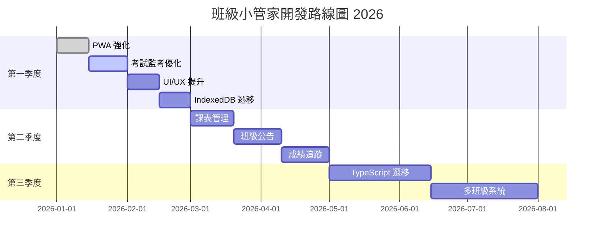

# 班級小管家 - 未來開發建議 📋

> 最後更新：2026-01-13 17:30  
> 當前版本：v2.6.1  
> 本文件提供詳細的未來優化與開發方向建議，供開發參考

---

## 📊 目錄

1. [優先級說明](#優先級說明)
2. [短期優化 (1-2 週)](#短期優化-1-2-週)
3. [中期功能 (1-2 個月)](#中期功能-1-2-個月)
4. [長期規劃 (3-6 個月)](#長期規劃-3-6-個月)
5. [技術債務清理](#技術債務清理)
6. [效能優化](#效能優化)
7. [無障礙與國際化](#無障礙與國際化)
8. [部署與維運](#部署與維運)

---

## 優先級說明

| 優先級 | 圖示 | 說明 |
|--------|------|------|
| 🔴 高 | P0 | 影響核心功能或用戶體驗，需優先處理 |
| 🟡 中 | P1 | 增強功能或改善體驗，可排入近期迭代 |
| 🟢 低 | P2 | 錦上添花的功能，可視資源決定 |

---

## 短期優化 (1-2 週)

### ✅ P0：程式碼品質提升（已完成）

#### 1. ✅ JavaScript 模組化重構（已完成）

> [!TIP]
> 此項目已於 v2.6.0 完成實作

**已實作內容**：
- ✅ 建立 `js/event-bus.js` 事件總線模組
  - 支援 `on`, `once`, `off`, `emit` 方法
  - 事件歷史記錄和除錯模式
  - 預定義事件類型常數 `EventTypes`
- ✅ 統一的模組間事件通訊機制

**完成日期**：2026-01-13

---

#### 2. ✅ 錯誤處理機制完善（已完成）

> [!TIP]
> 此項目已於 v2.6.0 完成實作

**已實作內容**：
- ✅ 建立 `js/error-handler.js` 錯誤處理模組
  - 統一錯誤類型定義（儲存、網路、驗證、渲染等）
  - 友善的中文錯誤訊息顯示
  - 全域錯誤捕獲（unhandledrejection、window.error）
  - 錯誤歷史記錄與匯出功能
  - 包裝函數（`wrap`、`wrapAsync`、`safeExecute`）
  - 資料驗證輔助（`validate`、`assert`）

**完成日期**：2026-01-13

---

### 🟡 P1：考試監考模組優化

#### 3. 新增音效提醒系統
**需求描述**：
- 考試開始/結束音效
- 倒數最後 5 分鐘提醒音
- 休息結束前 1 分鐘提醒

**建議實作**：
```javascript
// 在 exam-proctor.js 中新增
const ExamSounds = {
  sounds: {
    start: new Audio('sounds/exam-start.mp3'),
    end: new Audio('sounds/exam-end.mp3'),
    warning: new Audio('sounds/warning.mp3'),
    break: new Audio('sounds/break.mp3')
  },
  enabled: true,
  
  play(type) {
    if (!this.enabled) return;
    const sound = this.sounds[type];
    if (sound) {
      sound.currentTime = 0;
      sound.play().catch(e => console.log('Audio play failed:', e));
    }
  },
  
  toggle() {
    this.enabled = !this.enabled;
    localStorage.setItem('examSoundEnabled', this.enabled);
    return this.enabled;
  }
};
```

**所需資源**：
- 需準備音效檔案或使用 Web Audio API 產生
- 建議使用 [freesound.org](https://freesound.org/) 取得免費音效

**預估工時**：1 天

---

#### 4. 科目時間衝突檢測
**需求描述**：
- 新增/編輯科目時自動檢測時間衝突
- 衝突時顯示警告並阻止儲存
- 視覺化標記衝突的時段

**建議實作**：
```javascript
function checkTimeConflict(newSubject, existingSubjects) {
  const conflicts = [];
  
  existingSubjects.forEach(subject => {
    if (subject.id === newSubject.id) return;
    
    const newStart = parseTime(newSubject.startTime);
    const newEnd = parseTime(newSubject.endTime);
    const existStart = parseTime(subject.startTime);
    const existEnd = parseTime(subject.endTime);
    
    // 檢測重疊
    if (newStart < existEnd && newEnd > existStart) {
      conflicts.push({
        subject: subject.name,
        time: `${subject.startTime}-${subject.endTime}`
      });
    }
  });
  
  return conflicts;
}

function parseTime(timeStr) {
  const [hours, minutes] = timeStr.split(':').map(Number);
  return hours * 60 + minutes;
}
```

**預估工時**：0.5 天

---

#### 5. 缺考學生名單記錄
**需求描述**：
- 連接學生資料庫
- 記錄每科缺考/請假學生
- 匯出缺考統計報表

**建議資料結構**：
```javascript
const examAttendanceRecord = {
  examId: 'exam_20260113',
  date: '2026-01-13',
  subjects: [
    {
      name: '國語',
      startTime: '08:45',
      endTime: '09:25',
      expected: 28,
      present: 26,
      absent: [
        { studentId: 5, name: '王小明', reason: 'sick', note: '發燒請假' },
        { studentId: 12, name: '李小華', reason: 'other', note: '家中有事' }
      ]
    }
  ]
};
```

**預估工時**：2 天  
**依賴**：需確保學生資料結構統一

---

### 🟡 P1：UI/UX 細節優化

#### 6. 載入狀態統一化
**現狀問題**：
- 各模組載入狀態顯示不一致
- 缺乏骨架屏（Skeleton Screen）

**建議方案**：
```css
/* 新增至 css/main.css */
.skeleton {
  background: linear-gradient(90deg, #f0f0f0 25%, #e0e0e0 50%, #f0f0f0 75%);
  background-size: 200% 100%;
  animation: skeleton-loading 1.5s infinite;
}

@keyframes skeleton-loading {
  0% { background-position: 200% 0; }
  100% { background-position: -200% 0; }
}

.skeleton-text {
  height: 1em;
  border-radius: 4px;
  margin-bottom: 0.5em;
}

.skeleton-avatar {
  width: 40px;
  height: 40px;
  border-radius: 50%;
}
```

```javascript
// 通用骨架屏生成器
function createSkeleton(type, count = 1) {
  const templates = {
    student: `
      <div class="skeleton-card">
        <div class="skeleton skeleton-avatar"></div>
        <div class="skeleton skeleton-text" style="width: 60%"></div>
        <div class="skeleton skeleton-text" style="width: 40%"></div>
      </div>
    `,
    subject: `
      <div class="skeleton-row">
        <div class="skeleton skeleton-text" style="width: 30%"></div>
        <div class="skeleton skeleton-text" style="width: 50%"></div>
      </div>
    `
  };
  
  return templates[type].repeat(count);
}
```

**預估工時**：1 天

---

## 中期功能 (1-2 個月)

### 🔴 P0：資料持久化增強

#### 7. IndexedDB 遷移
**現狀問題**：
- localStorage 有 5MB 限制
- 大量學生資料可能超出限制
- 無法儲存二進位資料（如學生照片）

**建議方案**：
```javascript
// 新增檔案：js/indexed-db.js
const DB_NAME = 'ClassManagerDB';
const DB_VERSION = 1;

class ClassDatabase {
  constructor() {
    this.db = null;
  }
  
  async init() {
    return new Promise((resolve, reject) => {
      const request = indexedDB.open(DB_NAME, DB_VERSION);
      
      request.onerror = () => reject(request.error);
      request.onsuccess = () => {
        this.db = request.result;
        resolve(this);
      };
      
      request.onupgradeneeded = (event) => {
        const db = event.target.result;
        
        // 學生資料表
        if (!db.objectStoreNames.contains('students')) {
          const store = db.createObjectStore('students', { keyPath: 'id' });
          store.createIndex('name', 'name', { unique: false });
          store.createIndex('seatNumber', 'seatNumber', { unique: false });
        }
        
        // 考試記錄表
        if (!db.objectStoreNames.contains('examRecords')) {
          const store = db.createObjectStore('examRecords', { keyPath: 'id' });
          store.createIndex('date', 'date', { unique: false });
        }
        
        // 評分歷史表
        if (!db.objectStoreNames.contains('scoreHistory')) {
          const store = db.createObjectStore('scoreHistory', { keyPath: 'id' });
          store.createIndex('studentId', 'studentId', { unique: false });
          store.createIndex('timestamp', 'timestamp', { unique: false });
        }
      };
    });
  }
  
  async getAll(storeName) {
    return new Promise((resolve, reject) => {
      const transaction = this.db.transaction(storeName, 'readonly');
      const store = transaction.objectStore(storeName);
      const request = store.getAll();
      
      request.onerror = () => reject(request.error);
      request.onsuccess = () => resolve(request.result);
    });
  }
  
  async put(storeName, data) {
    return new Promise((resolve, reject) => {
      const transaction = this.db.transaction(storeName, 'readwrite');
      const store = transaction.objectStore(storeName);
      const request = store.put(data);
      
      request.onerror = () => reject(request.error);
      request.onsuccess = () => resolve(request.result);
    });
  }
  
  async delete(storeName, key) {
    return new Promise((resolve, reject) => {
      const transaction = this.db.transaction(storeName, 'readwrite');
      const store = transaction.objectStore(storeName);
      const request = store.delete(key);
      
      request.onerror = () => reject(request.error);
      request.onsuccess = () => resolve(request.result);
    });
  }
}

// 全域實例
const classDB = new ClassDatabase();
```

**遷移策略**：
1. 建立 IndexedDB 架構
2. 保留 localStorage 作為備份
3. 首次載入時自動遷移資料
4. 逐步移除 localStorage 依賴

**預估工時**：5-7 天

---

#### 8. Firebase 離線支援
**需求描述**：
- 支援離線使用
- 連線恢復後自動同步
- 衝突解決機制

**建議方案**：
```javascript
// 修改 js/firebase-sync.js
import { enableIndexedDbPersistence } from 'firebase/firestore';

// 啟用離線持久化
async function initOfflineSupport() {
  try {
    await enableIndexedDbPersistence(db);
    console.log('離線支援已啟用');
  } catch (err) {
    if (err.code === 'failed-precondition') {
      console.warn('多個分頁開啟，離線支援僅在一個分頁生效');
    } else if (err.code === 'unimplemented') {
      console.warn('瀏覽器不支援離線持久化');
    }
  }
}

// 網路狀態監聽
function setupNetworkListener() {
  window.addEventListener('online', () => {
    showNotification('網路已恢復，開始同步資料', 'success');
    syncPendingChanges();
  });
  
  window.addEventListener('offline', () => {
    showNotification('目前處於離線模式', 'warning');
  });
}

// 待同步變更追蹤
const pendingChanges = [];

function trackChange(collection, docId, data, action) {
  if (!navigator.onLine) {
    pendingChanges.push({ collection, docId, data, action, timestamp: Date.now() });
    localStorage.setItem('pendingChanges', JSON.stringify(pendingChanges));
  }
}

async function syncPendingChanges() {
  const pending = JSON.parse(localStorage.getItem('pendingChanges') || '[]');
  
  for (const change of pending) {
    try {
      if (change.action === 'set') {
        await setDoc(doc(db, change.collection, change.docId), change.data);
      } else if (change.action === 'update') {
        await updateDoc(doc(db, change.collection, change.docId), change.data);
      } else if (change.action === 'delete') {
        await deleteDoc(doc(db, change.collection, change.docId));
      }
    } catch (error) {
      console.error('同步失敗:', change, error);
      // 保留失敗的變更供重試
      continue;
    }
  }
  
  localStorage.removeItem('pendingChanges');
}
```

**預估工時**：4-5 天

---

### 🟡 P1：新功能模組

#### 9. 課表管理模組
**需求描述**：
- 視覺化課表編輯
- 支援多班級課表
- 整合考試監考時間

**功能規劃**：
```
📅 課表管理
├── 🗓️ 週課表顯示
│   ├── 拖拽編輯課程
│   ├── 顏色區分科目
│   └── 顯示任課教師
├── 📋 課表範本
│   ├── 預設範本
│   └── 自訂範本儲存
├── 🔄 課表切換
│   ├── 正課課表
│   └── 段考/特殊課表
└── 📤 匯出功能
    ├── 匯出圖片
    └── 匯出 PDF
```

**建議 UI 設計**：
```html
<!-- 課表網格結構 -->
<div class="timetable-grid">
  <div class="timetable-header">
    <div class="time-col">時間</div>
    <div class="day-col">週一</div>
    <div class="day-col">週二</div>
    <!-- ... -->
  </div>
  <div class="timetable-body">
    <div class="time-row">
      <div class="time-cell">08:00-08:45</div>
      <div class="class-cell" data-day="1" data-period="1">
        <span class="subject-tag" style="background: var(--subject-chinese)">
          國語
        </span>
      </div>
      <!-- ... -->
    </div>
  </div>
</div>
```

**預估工時**：7-10 天  
**新增檔案**：`js/timetable.js`

---

#### 10. 班級公告系統
**需求描述**：
- 發布班級公告
- 重要通知置頂
- 公告到期自動隱藏

**功能規劃**：
```javascript
const Announcement = {
  types: {
    GENERAL: { icon: '📢', color: '#6366f1', label: '一般公告' },
    URGENT: { icon: '🚨', color: '#ef4444', label: '緊急通知' },
    EVENT: { icon: '🎉', color: '#22c55e', label: '活動通知' },
    HOMEWORK: { icon: '📚', color: '#f59e0b', label: '作業提醒' }
  },
  
  create(data) {
    return {
      id: Date.now().toString(),
      type: data.type || 'GENERAL',
      title: data.title,
      content: data.content,
      isPinned: data.isPinned || false,
      createdAt: new Date().toISOString(),
      expiresAt: data.expiresAt || null,
      attachments: data.attachments || []
    };
  },
  
  // 取得有效公告（過濾過期）
  getActive() {
    const now = new Date();
    return announcements.filter(a => {
      if (!a.expiresAt) return true;
      return new Date(a.expiresAt) > now;
    }).sort((a, b) => {
      // 置頂優先，再按時間排序
      if (a.isPinned !== b.isPinned) return b.isPinned - a.isPinned;
      return new Date(b.createdAt) - new Date(a.createdAt);
    });
  }
};
```

**預估工時**：4-5 天  
**新增檔案**：`js/announcement.js`

---

#### 11. 學生成績追蹤
**需求描述**：
- 記錄各科成績
- 成績趨勢圖表
- 成績單匯出

**功能規劃**：
```javascript
// 成績資料結構
const GradeRecord = {
  studentId: '',
  examId: '', // 段考/平時考識別
  examType: 'midterm', // midterm, final, quiz
  examDate: '',
  scores: [
    { subject: 'chinese', score: 95, fullScore: 100 },
    { subject: 'math', score: 88, fullScore: 100 },
    // ...
  ],
  rank: 5,
  totalStudents: 28,
  comments: ''
};

// 成績統計
const GradeAnalytics = {
  // 計算平均分
  calculateAverage(grades, subject = null) {
    const relevantScores = grades
      .flatMap(g => g.scores)
      .filter(s => !subject || s.subject === subject)
      .map(s => s.score);
    
    return relevantScores.reduce((a, b) => a + b, 0) / relevantScores.length;
  },
  
  // 計算進步幅度
  calculateProgress(studentId, subject) {
    const studentGrades = grades
      .filter(g => g.studentId === studentId)
      .sort((a, b) => new Date(a.examDate) - new Date(b.examDate));
    
    if (studentGrades.length < 2) return null;
    
    const getScore = (grade) => 
      grade.scores.find(s => s.subject === subject)?.score || 0;
    
    const first = getScore(studentGrades[0]);
    const last = getScore(studentGrades[studentGrades.length - 1]);
    
    return { change: last - first, percentage: ((last - first) / first * 100).toFixed(1) };
  },
  
  // 產生班級報表
  generateClassReport(examId) {
    // 產生各科統計、排名等
  }
};
```

**預估工時**：7-10 天  
**新增檔案**：`js/grade-tracker.js`  
**依賴**：需整合 Chart.js 或 D3.js 做圖表

---

### 🟢 P2：體驗增強

#### 12. 手勢操作支援
**需求描述**：
- 觸控滑動切換功能區
- 長按編輯項目
- 雙指縮放時鐘

**建議實作**：
```javascript
// 新增檔案：js/gesture-handler.js
class GestureHandler {
  constructor(element, options = {}) {
    this.element = element;
    this.options = {
      swipeThreshold: 50,
      longPressDelay: 500,
      ...options
    };
    
    this.touchStartX = 0;
    this.touchStartY = 0;
    this.longPressTimer = null;
    
    this.bindEvents();
  }
  
  bindEvents() {
    this.element.addEventListener('touchstart', this.handleTouchStart.bind(this));
    this.element.addEventListener('touchend', this.handleTouchEnd.bind(this));
    this.element.addEventListener('touchmove', this.handleTouchMove.bind(this));
  }
  
  handleTouchStart(e) {
    this.touchStartX = e.touches[0].clientX;
    this.touchStartY = e.touches[0].clientY;
    
    this.longPressTimer = setTimeout(() => {
      this.options.onLongPress?.(e);
    }, this.options.longPressDelay);
  }
  
  handleTouchMove(e) {
    clearTimeout(this.longPressTimer);
  }
  
  handleTouchEnd(e) {
    clearTimeout(this.longPressTimer);
    
    const touchEndX = e.changedTouches[0].clientX;
    const touchEndY = e.changedTouches[0].clientY;
    
    const deltaX = touchEndX - this.touchStartX;
    const deltaY = touchEndY - this.touchStartY;
    
    if (Math.abs(deltaX) > this.options.swipeThreshold) {
      if (deltaX > 0) {
        this.options.onSwipeRight?.(e);
      } else {
        this.options.onSwipeLeft?.(e);
      }
    }
    
    if (Math.abs(deltaY) > this.options.swipeThreshold) {
      if (deltaY > 0) {
        this.options.onSwipeDown?.(e);
      } else {
        this.options.onSwipeUp?.(e);
      }
    }
  }
}

// 使用範例
const contentArea = document.querySelector('.content-area');
new GestureHandler(contentArea, {
  onSwipeLeft: () => switchToNextTab(),
  onSwipeRight: () => switchToPrevTab(),
  onLongPress: (e) => showContextMenu(e)
});
```

**預估工時**：2-3 天

---

#### 13. 語音指令整合
**需求描述**：
- 語音抽籤：「抽一個人」
- 語音計時：「設定 5 分鐘」
- 語音加分：「王小明加 5 分」

**建議實作**：
```javascript
// 新增檔案：js/voice-commands.js
class VoiceCommands {
  constructor() {
    this.recognition = null;
    this.isListening = false;
    this.commands = new Map();
    
    this.initRecognition();
    this.registerCommands();
  }
  
  initRecognition() {
    const SpeechRecognition = window.SpeechRecognition || window.webkitSpeechRecognition;
    if (!SpeechRecognition) {
      console.warn('瀏覽器不支援語音辨識');
      return;
    }
    
    this.recognition = new SpeechRecognition();
    this.recognition.lang = 'zh-TW';
    this.recognition.continuous = false;
    this.recognition.interimResults = false;
    
    this.recognition.onresult = (event) => {
      const transcript = event.results[0][0].transcript;
      console.log('語音辨識結果:', transcript);
      this.processCommand(transcript);
    };
    
    this.recognition.onerror = (event) => {
      console.error('語音辨識錯誤:', event.error);
      this.isListening = false;
    };
    
    this.recognition.onend = () => {
      this.isListening = false;
    };
  }
  
  registerCommands() {
    // 抽籤相關
    this.commands.set(/抽(一個|一位|1個)?人?/, () => {
      startLottery(1);
    });
    
    this.commands.set(/抽(\d+)個人/, (match) => {
      const count = parseInt(match[1]);
      startLottery(count);
    });
    
    // 計時相關
    this.commands.set(/計時(\d+)分鐘?/, (match) => {
      const minutes = parseInt(match[1]);
      setTimer(minutes * 60);
      startTimer();
    });
    
    // 加分相關
    this.commands.set(/(.+)(加|扣)(\d+)分/, (match) => {
      const studentName = match[1].trim();
      const isAdd = match[2] === '加';
      const points = parseInt(match[3]);
      
      const student = findStudentByName(studentName);
      if (student) {
        adjustScore(student.id, isAdd ? points : -points);
      }
    });
  }
  
  processCommand(transcript) {
    for (const [pattern, handler] of this.commands) {
      const match = transcript.match(pattern);
      if (match) {
        handler(match);
        showNotification(`已執行: ${transcript}`, 'success');
        return;
      }
    }
    showNotification('無法辨識指令', 'warning');
  }
  
  start() {
    if (!this.recognition) return;
    this.recognition.start();
    this.isListening = true;
    showNotification('請說出指令...', 'info');
  }
  
  stop() {
    if (!this.recognition) return;
    this.recognition.stop();
    this.isListening = false;
  }
}

// 全域實例
const voiceCommands = new VoiceCommands();
```

**預估工時**：3-4 天  
**注意事項**：
- 需 HTTPS 環境或 localhost
- 部分瀏覽器可能不支援

---

## 長期規劃 (3-6 個月)

### 🔴 P0：架構升級

#### 14. TypeScript 遷移
**現狀問題**：
- 缺乏型別檢查
- IDE 自動補全有限
- 大型專案維護困難

**遷移計劃**：

**Phase 1：基礎設置 (1 週)**
1. 安裝 TypeScript：`npm install -D typescript`
2. 建立 `tsconfig.json`
3. 添加基本型別定義

```typescript
// types/student.d.ts
interface Student {
  id: string;
  name: string;
  seatNumber: number;
  avatar: string;
  score: number;
  tags: StudentTag[];
  createdAt: string;
  updatedAt: string;
}

type StudentTag = 'leader' | 'monitor' | 'tutor' | 'special' | 'president' | 'vicePresident';

interface ScoreHistory {
  id: string;
  studentId: string;
  change: number;
  reason: string;
  timestamp: string;
}
```

**Phase 2：核心模組遷移 (2-3 週)**
```
優先順序：
1. app-state.ts (狀態管理)
2. storage-manager.ts (資料儲存)
3. utils.ts (工具函數)
4. 各功能模組...
```

**Phase 3：建置流程 (1 週)**
- 設定 Webpack 或 Vite
- 配置 source maps
- 設定 lint 規則

**預估工時**：4-6 週

---

#### 15. Web Components 重構
**需求描述**：
- 建立可重用 UI 元件
- 元件封裝與隔離
- 跨專案共用

**建議元件清單**：
```
📦 Web Components
├── <class-student-card>     學生卡片
├── <class-timer>            計時器
├── <class-lottery-wheel>    抽籤輪盤
├── <class-leaderboard>      排行榜
├── <class-notification>     通知訊息
├── <class-modal>            彈窗
├── <class-timetable>        課表
└── <class-score-badge>      分數徽章
```

**範例元件**：
```javascript
// components/student-card.js
class StudentCard extends HTMLElement {
  constructor() {
    super();
    this.attachShadow({ mode: 'open' });
  }
  
  static get observedAttributes() {
    return ['student-id', 'name', 'avatar', 'score'];
  }
  
  connectedCallback() {
    this.render();
  }
  
  attributeChangedCallback(name, oldValue, newValue) {
    if (oldValue !== newValue) {
      this.render();
    }
  }
  
  render() {
    const name = this.getAttribute('name') || '';
    const avatar = this.getAttribute('avatar') || '👤';
    const score = this.getAttribute('score') || '0';
    
    this.shadowRoot.innerHTML = `
      <style>
        :host {
          display: block;
          padding: 1rem;
          border-radius: 12px;
          background: var(--card-bg, white);
          box-shadow: 0 2px 8px rgba(0,0,0,0.1);
          transition: transform 0.2s;
        }
        :host(:hover) {
          transform: translateY(-2px);
        }
        .avatar {
          font-size: 2rem;
          margin-bottom: 0.5rem;
        }
        .name {
          font-weight: 600;
          color: var(--text-primary, #333);
        }
        .score {
          color: var(--primary-color, #6366f1);
          font-weight: 700;
        }
      </style>
      <div class="card">
        <div class="avatar">${avatar}</div>
        <div class="name">${name}</div>
        <div class="score">${score} 分</div>
      </div>
    `;
  }
}

customElements.define('class-student-card', StudentCard);
```

**預估工時**：6-8 週

---

### 🟡 P1：多租戶支援

#### 16. 多班級/多帳號系統
**需求描述**：
- 教師可管理多個班級
- 班級資料完全隔離
- 快速切換班級

**建議架構**：
```javascript
// 多班級資料結構
const UserData = {
  userId: 'teacher_001',
  name: '王老師',
  classes: [
    {
      classId: 'class_501',
      className: '501班',
      studentCount: 28,
      lastAccessed: '2026-01-13T10:00:00Z'
    },
    {
      classId: 'class_502',
      className: '502班',
      studentCount: 30,
      lastAccessed: '2026-01-12T15:30:00Z'
    }
  ],
  currentClassId: 'class_501',
  settings: {
    theme: 'dark',
    notifications: true
  }
};

// 班級資料結構
const ClassData = {
  classId: 'class_501',
  className: '501班',
  ownerId: 'teacher_001',
  students: [...],
  schedules: [...],
  announcements: [...],
  settings: {
    defaultScoreChange: 1,
    autoBackup: true
  }
};

// 班級切換
async function switchClass(classId) {
  // 1. 儲存當前班級資料
  await saveCurrentClassData();
  
  // 2. 載入新班級資料
  const classData = await loadClassData(classId);
  
  // 3. 更新全域狀態
  AppState.set('currentClass', classData);
  AppState.set('students', classData.students);
  
  // 4. 重新渲染 UI
  renderAllViews();
  
  // 5. 更新最後存取時間
  updateLastAccessed(classId);
}
```

**預估工時**：8-10 週

---

### 🟢 P2：進階功能

#### 17. AI 助教整合
**需求描述**：
- 智慧分組建議
- 學習狀況分析
- 評語生成

**可行方案**：
1. **OpenAI API** - 評語生成
2. **TensorFlow.js** - 本地分析模型
3. **Firebase ML** - 雲端機器學習

```javascript
// AI 評語生成範例
async function generateComment(studentData) {
  const prompt = `
    學生資訊：
    - 姓名：${studentData.name}
    - 總分：${studentData.score}
    - 優點標籤：${studentData.tags.join(', ')}
    - 最近表現：${studentData.recentScores.join(', ')}
    
    請生成一段 50-100 字的期末評語，語氣親切正面。
  `;
  
  const response = await fetch('https://api.openai.com/v1/chat/completions', {
    method: 'POST',
    headers: {
      'Content-Type': 'application/json',
      'Authorization': `Bearer ${API_KEY}`
    },
    body: JSON.stringify({
      model: 'gpt-3.5-turbo',
      messages: [{ role: 'user', content: prompt }],
      max_tokens: 200
    })
  });
  
  const data = await response.json();
  return data.choices[0].message.content;
}
```

**預估工時**：4-6 週  
**注意事項**：
- API 費用考量
- 資料隱私問題
- 需要使用者同意

---

## 技術債務清理

### 18. Console Log 清理
**現狀**：開發用的 console.log 散落各處

**解決方案**：
```javascript
// js/logger.js
const Logger = {
  isDev: window.location.hostname === 'localhost',
  
  log(...args) {
    if (this.isDev) console.log('[LOG]', ...args);
  },
  
  warn(...args) {
    if (this.isDev) console.warn('[WARN]', ...args);
  },
  
  error(...args) {
    console.error('[ERROR]', ...args);
    // 生產環境也記錄錯誤
    this.report('error', args);
  },
  
  info(...args) {
    if (this.isDev) console.info('[INFO]', ...args);
  },
  
  report(level, args) {
    // 未來可接錯誤收集服務
  }
};

// 使用
Logger.log('學生資料載入完成', students.length);
Logger.error('資料儲存失敗', error);
```

**預估工時**：1 天

---

### 19. CSS 架構優化
**現狀**：
- 混用 Tailwind CDN 與自訂 CSS
- 樣式分散在多個檔案
- 部分樣式內嵌在 JS 中

**建議方案**：
```
css/
├── base/
│   ├── reset.css        # 重置樣式
│   ├── typography.css   # 字體樣式
│   └── variables.css    # CSS 變數
├── components/
│   ├── buttons.css
│   ├── cards.css
│   ├── modals.css
│   └── forms.css
├── layouts/
│   ├── grid.css
│   ├── nav.css
│   └── sidebar.css
├── utilities/
│   ├── spacing.css
│   ├── colors.css
│   └── animations.css
└── main.css             # 入口檔案
```

**CSS 變數整理**：
```css
/* css/base/variables.css */
:root {
  /* 色彩系統 */
  --primary-50: #eef2ff;
  --primary-100: #e0e7ff;
  --primary-500: #6366f1;
  --primary-600: #4f46e5;
  --primary-700: #4338ca;
  
  --success-500: #22c55e;
  --warning-500: #f59e0b;
  --danger-500: #ef4444;
  
  /* 間距系統 */
  --space-1: 0.25rem;
  --space-2: 0.5rem;
  --space-3: 0.75rem;
  --space-4: 1rem;
  --space-6: 1.5rem;
  --space-8: 2rem;
  
  /* 圓角 */
  --radius-sm: 4px;
  --radius-md: 8px;
  --radius-lg: 12px;
  --radius-xl: 16px;
  --radius-full: 9999px;
  
  /* 陰影 */
  --shadow-sm: 0 1px 2px rgba(0,0,0,0.05);
  --shadow-md: 0 4px 6px rgba(0,0,0,0.1);
  --shadow-lg: 0 10px 15px rgba(0,0,0,0.1);
  
  /* 動畫 */
  --transition-fast: 150ms ease;
  --transition-normal: 250ms ease;
  --transition-slow: 350ms ease;
}

[data-theme="dark"] {
  --bg-primary: #0f172a;
  --bg-secondary: #1e293b;
  --text-primary: #f8fafc;
  --text-secondary: #94a3b8;
}
```

**預估工時**：3-5 天

---

### 20. HTML 拆分
**現狀**：`classnew.html` 達 5000+ 行

**建議方案**：
使用 HTML Imports 或建置工具組合

```
templates/
├── header.html
├── sidebar.html
├── student-section.html
├── timer-section.html
├── lottery-section.html
├── exam-section.html
├── notebook-section.html
├── homework-section.html
└── modals/
    ├── add-student-modal.html
    ├── settings-modal.html
    └── backup-modal.html
```

**使用 JavaScript 載入**：
```javascript
// js/template-loader.js
async function loadTemplate(name) {
  const response = await fetch(`templates/${name}.html`);
  if (!response.ok) throw new Error(`Template ${name} not found`);
  return response.text();
}

async function renderSection(containerId, templateName) {
  const container = document.getElementById(containerId);
  const template = await loadTemplate(templateName);
  container.innerHTML = template;
}

// 初始化
async function initApp() {
  await Promise.all([
    renderSection('header-container', 'header'),
    renderSection('sidebar-container', 'sidebar'),
    renderSection('main-container', 'student-section')
  ]);
  
  // 初始化各模組
  initModules();
}
```

**預估工時**：4-5 天

---

## 效能優化

### 21. 虛擬列表
**適用場景**：學生列表超過 50 人

```javascript
// js/virtual-list.js
class VirtualList {
  constructor(container, options) {
    this.container = container;
    this.itemHeight = options.itemHeight || 60;
    this.bufferSize = options.bufferSize || 5;
    this.items = [];
    this.renderItem = options.renderItem;
    
    this.init();
  }
  
  init() {
    this.container.style.overflow = 'auto';
    this.container.style.position = 'relative';
    
    this.innerContainer = document.createElement('div');
    this.container.appendChild(this.innerContainer);
    
    this.container.addEventListener('scroll', () => this.onScroll());
  }
  
  setItems(items) {
    this.items = items;
    this.innerContainer.style.height = `${items.length * this.itemHeight}px`;
    this.onScroll();
  }
  
  onScroll() {
    const scrollTop = this.container.scrollTop;
    const viewportHeight = this.container.clientHeight;
    
    const startIndex = Math.max(0, Math.floor(scrollTop / this.itemHeight) - this.bufferSize);
    const endIndex = Math.min(
      this.items.length,
      Math.ceil((scrollTop + viewportHeight) / this.itemHeight) + this.bufferSize
    );
    
    this.render(startIndex, endIndex);
  }
  
  render(startIndex, endIndex) {
    const fragment = document.createDocumentFragment();
    
    for (let i = startIndex; i < endIndex; i++) {
      const itemEl = this.renderItem(this.items[i], i);
      itemEl.style.position = 'absolute';
      itemEl.style.top = `${i * this.itemHeight}px`;
      itemEl.style.left = '0';
      itemEl.style.right = '0';
      fragment.appendChild(itemEl);
    }
    
    this.innerContainer.innerHTML = '';
    this.innerContainer.appendChild(fragment);
  }
}
```

**預估工時**：2 天

---

### 22. 圖片懶載入
**適用場景**：學生頭像

```javascript
// js/lazy-load.js
const lazyLoadObserver = new IntersectionObserver((entries) => {
  entries.forEach(entry => {
    if (entry.isIntersecting) {
      const img = entry.target;
      if (img.dataset.src) {
        img.src = img.dataset.src;
        img.removeAttribute('data-src');
        lazyLoadObserver.unobserve(img);
      }
    }
  });
}, {
  rootMargin: '50px 0px'
});

function initLazyLoad() {
  document.querySelectorAll('img[data-src]').forEach(img => {
    lazyLoadObserver.observe(img);
  });
}
```

---

### 23. 資料快取策略
```javascript
// js/cache-manager.js
class CacheManager {
  constructor(cacheKey, ttl = 5 * 60 * 1000) { // 預設 5 分鐘
    this.cacheKey = cacheKey;
    this.ttl = ttl;
  }
  
  get(key) {
    const cached = localStorage.getItem(`${this.cacheKey}_${key}`);
    if (!cached) return null;
    
    const { data, timestamp } = JSON.parse(cached);
    if (Date.now() - timestamp > this.ttl) {
      this.delete(key);
      return null;
    }
    
    return data;
  }
  
  set(key, data) {
    localStorage.setItem(`${this.cacheKey}_${key}`, JSON.stringify({
      data,
      timestamp: Date.now()
    }));
  }
  
  delete(key) {
    localStorage.removeItem(`${this.cacheKey}_${key}`);
  }
  
  clear() {
    Object.keys(localStorage)
      .filter(key => key.startsWith(this.cacheKey))
      .forEach(key => localStorage.removeItem(key));
  }
}
```

---

## 無障礙與國際化

### 24. 無障礙 (a11y) 改善

**檢查項目**：
- [ ] 所有互動元素可用鍵盤操作
- [ ] 圖片有適當 alt 文字
- [ ] 色彩對比度符合 WCAG 2.1 AA
- [ ] 表單欄位有關聯 label
- [ ] ARIA 屬性正確使用

**範例改善**：
```html
<!-- 改善前 -->
<div onclick="addScore(1)">+</div>

<!-- 改善後 -->
<button 
  onclick="addScore(1)"
  aria-label="加 1 分"
  class="score-btn"
  tabindex="0"
>
  <span aria-hidden="true">+</span>
</button>
```

**預估工時**：3-4 天

---

### 25. 國際化 (i18n) 支援

**建議結構**：
```javascript
// js/i18n.js
const translations = {
  'zh-TW': {
    common: {
      save: '儲存',
      cancel: '取消',
      delete: '刪除',
      edit: '編輯',
      confirm: '確認'
    },
    student: {
      add: '新增學生',
      name: '姓名',
      seatNumber: '座號',
      score: '分數'
    },
    timer: {
      start: '開始',
      pause: '暫停',
      reset: '重置',
      minutes: '分鐘',
      seconds: '秒'
    }
  },
  'en': {
    common: {
      save: 'Save',
      cancel: 'Cancel',
      delete: 'Delete',
      edit: 'Edit',
      confirm: 'Confirm'
    },
    // ...
  }
};

class I18n {
  constructor(locale = 'zh-TW') {
    this.locale = locale;
    this.translations = translations;
  }
  
  t(key) {
    const keys = key.split('.');
    let value = this.translations[this.locale];
    
    for (const k of keys) {
      value = value?.[k];
    }
    
    return value || key;
  }
  
  setLocale(locale) {
    this.locale = locale;
    localStorage.setItem('locale', locale);
    this.updateDOM();
  }
  
  updateDOM() {
    document.querySelectorAll('[data-i18n]').forEach(el => {
      const key = el.dataset.i18n;
      el.textContent = this.t(key);
    });
  }
}

const i18n = new I18n();
```

**使用方式**：
```html
<button data-i18n="common.save">儲存</button>
```

**預估工時**：5-7 天

---

## 部署與維運

### 26. CI/CD 流程建立

**GitHub Actions 範例**：
```yaml
# .github/workflows/deploy.yml
name: Deploy to GitHub Pages

on:
  push:
    branches: [main]

jobs:
  deploy:
    runs-on: ubuntu-latest
    
    steps:
      - uses: actions/checkout@v4
      
      - name: Setup Node.js
        uses: actions/setup-node@v4
        with:
          node-version: '20'
          
      - name: Install dependencies
        run: npm ci
        
      - name: Build
        run: npm run build
        
      - name: Run tests
        run: npm test
        
      - name: Deploy
        uses: peaceiris/actions-gh-pages@v3
        with:
          github_token: ${{ secrets.GITHUB_TOKEN }}
          publish_dir: ./dist
```

---

### 27. 環境變數管理

```javascript
// config/env.js
const ENV = {
  development: {
    apiUrl: 'http://localhost:3000',
    firebaseConfig: {
      // 開發環境 Firebase 設定
    },
    enableDebug: true
  },
  production: {
    apiUrl: 'https://api.classmanager.app',
    firebaseConfig: {
      // 生產環境 Firebase 設定
    },
    enableDebug: false
  }
};

const currentEnv = window.location.hostname === 'localhost' 
  ? 'development' 
  : 'production';

export default ENV[currentEnv];
```

---

### 28. 錯誤監控整合

**Sentry 整合範例**：
```javascript
// js/error-monitoring.js
import * as Sentry from '@sentry/browser';

Sentry.init({
  dsn: 'YOUR_SENTRY_DSN',
  environment: currentEnv,
  release: 'class-manager@2.4.0',
  
  beforeSend(event) {
    // 過濾敏感資料
    if (event.user) {
      delete event.user.email;
    }
    return event;
  }
});

// 手動捕捉錯誤
function captureError(error, context = {}) {
  Sentry.captureException(error, {
    extra: context
  });
}
```

---

## 📋 優先級總覽

| 優先級 | 項目 | 預估工時 | 依賴 |
|--------|------|----------|------|
| 🔴 P0 | JavaScript 模組化重構 | 3-4 天 | - |
| 🔴 P0 | 錯誤處理機制 | 2 天 | - |
| 🔴 P0 | IndexedDB 遷移 | 5-7 天 | 模組化 |
| 🟡 P1 | 音效提醒系統 | 1 天 | - |
| 🟡 P1 | 科目時間衝突檢測 | 0.5 天 | - |
| 🟡 P1 | 缺考學生記錄 | 2 天 | - |
| 🟡 P1 | 載入狀態統一化 | 1 天 | - |
| 🟡 P1 | Firebase 離線支援 | 4-5 天 | - |
| 🟡 P1 | 課表管理模組 | 7-10 天 | - |
| 🟡 P1 | 班級公告系統 | 4-5 天 | - |
| 🟡 P1 | 學生成績追蹤 | 7-10 天 | - |
| 🟢 P2 | 手勢操作支援 | 2-3 天 | - |
| 🟢 P2 | 語音指令 | 3-4 天 | - |
| 🔴 P0 | TypeScript 遷移 | 4-6 週 | 模組化 |
| 🟡 P1 | 多班級系統 | 8-10 週 | TS 遷移 |
| 🟢 P2 | AI 助教整合 | 4-6 週 | - |

---

## 🎯 建議執行順序

### ✅ 第一階段（1-2 週）- 已完成
1. ✅ JavaScript 模組化重構 - `js/event-bus.js` 已建立
2. ✅ 錯誤處理機制 - `js/error-handler.js` 已建立
3. ⬜ Console Log 清理 - 待處理
4. ⬜ CSS 架構優化 - 待處理

### 🔄 第二階段（3-4 週）- 進行中
1. 🔄 考試監考優化
   - ⬜ 音效提醒系統
   - ⬜ 科目時間衝突檢測
   - ⬜ 缺考學生名單記錄
   - ✅ RWD 佈局優化 - 已完成
   - ✅ 圓形時鐘切換 - 已完成
   - ✅ 深色模式時鐘顏色 - 已完成
2. ⬜ 載入狀態統一化
3. ⬜ IndexedDB 遷移

### ⬜ 第三階段（5-8 週）
1. ⬜ Firebase 離線支援
2. ⬜ 課表管理模組
3. ⬜ 班級公告系統

### ⬜ 第四階段（9-12 週）
1. ⬜ 學生成績追蹤
2. ⬜ 無障礙改善
3. ⬜ CI/CD 建立

### 長期目標（3-6 個月）
1. TypeScript 遷移
2. Web Components 重構
3. 多班級/多帳號系統

---

## 📊 完成進度統計

| 階段 | 完成項目 | 總項目 | 進度 |
|------|----------|--------|------|
| 第一階段 | 2 | 4 | 50% |
| 第二階段 | 3 | 6 | 50% |
| 第三階段 | 0 | 3 | 0% |
| 第四階段 | 0 | 3 | 0% |
| **總計** | **5** | **16** | **31%** |

---

> 📝 **備註**：本文件為開發參考，實際執行時間可能因專案狀況調整。建議每完成一個階段後更新此文件，記錄實際進度與遇到的問題。

> 📅 **最後更新**：2026-01-13 17:30 by Antigravity AI

---

## 🆕 2026 新增開發建議

> [!IMPORTANT]
> 以下為 2026-01-13 新增的開發建議，基於目前專案狀態與功能需求整理

---

### 🔧 P0：PWA 與離線功能強化

#### 29. Service Worker 快取策略優化
**現狀**：
- 基礎 PWA 已實作（manifest.json、icons）
- Service Worker 可能有快取路徑問題

**建議方案**：
```javascript
// sw.js 優化版
const CACHE_NAME = 'class-manager-v2.6.1';
const ASSETS_TO_CACHE = [
  './',
  './index.html',
  './classnew.html',
  './css/main.css',
  './css/rwd-breakpoints.css',
  './js/app-state.js',
  './js/event-bus.js',
  './js/error-handler.js',
  // ... 其他資源
];

// 網路優先策略（適合動態內容）
async function networkFirst(request) {
  try {
    const networkResponse = await fetch(request);
    const cache = await caches.open(CACHE_NAME);
    cache.put(request, networkResponse.clone());
    return networkResponse;
  } catch (error) {
    const cachedResponse = await caches.match(request);
    return cachedResponse || new Response('Offline', { status: 503 });
  }
}

// 快取優先策略（適合靜態資源）
async function cacheFirst(request) {
  const cachedResponse = await caches.match(request);
  if (cachedResponse) return cachedResponse;
  
  const networkResponse = await fetch(request);
  const cache = await caches.open(CACHE_NAME);
  cache.put(request, networkResponse.clone());
  return networkResponse;
}
```

**預估工時**：1-2 天

---

#### 30. PWA 安裝引導優化
**需求描述**：
- 更友善的「加入主畫面」引導
- iOS/Android 分別處理
- 安裝後隱藏提示

**建議實作**：
```javascript
// js/pwa-install.js
class PWAInstaller {
  constructor() {
    this.deferredPrompt = null;
    this.isInstalled = this.checkIfInstalled();
    
    window.addEventListener('beforeinstallprompt', (e) => {
      e.preventDefault();
      this.deferredPrompt = e;
      this.showInstallPrompt();
    });
  }
  
  checkIfInstalled() {
    return window.matchMedia('(display-mode: standalone)').matches
      || window.navigator.standalone === true;
  }
  
  showInstallPrompt() {
    if (this.isInstalled) return;
    
    const isIOS = /iPad|iPhone|iPod/.test(navigator.userAgent);
    
    if (isIOS) {
      this.showIOSGuide();
    } else {
      this.showAndroidPrompt();
    }
  }
  
  showIOSGuide() {
    const guide = document.createElement('div');
    guide.className = 'pwa-ios-guide';
    guide.innerHTML = `
      <div class="guide-content">
        <button class="close-btn" onclick="this.parentElement.parentElement.remove()">×</button>
        <p>📱 將「班級小管家」加入主畫面：</p>
        <ol>
          <li>點擊底部 <span class="share-icon">⬆️</span> 分享按鈕</li>
          <li>選擇「加入主畫面」</li>
        </ol>
      </div>
    `;
    document.body.appendChild(guide);
  }
  
  async showAndroidPrompt() {
    if (!this.deferredPrompt) return;
    
    const result = await this.deferredPrompt.prompt();
    if (result.outcome === 'accepted') {
      localStorage.setItem('pwaInstalled', 'true');
    }
    this.deferredPrompt = null;
  }
}
```

**預估工時**：1 天

---

### 🟡 P1：考試監考模式進階功能

#### 31. 考試音效提醒系統
**需求描述**：
- 考試開始/結束音效
- 最後 5 分鐘警示音
- 休息結束前 1 分鐘提醒
- 音量控制

**建議實作**：
```javascript
// 在 exam-proctor.js 中新增
const ExamSounds = {
  sounds: {
    start: null,
    end: null,
    warning: null,
    break: null
  },
  
  enabled: localStorage.getItem('examSoundEnabled') !== 'false',
  volume: parseFloat(localStorage.getItem('examSoundVolume') || '0.5'),
  
  // 使用 Web Audio API 產生簡單音效
  createTone(frequency, duration, type = 'sine') {
    const audioCtx = new (window.AudioContext || window.webkitAudioContext)();
    const oscillator = audioCtx.createOscillator();
    const gainNode = audioCtx.createGain();
    
    oscillator.connect(gainNode);
    gainNode.connect(audioCtx.destination);
    
    oscillator.frequency.value = frequency;
    oscillator.type = type;
    gainNode.gain.value = this.volume;
    
    oscillator.start();
    setTimeout(() => {
      gainNode.gain.exponentialRampToValueAtTime(0.001, audioCtx.currentTime + 0.5);
      setTimeout(() => oscillator.stop(), 500);
    }, duration);
  },
  
  playStart() {
    if (!this.enabled) return;
    this.createTone(880, 500); // A5
    setTimeout(() => this.createTone(1046, 300), 500); // C6
  },
  
  playEnd() {
    if (!this.enabled) return;
    this.createTone(1046, 300);
    setTimeout(() => this.createTone(880, 300), 300);
    setTimeout(() => this.createTone(784, 500), 600);
  },
  
  playWarning() {
    if (!this.enabled) return;
    this.createTone(587, 200); // D5
    setTimeout(() => this.createTone(587, 200), 300);
  }
};
```

**預估工時**：1 天

---

#### 32. 科目時間衝突視覺化
**需求描述**：
- 時間軸視覺化顯示
- 衝突區域紅色高亮
- 點擊衝突快速修正

**建議 UI**：
```html
<!-- 時間軸視覺化 -->
<div class="exam-timeline">
  <div class="timeline-header">
    <span>08:00</span>
    <span>09:00</span>
    <span>10:00</span>
    <span>11:00</span>
    <span>12:00</span>
  </div>
  <div class="timeline-body">
    <div class="subject-bar" 
         style="left: 12.5%; width: 10%;" 
         data-subject="國語">
      國語
    </div>
    <div class="subject-bar conflict" 
         style="left: 21%; width: 10%;" 
         data-subject="數學">
      數學 ⚠️
    </div>
  </div>
</div>
```

**預估工時**：2 天

---

#### 33. 缺考學生快速記錄
**需求描述**：
- 從學生清單快速選擇缺考者
- 支援請假原因分類（病假/事假/公假）
- 自動計算出席率

**建議資料結構**：
```javascript
const examAbsence = {
  examId: 'exam_20260113',
  date: '2026-01-13',
  records: [
    {
      subjectId: 'chinese',
      subjectName: '國語',
      expected: 28,
      present: 26,
      absences: [
        { studentId: 5, name: '王小明', type: 'sick', note: '發燒請假' },
        { studentId: 12, name: '李小華', type: 'personal', note: '家中有事' }
      ]
    }
  ]
};

// 缺考類型
const AbsenceTypes = {
  sick: { label: '病假', icon: '🤒', color: '#ef4444' },
  personal: { label: '事假', icon: '📝', color: '#f59e0b' },
  official: { label: '公假', icon: '🏫', color: '#3b82f6' },
  other: { label: '其他', icon: '❓', color: '#6b7280' }
};
```

**預估工時**：2 天

---

### 🟡 P1：UI/UX 體驗提升

#### 34. 全域 Toast 通知優化
**需求描述**：
- 通知堆疊顯示（最多 3 則）
- 進度條倒數
- 可點擊關閉
- 動作按鈕支援

**建議實作**：
```javascript
// js/toast-notification.js
class ToastNotification {
  constructor() {
    this.container = this.createContainer();
    this.toasts = [];
    this.maxToasts = 3;
  }
  
  createContainer() {
    const container = document.createElement('div');
    container.className = 'toast-container';
    container.style.cssText = `
      position: fixed;
      top: 1rem;
      right: 1rem;
      z-index: 9999;
      display: flex;
      flex-direction: column;
      gap: 0.5rem;
    `;
    document.body.appendChild(container);
    return container;
  }
  
  show(message, type = 'info', duration = 3000, action = null) {
    if (this.toasts.length >= this.maxToasts) {
      this.dismiss(this.toasts[0]);
    }
    
    const toast = this.createToast(message, type, duration, action);
    this.container.appendChild(toast);
    this.toasts.push(toast);
    
    // 進度條動畫
    const progress = toast.querySelector('.toast-progress');
    progress.style.transition = `width ${duration}ms linear`;
    requestAnimationFrame(() => {
      progress.style.width = '0%';
    });
    
    setTimeout(() => this.dismiss(toast), duration);
    return toast;
  }
  
  createToast(message, type, duration, action) {
    const icons = {
      success: '✅',
      error: '❌',
      warning: '⚠️',
      info: 'ℹ️'
    };
    
    const colors = {
      success: '#10b981',
      error: '#ef4444',
      warning: '#f59e0b',
      info: '#3b82f6'
    };
    
    const toast = document.createElement('div');
    toast.className = `toast toast-${type}`;
    toast.innerHTML = `
      <div class="toast-content">
        <span class="toast-icon">${icons[type]}</span>
        <span class="toast-message">${message}</span>
        ${action ? `<button class="toast-action">${action.label}</button>` : ''}
        <button class="toast-close">×</button>
      </div>
      <div class="toast-progress" style="background: ${colors[type]}; width: 100%;"></div>
    `;
    
    toast.querySelector('.toast-close').onclick = () => this.dismiss(toast);
    if (action) {
      toast.querySelector('.toast-action').onclick = action.callback;
    }
    
    return toast;
  }
  
  dismiss(toast) {
    toast.style.animation = 'slideOut 0.3s ease forwards';
    setTimeout(() => {
      toast.remove();
      this.toasts = this.toasts.filter(t => t !== toast);
    }, 300);
  }
}

window.Toast = new ToastNotification();
```

**預估工時**：1 天

---

#### 35. 深色模式轉場動畫
**需求描述**：
- 平滑的顏色過渡
- 避免閃爍
- 記憶使用者偏好

**建議實作**：
```css
/* css/theme-transitions.css */
:root {
  --theme-transition-duration: 300ms;
}

/* 基礎過渡 */
body,
.card,
.modal,
.sidebar,
.header,
.btn {
  transition: 
    background-color var(--theme-transition-duration) ease,
    color var(--theme-transition-duration) ease,
    border-color var(--theme-transition-duration) ease,
    box-shadow var(--theme-transition-duration) ease;
}

/* 切換時暫時禁用過渡（避免大量元素同時過渡造成卡頓） */
.theme-switching * {
  transition-duration: 0ms !important;
}

/* 圓形展開動畫（從切換按鈕位置展開） */
.theme-transition-overlay {
  position: fixed;
  border-radius: 50%;
  background: var(--bg-primary);
  transform: scale(0);
  z-index: 9999;
  pointer-events: none;
}

.theme-transition-overlay.active {
  animation: themeExpand 400ms ease-out forwards;
}

@keyframes themeExpand {
  to {
    transform: scale(1);
    opacity: 0;
  }
}
```

**預估工時**：0.5 天

---

### 🟢 P2：功能擴展建議

#### 36. 快速指令面板（Command Palette）
**需求描述**：
- 按 Ctrl+K 或 ⌘+K 開啟
- 模糊搜尋功能
- 鍵盤導航

**建議實作**：
```javascript
// js/command-palette.js
class CommandPalette {
  constructor() {
    this.commands = [
      { id: 'lottery', name: '抽籤', icon: '🎲', shortcut: 'L', action: () => startLottery(1) },
      { id: 'timer', name: '計時器', icon: '⏱️', shortcut: 'T', action: () => showTimer() },
      { id: 'group', name: '隨機分組', icon: '👥', shortcut: 'G', action: () => showGrouping() },
      { id: 'exam', name: '監考模式', icon: '📝', shortcut: 'E', action: () => enterExamMode() },
      { id: 'dark', name: '深色模式', icon: '🌙', shortcut: 'D', action: () => toggleDarkMode() },
      { id: 'export', name: '匯出資料', icon: '📤', action: () => exportData() },
      { id: 'backup', name: '備份', icon: '💾', action: () => createBackup() },
      // ... 更多指令
    ];
    
    this.visible = false;
    this.selectedIndex = 0;
    this.filteredCommands = this.commands;
    
    this.bindEvents();
  }
  
  bindEvents() {
    document.addEventListener('keydown', (e) => {
      if ((e.ctrlKey || e.metaKey) && e.key === 'k') {
        e.preventDefault();
        this.toggle();
      }
      
      if (this.visible) {
        if (e.key === 'ArrowDown') {
          e.preventDefault();
          this.navigate(1);
        } else if (e.key === 'ArrowUp') {
          e.preventDefault();
          this.navigate(-1);
        } else if (e.key === 'Enter') {
          e.preventDefault();
          this.execute();
        } else if (e.key === 'Escape') {
          this.hide();
        }
      }
    });
  }
  
  toggle() {
    this.visible ? this.hide() : this.show();
  }
  
  show() {
    this.visible = true;
    this.render();
    this.modal.querySelector('input').focus();
  }
  
  hide() {
    this.visible = false;
    this.modal?.remove();
  }
  
  filter(query) {
    const lowerQuery = query.toLowerCase();
    this.filteredCommands = this.commands.filter(cmd => 
      cmd.name.toLowerCase().includes(lowerQuery) ||
      cmd.id.includes(lowerQuery)
    );
    this.selectedIndex = 0;
    this.updateList();
  }
  
  navigate(delta) {
    this.selectedIndex = Math.max(0, 
      Math.min(this.filteredCommands.length - 1, this.selectedIndex + delta)
    );
    this.updateList();
  }
  
  execute() {
    const command = this.filteredCommands[this.selectedIndex];
    if (command) {
      command.action();
      this.hide();
    }
  }
  
  render() {
    // 渲染指令面板 UI
  }
}

window.commandPalette = new CommandPalette();
```

**預估工時**：2 天

---

#### 37. 資料同步狀態指示器
**需求描述**：
- 顯示目前同步狀態
- 離線模式明確提示
- 待同步項目計數

**建議 UI**：
```html
<!-- Header 同步狀態指示器 -->
<div class="sync-indicator">
  <span class="sync-icon synced">☁️</span>
  <span class="sync-text">已同步</span>
</div>

<div class="sync-indicator offline">
  <span class="sync-icon">📴</span>
  <span class="sync-text">離線模式</span>
  <span class="sync-pending">3 項待同步</span>
</div>

<div class="sync-indicator syncing">
  <span class="sync-icon spinning">🔄</span>
  <span class="sync-text">同步中...</span>
</div>
```

**預估工時**：1 天

---

#### 38. 學生快速搜尋
**需求描述**：
- 即時搜尋過濾
- 支援姓名、座號搜尋
- 高亮匹配文字

**建議實作**：
```javascript
// js/student-search.js
function searchStudents(query) {
  const lowerQuery = query.toLowerCase().trim();
  if (!lowerQuery) return students;
  
  return students.filter(student => {
    const nameMatch = student.name.toLowerCase().includes(lowerQuery);
    const seatMatch = student.seatNumber.toString() === lowerQuery;
    return nameMatch || seatMatch;
  }).map(student => ({
    ...student,
    highlightedName: highlightMatch(student.name, lowerQuery)
  }));
}

function highlightMatch(text, query) {
  const regex = new RegExp(`(${escapeRegex(query)})`, 'gi');
  return text.replace(regex, '<mark>$1</mark>');
}

function escapeRegex(str) {
  return str.replace(/[.*+?^${}()|[\]\\]/g, '\\$&');
}
```

**預估工時**：0.5 天

---

### 📱 RWD 與觸控優化

#### 39. 觸控手勢增強
**適用場景**：
- 側滑切換功能區
- 長按編輯項目
- 下拉重新整理

**建議實作**：
```javascript
// js/touch-gestures.js
class TouchGestures {
  constructor(element) {
    this.element = element;
    this.startX = 0;
    this.startY = 0;
    this.threshold = 50;
    
    this.bindEvents();
  }
  
  bindEvents() {
    this.element.addEventListener('touchstart', this.handleTouchStart.bind(this), { passive: true });
    this.element.addEventListener('touchend', this.handleTouchEnd.bind(this), { passive: true });
  }
  
  handleTouchStart(e) {
    this.startX = e.touches[0].clientX;
    this.startY = e.touches[0].clientY;
  }
  
  handleTouchEnd(e) {
    const endX = e.changedTouches[0].clientX;
    const endY = e.changedTouches[0].clientY;
    const deltaX = endX - this.startX;
    const deltaY = endY - this.startY;
    
    if (Math.abs(deltaX) > this.threshold && Math.abs(deltaX) > Math.abs(deltaY)) {
      if (deltaX > 0) {
        this.onSwipeRight?.();
      } else {
        this.onSwipeLeft?.();
      }
    }
  }
}
```

**預估工時**：1 天

---

## 📋 2026 年開發路線圖



---

## 📌 優先級快速參考

| 優先級 | 新增項目 | 預估工時 | 建議時程 |
|--------|----------|----------|----------|
| 🔴 P0 | Service Worker 優化 | 1-2 天 | 本週 |
| 🔴 P0 | PWA 安裝引導 | 1 天 | 本週 |
| 🟡 P1 | 考試音效系統 | 1 天 | 下週 |
| 🟡 P1 | 科目時間衝突視覺化 | 2 天 | 下週 |
| 🟡 P1 | 缺考學生記錄 | 2 天 | 下週 |
| 🟡 P1 | Toast 通知優化 | 1 天 | 下週 |
| 🟢 P2 | Command Palette | 2 天 | 本月 |
| 🟢 P2 | 同步狀態指示器 | 1 天 | 本月 |
| 🟢 P2 | 學生快速搜尋 | 0.5 天 | 本月 |
| 🟢 P2 | 觸控手勢 | 1 天 | 本月 |
